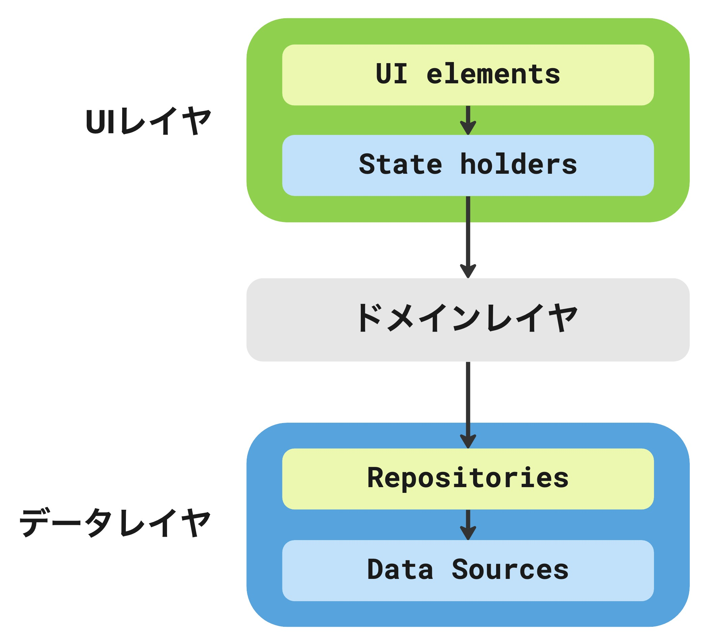

# データレイヤをテストする

## データレイヤの役割

- アプリデータと、アプリデータの作成・保存・変更方法を決定するビジネスロジックをもつ
- データソースクラスはファイル・API・ローカルデータベース等、1つのデータソースのみを処理する役割
- Repositoryクラスはデータレイヤのエントリーポイントとなり、データソースを抽象化する

 
 

 
 

## データレイヤでテストしたいことを考える

データレイヤでは、主に次のことをテストする。

- Repository内のロジック
- データソースの特性に応じたテスト

ただし、データレイヤはアプリによって複雑度・データソースの種類も異なり、それにあわせて実装するべきテストも変わってくる。 
そのため、実装者が何をテストしたいのかを掘り下げる必要がある。

データレイヤで具体的にどのようなテストをするかイメージがしやすいように、一例をあげる。

- API通信
  - リクエストやレスポンスのパース処理
  - リクエストやレスポンスの加工処理
  - エラーハンドリング
- オンメモリキャッシュ
  - キャッシュの利用
  - キャッシュの有効期限
- ファイル
  - 適切なパスへの保存・読み込み
  - エラーハンドリング
- データベース(Room)
  - DAOに定義されたクエリ
  - マイグレーション
  - エラーハンドリング
- Preferences
  - 保存・取得
  - マイグレーション
- DataStore
  - 保存・取得
  - マイグレーション
- Repository内のロジック 
  - キューイング
  - 排他制御
  - モデルの変換

このハンズオンでは、データレイヤがKotlin Coroutine/Kotlin Flowで実装されていることを前提に、Kotlin Coroutine/Kotlin Flowのテストの書き方、またいくつかのデータソースに応じたテストの書き方を紹介する。

## 目次

- [API通信をするコードのテストを実装しながらCoroutineのテストについて学ぶ](./DataLayerTest_Coroutine.md)
- データソースに応じたテストの書き方を学ぶ
  - [データベース(Room)のテストを書く](./DataLayerTest_DataSource_Room.md)
  - [DataStoreのテストを書く](./DataLayerTest_DataSource_DataStore.md)
  - [オンメモリキャッシュのテストを書く](./DataLayerTest_DataSource_OnMemoryCache.md)
