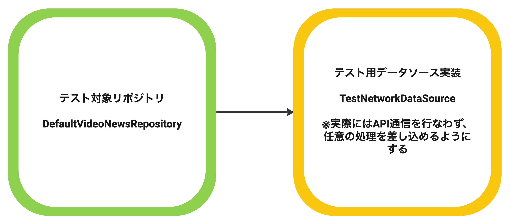
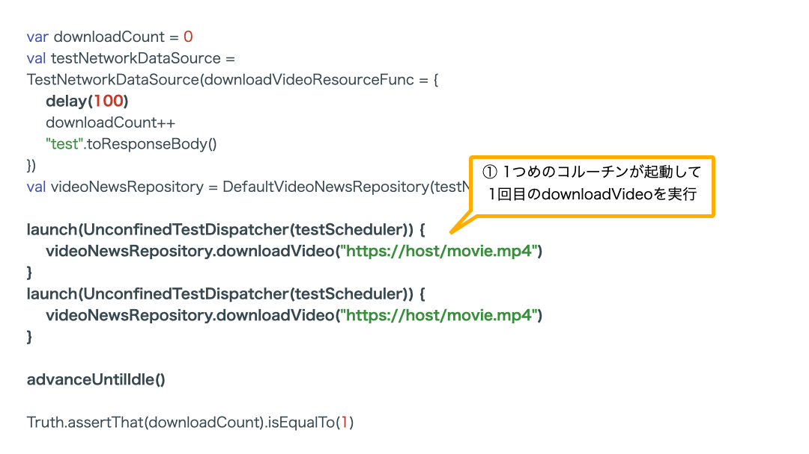

# API通信をするコードのテストを実装しながらCoroutineのテストについて学ぶ

このセクションでは、次のテストの書き方を紹介しながらKotlin Coroutine及びKotlin Flowのテストの書き方を学ぶ。<br>
※Kotlin Coroutine/Kotlin Flowのバージョンは1.6+

- suspend関数のテストを書く
- APIからエラーが返ってきた時のテストを書く
- Flowが公開されている実装のテストを書く
- Flowを継続的にcollectするテストを書く
- delayを入れたテストを書く
- Dispatcherが指定されたテストを書く

## ハンズオンを始める前に

### 使用するライブラリ

```gradle
dependencies {
    testImplementation "org.jetbrains.kotlinx:kotlinx-coroutines-test:$coroutines_version"
   
    //optional: ハンズオン中のコードの中で登場するアサーションライブラリ
    testImplementation "com.google.truth:truth:$truth_version"
    testImplementation "org.jetbrains.kotlin:kotlin-test:$kotlin_version"
}
```

### テスト対象クラス`DefaultVideoNewsRepository`の実装

- テスト対象クラス： [DefaultVideoNewsRepository](../../core/data/src/exercise/java/com/google/samples/apps/nowinandroid/core/data/repository/VideoNewsRepository.kt)
- テストコード：[DefaultVideoNewsRepositoryTest](../../core/data/src/testExercise/java/com/google/samples/apps/nowinandroid/core/data/repository/DefaultVideoNewsRepositoryTest.kt)

DefaultVideoNewsRepositoryは2つのメソッドを持っている。

1. getVideoNewsResources
   - APIから動画ニュースのリストを取得する
   - リストが取得されたことを複数の画面に通知するためのFlowを公開する
2. downloadVideo
   - URLを引数に動画ファイルをダウンロードする
   - 同じ動画に対してダウンロードが複数回同時に行われないように、ダウンロードが実行中のURLかを見て、すでに実行中であれば処理をスキップする

### `DefaultVideoNewsRepository`のテスト方針

DefaultVideoNewsRepositoryから使っているデータソースはNiaNetworkDataSourceで、名前のとおりAPI通信をするデータソース。<br>
そのため、テスト用データソースを用意する方針でテストを実装する。



API通信をするデータソースに対してテスト用のデータソースを用意することは、次のメリットがある。

 - API通信をせずにテスト用のデータを返せるようになるため、テストの実行速度とテストの安定性が向上する
 - 任意のレスポンスを返せるようにすることで、レスポンスのバリエーションのテストが容易になる
 - エラー発生時のテストが書きやすくなる

### テスト用データソース(TestNetworkDataSource)の実装

今回準備したテスト用データソースのコードを抜粋する。

```kotlin
class TestNetworkDataSource(
    // テストコードから任意の関数をセットする
    // テストコードの中で何度も更新できるようにvarになっている
    var getVideoNewsResourcesFunc: (suspend () -> List<NetworkVideoNewsResource>)? = null,
) : NiaNetworkDataSource {

  override suspend fun getVideoNewsResources(): List<NetworkVideoNewsResource> =
    requireNotNull(getVideoNewsResourcesFunc) { "not set getVideoNewsResources()" }
      .invoke()
}
```

テスト用データソースはテストしたい内容が実現できればどのような実装でも問題ないが、テスト用データソースを作成しやすいようにデータソースのI/Fが定義されていることが重要。

### 練習問題で修正するファイルと解答例

<!-- textlint-disable japanese/sentence-length -->
- `demoExerciseDebug`ビルドバリアントで [`core/data/src/testExercise/java/com/google/samples/apps/nowinandroid/core/data/repository/DefaultVideoNewsRepositoryTest.kt`](../../core/data/src/testExercise/java/com/google/samples/apps/nowinandroid/core/data/repository/DefaultVideoNewsRepositoryTest.kt) を開いて作業する
- `demoAnswerDebug` ビルドバリアントに切り替えると解答例を確認できる
<!-- textlint-disable japanese/sentence-length -->


## suspend関数のテストを書く

`runTest`でテストメソッドを囲むことで、テストメソッド内でCoroutineを扱えるようになる。

```kotlin
class VideoNewsRepository() {

  // テストしたいsuspend関数
  suspend fun getVideoNewsResources(): List<VideoNewsResource> {
    return listOf()
  }
}

@Test
fun getVideoNewsResources() = runTest { // テストメソッドをrunTestで囲む
    val videoNewsRepository = DefaultVideoNewsRepository()
  
   // suspend関数を実行し、戻り値が返る
    val actual = videoNewsRepository.getVideoNewsResources()

    assertThat(actual).isEqualTo(expected)
}
```

### runTest

runTestの特徴は次のとおり。

- テスト用に新しいCoroutineを開始するCoroutineビルダー
- テストコードをラップすることで、Coroutineの中でテストコードを実行する
- 振る舞いはrunBlockingと似ているが、delayを入れても実時間ではその分の時間を待つ必要はない
- Coroutineの実行が他のDispatcherに移動する場合も動作する
  - runTest内で直接実行されたsuspend関数は、Dispatcherが切り替わっていた場合でも、戻り値が返ってくるまで待つ 

#### runTestの中のdelayの振る舞い

さきほどのコードにdelayを追加してrunTestを実行すると、1秒待つことなくテストが成功する。<br>
runTestのスコープでは時間を仮想時間で扱うことができるため、テストの実行時間を延ばさずに時間の経過をシミュレートできる。

```kotlin
class VideoNewsRepository {

  suspend fun getVideoNewsResources(): List<VideoNewsResource> {
    delay(1000) // delay
    return listOf()
  }
}

@Test
fun getVideoNewsResources() = runTest { 
    val videoNewsRepository = DefaultVideoNewsRepository()
  
    val actual = videoNewsRepository.getVideoNewsResources()

    assertThat(actual).isEqualTo(expected)
}
```

## APIからエラーが返ってきた時のテストを書く

通信処理のライブラリとしてRetrofitを採用しているプロダクトは多い。RetrofitではAPIからエラーが返ってきたときにHttpExceptionをthrowする。<br>
HttpExceptionをcatchしてアプリ用のExceptionに変換して再度throwするコードのテストは次のように書くことができる。

```kotlin
@Test(expected = ApiException::class) // ThrowされるException
fun `getVideoNewsResources_HttpException`() = runTest {

    val videoNewsRepository = DefaultVideoNewsRepository(testNetworkDataSource)
    
    videoNewsRepository.getVideoNewsResources() // Exceptionがthrowされるsuspend関数
}
```
ただし、アノテーションを使った書き方だと、メッセージの中身といったインスタンスに対してのテストはできない。

Junitには`assertThrows`というアサーションもあり、これを使うとThrowableのインスタンスに対してアサーションを追加できる。<br>
ただし、Junit4の`assertThrows`をsuspend関数に対して使うと、`Suspension functions can be called only within coroutine body`のエラーになる。

そのため、`kotlin.test.assertFail`や`kotlin.test.assertFailWith`を使うと、suspend関数のテストも楽に書くことができる。

```kotlin
@Test
fun `getVideoNewsResources_HttpException`() = runTest {
    val videoNewsRepository = DefaultVideoNewsRepository(testNetworkDataSource)

    val throwable = assertFailWith<ApiException> {
      videoNewsRepository.getVideoNewsResources() // suspend関数の呼び出し
    }
    assertThat(throwable.message).isEqualTo("error occurred") // throwableのインスタンスに対してアサーション
}
```

### 練習問題

`// TODO`部分を埋めてテストを完成させよう。
- テストメソッド： `getVideoNewsResources_APIからエラーが返ってきた時のテストを書く`
- テスト概要： `getVideoNewsResources`からApiExceptionがthrowされることと、ApiExceptionのメッセージを検証する


## Flowが公開されている実装のテストを書く

次のコードは、API通信の結果、`videoNewsStream(型: Flow<List<VideoNewsResource>>)`に更新をemitする。

```kotlin
private val _videoNewsStream = MutableSharedFlow<List<VideoNewsResource>>(replay = 1)
val videoNewsStream :SharedFlow<List<VideoNewsResource>> = _videoNewsStream.asSharedFlow()

override suspend fun getVideoNewsResources() {

    val videoNewsResource = networkDataSource
        .getVideoNewsResources()
        .map(NetworkVideoNewsResource::asModel)

    _videoNewsStream.emit(videoNewsResource)
}
```

テストコードでは、`videoNewsStream`にemitされた値に対してアサーションを行う。<br>
Flowの`first()`を呼び出すことで、最初にemitされるアイテムを取得できる。`first()`は、1つめのアイテムがemitされるまで待機し、更新を受け取ったらキャンセルする。

```kotlin
@Test
fun getVideoNewsResources() = runTest {

    val videoNewsRepository = DefaultVideoNewsRepository(testNetworkDataSource)
    videoNewsRepository.getVideoNewsResources()

    Truth.assertThat(videoNewsRepository.videoNewsStream.first())
        .isEqualTo(listOf(testVideoNewsResource))
}
```

### 購読時に値が流れないFlowのテスト

replayが0のMutableSharedFlowややcapacityが0のChannelは、購読時に値が流れてこない。

```kotlin
private val _videoNewsStream = MutableSharedFlow<List<VideoNewsResource>>()
val videoNewsStream :SharedFlow<List<VideoNewsResource>> = _videoNewsStream.asSharedFlow()

or

private val _videoNewsChannel = Channel<List<VideoNewsResource>>()
val videoNewsStream = _videoNewsChannel.receiveAsFlow()
```

このとき、Flowの`first()`を使って検証をしても、値が流れずにタイムアウトしてしまう。値が残らないワンショットのイベントとしてFlowを使う場合は、「Flowを継続的にcollectするテストを書く」のセクションを参考にテストを実装する。

### 練習問題

`// TODO`部分を埋めてテストを完成させよう。
- テストメソッド： `getVideoNewsResourcesStream_Flowが公開されている実装のテストを書く`
- テスト概要： `getVideoNewsResources`を呼び出すと`videoNewsStream`に更新が通知されることを検証する


## Flowを継続的にcollectするテストを書く

`first()`といったFlowのAPIを使って検証する以外にも、テストコード側でFlowを継続的にcollectして、collectした結果を見るテストを書くこともできる。

```kotlin
@Test
fun getVideoNewsResources() = runTest {

    val videoNewsRepository = DefaultVideoNewsRepository(testNetworkDataSource)
    
    // collectした結果を入れるリスト
    val actual = mutableListOf<List<VideoNewsResource>>()

    // videoNewsStreamをcollectするために、テストコード内でコルーチンを起動する
    // UnconfinedTestDispatcherを指定することで、即座にコルーチンが起動される
    val job = launch(UnconfinedTestDispatcher(testScheduler)) {
        // テストコードでvideoNewsStreamをcollectし、結果をリストに追加していく
        videoNewsRepository.videoNewsStream.toCollection(actual)
    }

    // 2回テストしたいメソッドを実行する. 2回videoNewsStreamにemitされる
    videoNewsRepository.refreshVideoNews()
    videoNewsRepository.refreshVideoNews()

    // 2回分のアイテムをassertする
    Truth.assertThat(actual)
      .isEqualTo(listOf(
        listOf(testVideoNewsResource),
        listOf(testVideoNewsResource)
      ))

    // collectしているjobをキャンセルする
    job.cancel()
}
```

上記コードについて、いくつかのポイントを説明する。

### FlowをCollectするCoroutineの起動

collectはsuspend関数なので、完了するまで次の処理が進まない。そのため、新しいCoroutineを起動してその中でcollectする。runTestはレシーバーがTestScope(テスト用のCoroutine Scope)になっており、runTestブロックの中では新しいCoroutineを起動できる。<br>
また、DispatcherにはUnconfinedTestDispatcherを指定し、即座にCoroutineが起動されるようにする。<br>

```kotlin
val job = launch(UnconfinedTestDispatcher(testScheduler)) {
    videoNewsRepository.videoNewsStream.toCollection(actual)
}

// テストの実行

job.cancel()
```

collectしているjobはテスト終了時にキャンセルする必要がある。runTestは自身のScope内に終了していないCoroutineがあると、終了するまで待機するため、キャンセルしないとタイムアウトでテストが失敗する。<br>

`backgroundScope`を使用することで、jobをキャンセルする記述を省略できる。`backgroundScopeは`、テスト終了時に自動でキャンセルされるテスト用のCoroutineScope。
ループと`delay`を組み合わせた定期実行処理のsuspend関数をテストするといった場合も、`backgroundScope`を使うと簡単にテストが実装できる。

```kotlin
// backgroundScopeでlaunch
// 自動でキャンセルされるため、明示的なキャンセルの記述は不要
backgroundScope.launch(UnconfinedTestDispatcher(testScheduler)) {
    videoNewsRepository.videoNewsStream.toCollection(actual)
}
```

### TestDispatcher

Coroutine起動時に指定したUnconfinedTestDispatcherはテスト用のDispatcher。kotlinx-coroutines-testパッケージでは、2つのテスト用Dispatcherが提供されている。

- StandardTestDispatcher
  - Coroutineをキューに追加し、テストスレッドが空いているときに実行する
  - runTestはデフォルトでStandardTestDispatcherを使う
- UnconfinedTestDispatcher
  - Coroutineをすぐに実行する

UnconfinedTestDispatcherを指定してCoroutineを起動した場合、処理の順番としては次のようになる。

```kotlin
@Test
fun getVideoNewsResources() = runTest {
    
    // ① テストコードセットアップ

    val job = launch(UnconfinedTestDispatcher(testScheduler)) {
      // ② videoNewsStreamのcollectのセットアップ
      videoNewsRepository.videoNewsStream.toCollection(actual)
    }
    
    // ③ テスト対象メソッドの実行 + アサーション
    videoNewsRepository.refreshVideoNews()
    // 以下省略
}
```

一方、launch時に何も指定しない(= StandardTestDispatcherを指定した)場合は、collectより前にテスト対象メソッドの実行とアサーションが実行される。
そのため、collect結果を格納するリストが空になっており、テストに失敗する。

```kotlin
@Test
fun getVideoNewsResources() = runTest {
    
    // ① テストコードセットアップ

    val job = launch { // StandardTestDispatcher
      // ③ videoNewsStreamのcollectのセットアップ
      videoNewsRepository.videoNewsStream.toCollection(actual)
    }
    
    // ② テスト対象メソッドの実行 + アサーション
    videoNewsRepository.refreshVideoNews()
    // 以下省略
}
```

これら2つのTestDispatcherは、Coroutineがどのような順番で呼ばれて欲しいのかに合わせて使い分ければよい。


### 練習問題

`// TODO`部分を埋めてテストを完成させよう。
- テストメソッド： `getVideoNewsResourcesStream_Flowを継続的にcollectするテストを書く`
- テスト概要： `getVideoNewsResources`を呼び出すと`videoNewsStream`に更新が通知されることを、Flowをcollectすることで検証する


### TestDispatcherへの理解を深める

TestDispatcherについての理解を深めるために、いくつかのトピックを紹介する。

#### TestScheduler

TestDispatcherはテストコード内で複数作成できるが、TestSchedulerは1つのインスタンスを共有する必要がある。<br>
それはTestSchedulerが、テスト内で実行されるCoroutineの管理と仮想時間の制御をしているためである。

```kotlin
@Test
fun getVideoNewsResources() = runTest {
    // runTest内で生成するTestDispatcherのコンストラクタにtestSchedulerを渡す
    // testSchedulerはTestScopeのフィールドで、型はCoroutineTestScheduler   
    val job = launch(UnconfinedTestDispatcher(testScheduler)) {
        ..
    }
}
```

#### キューに追加されたCoroutineを明示的に実行する

StandardTestDispatcherで新しいCoroutineを開始すると、キューに追加されすぐには実行されない。advanceUntilIdleやrunCurrentといったヘルパーを使うと、任意のタイミングでキューに追加されたCoroutineを実行できる。

次のようにアサーションの前にadvanceUntilIdleを入れることで、StandardTestDispatcherを使用している場合でもテストが成功するようになる。

```kotlin
@Test
fun getVideoNewsResources() = runTest {

    // ① テストコードセットアップ

    val job = launch { // StandardTestDispatcherなのでコルーチンはキューに追加されて待機
      // ③ videoNewsStreamのcollectのセットアップ
      videoNewsRepository.videoNewsStream.toCollection(actual)
    }
    // ② 待機中のコルーチンを実行   
    advanceUntilIdle() // or runCurrent
        
    // ④ テスト対象メソッドの実行 + アサーション
    videoNewsRepository.refreshVideoNews()
}
```

#### TestDispatcherとテストスレッド

`Dispatchers.IO`や`Dispatchers.Default`でCoroutineを複数起動した場合、Coroutineの実行順序は保証されない。<br>
次のコードを実行したときにtestとtest2のどちらが先にprintされるかは、実行するまでわからない。

```kotlin
@Test
fun test() = runTest {
    launch(Dispatchers.Default) {
        println("test")
    }
    launch(Dispatchers.Default) {
        println("test2")
    }
}
```


一方、TestDispatcherで開始されたCoroutineは、1つのテストスレッドで同期的に実行される。<br>
Coroutineはキューに追加した順番で実行され、test → test2の順にprintされる。

```kotlin
@Test
fun test() = runTest {
    // 明示的に指定しているが未指定の場合も同様    
    launch(StandardTestDispatcher(testScheduler)) {
        println("test") // ①
    }
    launch(StandardTestDispatcher(testScheduler)) {
        println("test2") // ②
    }
    advanceUntilIdle() 
}
```

#### runTestにTestDispatcherを指定する

runTestに直接UnconfinedTestDispatcherを指定すると、runTestブロック内はデフォルトでUnconfinedTestDispatcherが使用される。

```kotlin
@Test
fun test() = runTest(UnconfinedTestDispatcher()) {
   val job = launch {
       //　UnconfinedTestDispatcherで実行されるため、すぐにlaunch内の処理が行われる
   }
       ..    
}
```

## delayを入れたテストを書く

データソースがテストデータを返すタイミングでdelayを差し込めるようできれば、通信処理に時間がかかっているときの振る舞いをシミュレートできる。
たとえば、エンドポイントAへのリクエストが2回連続で呼ばれたときに、1回目がリクエスト中だったら2回目のリクエストは無視するといった振る舞いのテストを実装できるようになる。

`downloadVideo`メソッドでは、同じURLのリクエストが2回行われたときに、1回目のダウンロードに時間がかかっていれば2回目をスキップする。

```kotlin
suspend fun downloadVideo(url: String) {
     
    // ダウンロード中のURLのSetをフィールドに保持
  
    // ダウンロード中のだったらreturnして終了
    if (downloadingUrlSet.contains(url)) {
        return
    }

    // ダウンロード開始時にダウンロード先のURLをSetに追加
    downloadingUrlSet.add(url)
  
    // ダウンロード実行
    // このときに時間がかかっている状態をdelayを使ってエミュレートする
    networkDataSource.downloadVideoResource(url)

    // ダウンロードが終了したらダウンロード先のURLをSetから削除
    downloadingUrlSet.remove(url)
}
```

2回目がスキップされることを確認するテストは次のように書くことができる。

```kotlin
@Test
fun downloadVideo() = runTest {
    
    // TestNetworkDataSourceでdownloadVideo実行時にdelayするように処理を差し込む
    // また、NetworkDataSourceへの呼び出しをカウントして、1度しかダウンロードが実行されていないことを確認する
    var downloadCount = 0
    val testNetworkDataSource = TestNetworkDataSource(downloadVideoResourceFunc = {
      delay(100)
      downloadCount++
      "test".toResponseBody()
    })

    val videoNewsRepository = DefaultVideoNewsRepository(testNetworkDataSource)
    
    // 1回目と2回目のリクエストをそれぞれ新しいコルーチンで実行する 
    launch(UnconfinedTestDispatcher(testScheduler)) {
        videoNewsRepository.downloadVideo("https://host/movie.mp4")
    }
    launch(UnconfinedTestDispatcher(testScheduler)) {
        videoNewsRepository.downloadVideo("https://host/movie.mp4")
    }

    // delay分の時間をすすめる 
    advanceUntilIdle()

    // ダウンロードの実行が1回目しか行われていないことを確認する
    Truth.assertThat(downloadCount).isEqualTo(1)
}
```

delayを入れたテストについて、いくつかのポイントを説明する。

### 2つのリクエストの実行順をコントロールする

runTest内で直接`downloadVideo`を2回呼ぶと、1回目の実行が完了した後に2回目実行されるという処理の流れになる。今回は1回目がdelayしている間に2回目のリクエストをするといった流れにしたいため、それぞれ別のCoroutineを起動する。

それぞれ別のCoroutineにすることで、具体的には次の処理の流れになる。

1. 1つめのCoroutineが起動し、1回目の`downloadVideo`が実行される。ダウンロード先のURLがURLのセットに含まれていないのでスキップせずに、URLをSetに追加する
2. 1回目の`downloadVideo`が`NetworkDataSource#downloadVideoResource`を呼び出す。実態はTestNetworkDataSourceで、`delay`が呼ばれ、一度処理を中断する
3. 2つめのCoroutineが起動し、2回目の`downloadVideo`が実行される。ダウンロード先のURLがURLのセットに含まれているため、早期returnで終了する
4. advanceUntilIdleで実行待ちのCoroutineがなくなるまで時間を進める
5. 1回目の`downloadVideo`のdelayの待機が終了し、downloadCountがインクリメントされる。1回目の`downloadVideo`が終了する
6. downloadCountは1であることがアサートされる




### テストでCoroutineの時間を操作する

TestScopeの中では、時間を操作する次のメソッドを使うことができる。

 - advanceUntilIdle 
   - キューに何も残らなくなるまで、スケジュールされたCoroutineの実行を繰り返す
   - 細かい時刻経過のコントロールが不要な場合は、advanceUntilIdleを使うのが楽
- advanceTimeBy
    - 仮想時間を指定の分だけ進め、その時点までにスケジュール設定されているすべてのCoroutineを実行する
- runCurrent
    - 現在の仮想時間にスケジュールされたCoroutineを実行する

さきほどのテストは、advanceTimeByに書きかえても成功する。advanceTimeByではdelay分の時間 + 1をした値を渡すと、実行まで進む。

```kotlin
@Test
fun downloadVideo() = runTest {
    
    var downloadCount = 0
    val testNetworkDataSource = TestNetworkDataSource(downloadVideoResourceFunc = {
      delay(100)
      downloadCount++
      "test".toResponseBody()
    })

    val videoNewsRepository = DefaultVideoNewsRepository(testNetworkDataSource)

    launch(UnconfinedTestDispatcher(testScheduler)) {
        videoNewsRepository.downloadVideo("https://host/movie.mp4")
    }
    launch(UnconfinedTestDispatcher(testScheduler)) {
        videoNewsRepository.downloadVideo("https://host/movie.mp4")
    }

    advanceTimeBy(101L) // advanceUntilIdleをadvanceTimeByに書き換え

    Truth.assertThat(downloadCount).isEqualTo(1)
}
```

一方、runCurrentへの書き換えはテストが失敗する。runCurrentではdelay分の時間は進まないため、downloadCountが0のままテストが失敗する。

```kotlin
@Test
fun downloadVideo() = runTest {
    
    var downloadCount = 0
    val testNetworkDataSource = TestNetworkDataSource(downloadVideoResourceFunc = {
      delay(100)
      downloadCount++
      "test".toResponseBody()
    })

    val videoNewsRepository = DefaultVideoNewsRepository(testNetworkDataSource)

    launch(UnconfinedTestDispatcher(testScheduler)) {
        videoNewsRepository.downloadVideo("https://host/movie.mp4")
    }
    launch(UnconfinedTestDispatcher(testScheduler)) {
        videoNewsRepository.downloadVideo("https://host/movie.mp4")
    }

    runCurrent() // runCurrentに置き換え 

    Truth.assertThat(downloadCount).isEqualTo(1) // downloadCountは0のままで失敗
}
```

### 練習問題

`// TODO`部分を埋めてテストを完成させよう。
- テストメソッド： `downloadVideo_delayを入れたテストを書く`
- テスト概要： `downloadVideo`を呼び出した後、ダウンロードが終わらないうちに同じURLを引数で`downloadVideo`を呼び出すと、2回目はスキップされることを確認する

## Dispatcherが指定されたテストを書く

runTestはDispatcherが切り替わっていた場合も戻り値が返ってくるまで待ってくれる。そのため、基本的にはrunTestで囲むだけでテストが成功する。

```kotlin
class VideoNewsRepository() {

    // IOディスパッチャを直接指定
    suspend fun getVideoNewsResources(): List<VideoNewsResource> = withContext(Dispatchers.IO){
        return listOf()
    }
}

@Test
fun getVideoNewsResources() = runTest {
    val videoNewsRepository = DefaultVideoNewsRepository()

    // Dispatcherが切り替わっていた場合も、戻り値が返ってくるまで待ってくれる
    val actual = videoNewsRepository.getVideoNewsResources()

    assertThat(actual).isEqualTo(expected)
}
```

ただし、「delayを入れたテストを書く」で紹介した実装に`Dispatchers.IO`を直接指定すると、成功していたテストが失敗してしまう。

```kotlin
// IOディスパッチャを直接指定
suspend fun downloadVideo(url: String) = withContext(Dispatchers.IO) {
  // 省略
}

@Test
fun downloadVideo() = runTest {
    
    var downloadCount = 0
    val testNetworkDataSource = TestNetworkDataSource(downloadVideoResourceFunc = {
      delay(1000)
      downloadCount++
      "test".toResponseBody()
    })

    val videoNewsRepository = DefaultVideoNewsRepository(testNetworkDataSource)

    launch { videoNewsRepository.downloadVideo("https://host/movie.mp4") }

    advanceUntilIdle()

    Truth.assertThat(downloadCount).isEqualTo(1) // downloadCountは0のままで失敗
}
```

仮想時間やadvanceUntilIdleといったヘルパーを使うためには、TestSchedulerを共有したTestDispatcherを使う必要がある。
IO Dispatcherを直接指定していると、delayで一度中断したCoroutineを再開するために実時間を1秒進める必要があり、テストの実行時間が伸びてしまう。

Now in Android Appでは、Dagger Hiltを使ってIO DispatcherをコンストラクタからInjectできるようにしている。

```kotlin
// Qualifierの定義
@Qualifier
@Retention(RUNTIME)
annotation class Dispatcher(val niaDispatcher: NiaDispatchers)

enum class NiaDispatchers {
    IO
}

// Moduleの定義
@Module
@InstallIn(SingletonComponent::class)
object DispatchersModule {
    @Provides
    @Dispatcher(IO)
    fun providesIODispatcher(): CoroutineDispatcher = Dispatchers.IO
}

// リポジトリの実装ではIO Dispatcherをコンストラクタから差し替えられるようにする
class DefaultVideoNewsRepository(
    @Dispatcher(IO) private val ioDispatcher: CoroutineDispatcher
) {
    suspend fun downloadVideo(url: String) = withContext(ioDispatcher) {
    }
}
```

テストコードでは、TestDispatcherに差し替えることで仮想時間が扱えるようになる。

```kotlin
@Test
fun `downloadVideo`() = runTest {
        ..
        
        // TestDispatcherをコンスタントで渡すようにする
        // runTest内でtestSchedulerを作成するときは、testSchedulerを共有する
        val videoNewsRepository = DefaultVideoNewsRepository(
            StandardTestDispatcher(testScheduler)
        )
        
        ..
}
```

### 練習問題

`// TODO`部分を埋めてテストを完成させよう。
- テストメソッド： `downloadVideo_Dispatcherが指定されたテストを書く`
- テスト概要： `downloadVideo2`を呼び出した後、ダウンロードが終わらないうちに同じURLを引数で`downloadVideo2`を呼び出すと、2回目はスキップされることを確認する
- IO Dispatcherを外から差し込めるように [DefaultVideoNewsRepository](../../core/data/src/exercise/java/com/google/samples/apps/nowinandroid/core/data/repository/VideoNewsRepository.kt)を修正する

## まとめ

API通信をするRepositoryを題材に、Kotlin Coroutine及びKotlin Flowのテストの書き方を紹介した。

 - suspend関数をテストするには、runTestでテストメソッドを囲む
 - FlowはFlow#firstといったFlowのAPIを使ってテストができる
 - Flowをcollectする場合は、runTest内で新しいCoroutineを起動する
 - delayとadvanceUntilIdleといった時間を操作するヘルパーを使うことで、Coroutineの中断や再開をコントロールできる
 - Dispatcherを指定するときは、外から渡せるようにするとテストコードからのコントロールができるようになる

