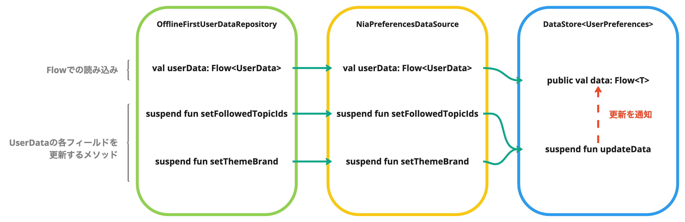

# DataStoreのテストを書く

このセクションでは、DataStoreをデータソースにもつRepositoryのテストの書き方を学ぶ。

## DataStoreのテスト方針

DataStoreを使うためのもっともシンプルな実装は、ContextからDataStoreのインスタンスを取得する実装である。

```kotlin
val Context.userPrefDataStore: DataStore<UserPreferences> by dataStore(
    fileName = "user_preferences.pb",
    serializer = UserPreferencesSerializer()
)
```

ただしRepositoryやデータソースのクラス内ではContextからDataStoreを取得するのではなく、`DataStore<T>`の依存をもつようにするほうが望ましい。`DataStore<T>`はインターフェースのため、実装をテスタブルに保つことができる。

たとえばDagger Hiltを使っている場合、次のようにDataStoreインスタンスを注入できるようにする。

```kotlin
// Dagger HiltのModule設定
@Module
@InstallIn(SingletonComponent::class)
object DataStoreModule {

    @Provides
    @Singleton
    fun providesUserPreferencesDataStore(
        @ApplicationContext context: Context,
        @Dispatcher(IO) ioDispatcher: CoroutineDispatcher,
    ): DataStore<UserPreferences> =
        
        // DataStoreFactory. DataStoreFactory.createでDataStoreのインスタンスを作成する.
        // ファイル型を返せれば良いため、DataStoreFactory自体はContextに依存しない。
        DataStoreFactory.create(
            serializer = UserPreferencesSerializer(),
            scope = CoroutineScope(ioDispatcher + SupervisorJob()),
        ) {
            // 保存先のFileクラスを返す
            context.dataStoreFile("user_preferences.pb")
        }
}

// DataStoreをラップするデータソース
class NiaPreferencesDataSource @Inject constructor(
    // DataStore<T>を参照し、Contextは参照しない
    private val userPreferences: DataStore<UserPreferences>
) 
```

DataStoreFactoryは任意の保存先を指定できる。テスト時にはAndroidのContextに依存しないパスを指定することで、Robolectricを使わなくてもDataStoreと結合できる。<br>
JUnitにはTemporaryFolderというルールが用意されている。このルールを使うとテスト開始時に一時ディレクトリを作成し、テスト終了時に削除をする。このTemporaryFolderをDataStoreの保存先に利用できる。

```kotlin
// @RunWith(AndroidJunit4::class)や@RunWith(RobolectricRunner::class)が不要
class NiaPreferencesDataSourceTest {
  private lateinit var dataSource: NiaPreferencesDataSource

  @get:Rule
  val tmpFolder: TemporaryFolder = TemporaryFolder.builder()
    .assureDeletion() // optional
    .build()

  @Before
  fun setup() {
    dataSource = NiaPreferencesDataSource(
      DataStoreFactory.create(
        serializer = UserPreferencesSerializer(),
      ) {
        // 一時ディレクトリ作成したファイルでDataStoreのインスタンスを作る
        tmpFolder.newFile("user_preferences_test.pb")
      }
    )
  }
  
  // 削除はTemporaryFolderのほうで勝手にやってくれる
}
```

上記を踏まえ、DataStoreがデータソースの場合は次のような方針でテストを実装すればよい。

- テストコードでは基本的にDataStoreのインスタンスはテストダブルに置き換える必要がない
  - ファイルの保存先だけContextを使用しないパスに変更する
  - Robolectricを使用しないため、実インスタンスを使うことによるテスト実行速度でのデメリットが少ない
- Repositoryのテストでも実DataStoreと結合する
    - ただしDataStoreと結合することでテストしにくい実装があれば、インターフェースからテスト用実装を作ったり、モックライブラリを利用する
        - DataStoreを操作するデータソースの実装が複雑、エラー時等
- DataStoreのユニットテスト(もしくはDataStoreを操作するデータソースの単体テスト)は、Repositoryのテストでカバーされていれば優先度は低い

### Serialize/Deserialize

Proto DataStore(プロトコルバッファを使用してスキーマを定義する、タイプセーフなDataStore)を使用している場合、自分自身でSerializer(androidx.datastore.core.Serializer)を実装する必要がある。

Serializerのユニットテストを別で実装してもよいが、 RepositoryのテストもしくはDataStoreのユニットテストでカバーされている場合が多いため優先度は低い。

ユニットテストを実装する場合は、[UserPreferencesSerializerTest](../../core/datastore/src/test/java/com/google/samples/apps/nowinandroid/core/datastore/UserPreferencesSerializerTest.kt)のコードが参考になる。

## テストの実装

### テスト対象のコード

[OfflineFirstUserDataRepository](../../core/data/src/main/java/com/google/samples/apps/nowinandroid/core/data/repository/OfflineFirstUserDataRepository.kt)

テストコードは[OfflineFirstUserDataRepositoryTest](../../core/data/src/testExercise/java/com/google/samples/apps/nowinandroid/core/data/repository/OfflineFirstUserDataRepositoryTest.kt)

現在のOfflineFirstUserDataRepositoryの実装はNiaPreferencesDataSourceを呼び出しているだけなので、ロジックは[NiaPreferencesDataSource](../../core/datastore/src/main/java/com/google/samples/apps/nowinandroid/core/datastore/NiaPreferencesDataSource.kt)に実装されている。<br>
UserDataの各フィールドを更新するメソッドがあり、それらを実行するとUserDataの変更がFlowで通知される。

```kotlin
class OfflineFirstUserDataRepository @Inject constructor(
    private val niaPreferencesDataSource: NiaPreferencesDataSource
) : UserDataRepository {

    override val userData: Flow<UserData> =
        niaPreferencesDataSource.userData

    override suspend fun setFollowedTopicIds(followedTopicIds: Set<String>) =
        niaPreferencesDataSource.setFollowedTopicIds(followedTopicIds)
    ..
}
```
<br>
<br>

<br>
<br>


### テストコード

テストコードは次のように実装できる。

```kotlin
class OfflineFirstUserDataRepositoryTest {

    private lateinit var repository: OfflineFirstUserDataRepository
    
    @get:Rule
    val tmpFolder: TemporaryFolder = TemporaryFolder.builder().assureDeletion().build()

    @Before
    fun setup() {
        val dataStore = DataStoreFactory.create(serializer = UserPreferencesSerializer()) {
            tmpFolder.newFile("user_preferences_test.pb")
        }

        val niaPreferencesDataSource = NiaPreferencesDataSource(dataStore)

        repository = OfflineFirstUserDataRepository(
            niaPreferencesDataSource = niaPreferencesDataSource
        )
    }

    @Test
    fun setFollowedTopicIds() = runTest {

        repository.setFollowedTopicIds(followedTopicIds = setOf("1", "2"))

        // Flow#firstで更新結果を確認する
        Truth.assertThat(repository.userData.first())
            .isEqualTo(
                UserData(
                    ..
            )
        )

        // UserDataの一部のフィールドを確認する
        Truth.assertThat(repository.userData.first().followedTopics)
            .isEqualTo(
                ..
            )
        )
    }
}
```


### 練習問題

`// TODO`部分を埋めてテストを完成させよう。

<!-- textlint-disable japanese/sentence-length -->
- `demoExerciseDebug`ビルドバリアントで [`/core/data/src/testExercise/java/com/google/samples/apps/nowinandroid/core/data/repository/OfflineFirstUserDataRepositoryTest.kt`](../../core/data/src/testExercise/java/com/google/samples/apps/nowinandroid/core/data/repository/OfflineFirstUserDataRepositoryTest.kt) を開いて作業する
- `demoAnswerDebug` ビルドバリアントに切り替えると解答例を確認できる
<!-- textlint-disable japanese/sentence-length -->

## まとめ

 - DataStoreはテストコードで任意の保存先を指定できるようになっている
 - AndroidのContextに依存しない保存先を指定すれば、テストを実行するためにRobolectricを使う必要がない