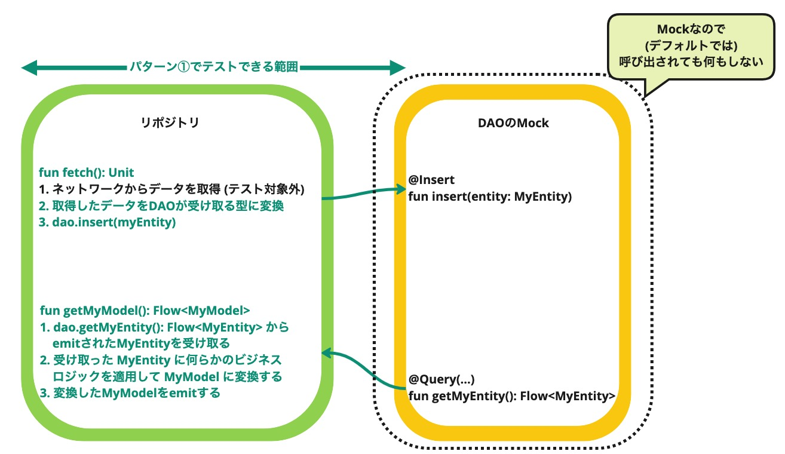
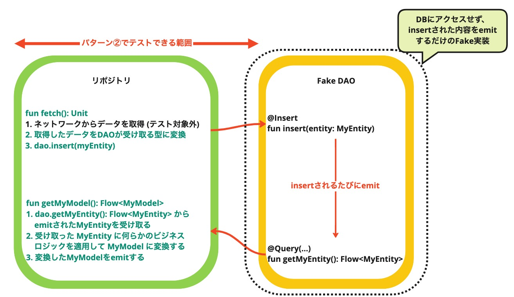
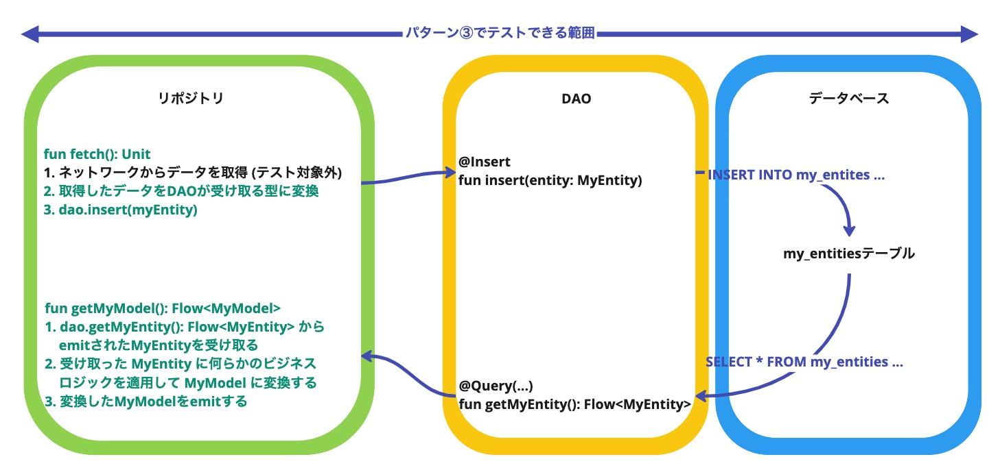
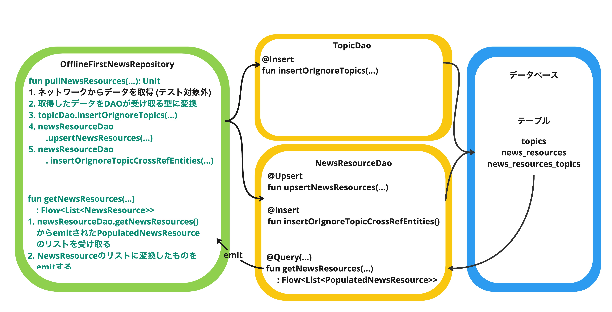
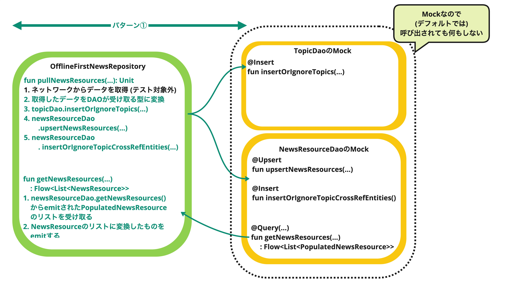
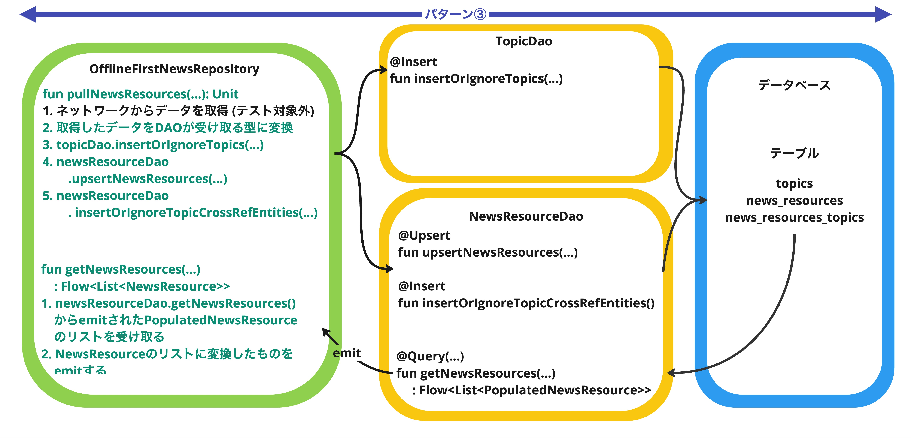

# データベース(Room)のテストを書く

本節では、データレイヤのテストのうち、[Room](https://developer.android.com/topic/libraries/architecture/room)を使った部分のテスト(以後「Roomのテスト」と表記する)について学んでいく。
ここでは、テストする範囲で3つに分けて解説する。

- [Room DAOのユニットテスト](#room)
- [Room DAOをデータソースとするRepositoryのテスト](#repository)
- [データマイグレーションのテスト](#migration)


## <a id="room"></a>Room DAOのユニットテスト

### テストの方針

Roomの[DAO (Data Access Object)](https://developer.android.com/training/data-storage/room/accessing-data)に対するテストでは、たとえば次のようなテストケースが考えられる。

- 正常系： DAOのアノテーションに書かれたSQLが意図とおりに振る舞うか確認する
- 準正常系： Insert系メソッドがコンフリクトした場合の振舞い([`OnConflictStrategy`](https://developer.android.com/reference/kotlin/androidx/room/OnConflictStrategy))を確認する

これらのテストケースすべてをDAOに対するテストとして書くべきか、というとそうではない。
DAOに対するテストとして書くべき範囲は、後述のRepositoryレイヤーのテスト方針と密接にかかわってくる。

たとえば、プロダクトコードのDAOを結合した状態でRepositoryをテストするケースを考えてみる。
そのケースではRepositoryから間接的に呼び出されるDAOのロジックもテストされていると考えてよい。  
言い換えると、Repositoryのテストでカバーされない部分だけをDAOのユニットテストで行えば十分ということになる。
その結果、DAOのユニットテストのうち、正常系のテストの大部分は不要になるかも知れない。

このように、Repositoryレイヤーのテスト方針が定まると、DAOに対するテストでカバーすべき範囲が見えてくる。
もし、その方針決定に先立ってDAOのユニットテストを書き始める場合は、あとから書くRepositoryレイヤーのテストとカバレッジが重複するかもしれない点に注意すること。

### Robolectricを使ってテストを書く

[Robolectric](https://robolectric.org/)を使うことで、SQLiteに依存しているRoomをローカルテストで(JVM上で)動かすことができる。
RobolectricによるSQLiteシミュレーションの特徴は次のとおり。

- ホストマシン(macOSなど)のSQLite実装を使って動く
- ホストマシン上で動作するのでテスト実行スピードが速い
- データベースをファイルに永続化するケースでも、インメモリデータベースを使うケースでも動作する
- データベースをファイルに永続化した場合でも、そのデータがテストをまたがって残り続けることはない。テスト終了時に、Robolectricによって自動的にファイルが削除される

[公式ドキュメントの「ホストマシン上でテストする」](https://developer.android.com/training/data-storage/room/testing-db?hl=ja#host-machine)では、
Robolectricによるデータベースのテストは非推奨という扱いになっているものの、ここではテストの実行速度重視でDAOのユニットテストでもRobolectricを使う方法を紹介する。

 **(補足)**  
DAOのユニットテストをRobolectricで行う場合、公式ドキュメントの指摘どおり、実際とは異なるバージョンのSQLite実装でテストしてしまうという問題はある。
しかし、(Robolectricを使わずに)実機やエミュレータでテストするとしても、そのAndroid環境に搭載されている1つのバージョンのSQLiteでしかテストできない。

仮にSQLiteのバージョン違いを気にするのであれば、市場に出回っている色々なバージョンのSQLiteに対してテストする必要がある。
そのためには、Robolectricを使わないだけでは足りず、**複数の実機**でテストを動かさなければならない点に注意すること。

#### テスト用データベースの生成

Robolectricを使う場合でも、プロダクトコードと同じ方法でデータベースを作ることができる。
テストクラスの`@Before`メソッドでデータベースを作成する例を次に示す。

**データベースをファイルに永続化するコード例**

```kotlin
@RunWith(AndroidJUnit4::class)
class NewsResourceDaoTest {
    private lateinit var db: NiaDatabase
    private lateinit var newsResourceDao: NewsResourceDao
    ...

    @Before
    fun createDb() {
        val context = ApplicationProvider.getApplicationContext<Context>()
        db = Room.databaseBuilder(
            context,
            NiaDatabase::class.java,
            "nia-database"
        ).build()
        newsResourceDao = db.newsResourceDao()
        ...
    }
    ...
}
```

**インメモリデータベースを使うコード例**

```kotlin
@RunWith(AndroidJUnit4::class)
class NewsResourceDaoTest {
    private lateinit var db: NiaDatabase
    private lateinit var newsResourceDao: NewsResourceDao
    ...

    @Before
    fun createDb() {
        val context = ApplicationProvider.getApplicationContext<Context>()
        db = Room.inMemoryDatabaseBuilder(
            context,
            NiaDatabase::class.java
        ).build()
        newsResourceDao = db.newsResourceDao()
        ...
    }
    ...
}
```


どちらの書き方でもテストケース(テストメソッド)ごとにデータベースは新しく作り直される。
そのため、テストメソッド内では、他のテストへの影響を気にすることなく自由にデータベースを変更できる。

### 実践: `NewsResourceDao`のテストを書いてみる

- テスト対象クラス： [`core/database/src/main/java/com/google/samples/apps/nowinandroid/core/database/dao/NewsResourceDao.kt`](../../core/database/src/main/java/com/google/samples/apps/nowinandroid/core/database/dao/NewsResourceDao.kt)
- テストコード： [`core/database/src/testExercise/java/com/google/samples/apps/nowinandroid/core/database/dao/NewsResourceDaoTest.kt`](../../core/database/src/testExercise/java/com/google/samples/apps/nowinandroid/core/database/dao/NewsResourceDaoTest.kt)

#### テスト対象クラス`NewsResourceDao`の概要

Query系(SELECT)のメソッドは、戻り値として`Flow`を返している。

```kotlin
@Transaction
@Query(
    value = """
        SELECT * FROM news_resources
        ORDER BY publish_date DESC
"""
)
fun getNewsResources(): Flow<List<PopulatedNewsResource>>
```


Insert・Update・Deleteなどの更新系メソッドはsuspend関数として実装されている。

```kotlin
@Insert(onConflict = OnConflictStrategy.IGNORE)
suspend fun insertOrIgnoreNewsResources(entities: List<NewsResourceEntity>): List<Long>

```

#### テストクラス`NewsResourceDaoTest`の概要

テストクラス`NewsResourceDaoTest`の各メソッドの内容を見てみよう。

- `createDb()`
  - `@Before`メソッド。データベースを作成し、テスト対象DAOとなるインスタンス(`NewsResourceDao`と`TopicDao`)を取得している
- `tearDown()`
  - `@After`メソッド。Robolectricからの警告抑止のため、データベースをクローズしている
- `getNewsResources_格納したNewsResourceEntityがpublish_dateの降順で取得できること()`
  - 単純なクエリーをテストする例になっている
    1. テストデータを `upsertNewsResources` を使ってテーブルに格納する
    2. 格納したテストデータが `getNewsResources()` を使って取り出す
    3. 取り出した結果が、`millisSinceEpoch`の降順に並んでいることを確認する
- `getNewsResources(filterTopicIds)_引数に指定したTopicに対応するNewsResourceEntityだけがpublish_dateの降順で取得できること()`
  - 関連テーブルまでセットアップしなければならない複雑な例になっている
    1. 次のようなテストデータを用意する
        - `NewsResourceEntity (ID=0)`: 関連トピック`TopicEntity (ID=1)`をもつ
        - `NewsResourceEntity (ID=1)`: 関連トピック`TopicEntity (ID=2)`をもつ
        - `NewsResourceEntity (ID=2)`: 関連トピックを持たない
    2. 用意したテストデータをテーブルに格納する
        - `NewsResourceEntity`と`TopicEntity`の関係は、関連テーブル`NewsResourceTopicCrossRef`に格納する
    3. 引数`filterTopicIds`に`setOf("2")`を指定して`getNewsResources()`を呼び出す
    4. ID=2のトピックに関連している`NewsResourceEntity(ID=1)`が取得できることを確認する

#### 練習問題

テストクラス`NewsResourceDaoTest`の次のメソッドについて、`// TODO` 部分を埋めてテストを完成させよう。

- `demoExerciseDebug`ビルドバリアントで
  [`core/database/src/testExercise/java/com/google/samples/apps/nowinandroid/core/database/dao/NewsResourceDaoTest.kt`](../../core/database/src/testExercise/java/com/google/samples/apps/nowinandroid/core/database/dao/NewsResourceDaoTest.kt)
   を開いて作業する
- `demoAnswerDebug` ビルドバリアントに切り替えると解答例を確認できる


##### 練習1

- テストメソッド： `deleteNewsResources_引数に指定したIDのNewsResourceEntityが削除されること()`
- テスト概要： `upsertNewsResources`を使って格納しておいたレコードについて、`deleteNewsResources`によって削除できること

次のうち、ステップ2〜3を実装してテストを完成させよう。

1. (実装済み) テストデータ(IDが`0`、`1`、`2`、`3`)を `upsertNewsResources` を使ってテーブルに格納する
2. テストデータのうち、IDが`0`と`2`のレコード(`toDelete`)を`deleteNewsResources`を使って削除する
3. 削除したもの以外のレコード(IDが`1`と`3`)について`getNewsResources`で取得できることを確認する

##### 練習2

- テストメソッド： `insertOrIgnoreNewsResources_格納済みのレコードと同じidのNewsResourceEntityを格納しようとすると無視されること()`
- テスト概要： 同じIDのレコードを2回`insertOrIgnoreNewsResources1すると、最初に格納したレコードが残ること

次のうち、ステップ3を実装してテストを完成させよう。

1. (実装済み) データベースに格納する`NewsResourceEntity`のリストを2つ作っておく
   - 1つめのリストは1アイテムのみ。(`id = "1", title = "old title`)
   - 2つめのリストの2アイテム。各要素の`title`は`"new title"`とし、`id`が`1`のものを含めておく
2. (実装済み) 1つめのリスト、2つめのリストの順に`insertOrIgnoreNewsResources`する(2回呼び出す)
3. データベースから全レコードを取得して、次のことを確認する
   - `id = "0", title = "new title"` が含まれていること
   - `id = "1", title = "old title"` が含まれていること

## <a id="repository"></a>Room DAOをデータソースとするRepositoryのテスト

### テストの方針

DAOをデータソースとするRepositoryに対するテストでは、Repositoryが内部で持っているDAOをどのように扱うのか決める必要がある。

- **パターン①:** モックライブラリを使ってDAOの**モック**を作成し、そのモックと結合してテストする  
  (Robolectricは使わない)  
  
- **パターン②:** Roomを使わずにDAOの振舞いを模倣した**Fake DAO**を実装し、そのFake DAOと結合してテストする  
  (Robolectricは使わない)  
  
- **パターン③:** DAOのプロダクト実装を**そのまま結合**し、Robolectricでテストする  
  (前述のように、Robolectricを使えばRoomのDAOをテストできる)  
  

それぞれの特徴を表にまとめると次のようになる。

| パターン | 忠実度 | テスト実行時間 | テストの書きやすさ | テストできる範囲 |
|----------|--------|--------------|-------------|------------------|
| ①       | 低い     | 短い         | かんたん | Repositoryのメソッド単体はテストできる<br><b>※図の緑の矢印の範囲</b><br><ul><li>Repositoryへ保存すると対応するDAOのメソッドが呼ばれること</li><li>スタブしたDAOの読み出しメソッドから値が返されたときに、その値がRepositoryから読み出せること</li><li>DAOがエラーとなったときのRepositoryの振る舞い</li></ul> |
| ②       | 低い     | 短い         | 面倒 | Repositoryの範囲内で複数メソッドにわたるテストができる<br><b>※図のオレンジの矢印の範囲(Fake DAO内部のロジックは範囲外)</b><br><ul><li>Repositoryへの保存から読み出し(Flowへのemit)までの一連の流れ</li></ul> |
| ③       | 高い     | 長い         | かんたん | 正常系はDAOも含めてテストできる<br><b>※図の青の矢印の範囲</b><ul><li>DAOの実装(SQLの正しさ)</li><li>Repositoryへの保存から読み出し(Flowへのemit)までの一連の流れ</li></ul> |

DAOがエラーになったときのRepositoryの振舞いをテストする場合は、DAOをモックするパターン①を使うことになる。  
Repositoryの正常系をテストする場合はどのパターンでも実現できるので、テストの実行時間・書きやすさ・範囲を踏まえて採用するパターンを決めるとよい。

まずはテストできる範囲と書きやすさを優先する(テスト実行時間は遅くなってから考える)というアプローチでは、パターン③が第1候補となる。
主にパターン③を採用する場合、次のようにすると手戻りが少ない。
- 正常系のテストはパターン③を採用する
- 異常系(DAOのメソッドで例外発生したときの振舞いなど)はパターン①を採用する
- Fake DAOを実装しないとやりにくいテストを書きたくなったときや、テスト実行時間の遅さが問題になってきたらFake DAOを実装してパターン②へ移行する


なお、正常系も含めたすべてのテストでパターン①やパターン②を採用する場合、DAOのロジックがまったくテストされていない状態になるので、正常系を含むDAOのユニットテストを別途書かなければならない点に注意すること。

### 実践: `OfflineFirstNewsRepository`のテストを書いてみる

本ハンズオンでは前述のパターン①と③それぞれでテストを書いてみる。両者で違いが出てくる点がどこなのか意識しながら書いてみよう。

- テスト対象クラス： [`core/data/src/main/java/com/google/samples/apps/nowinandroid/core/data/repository/OfflineFirstNewsRepository.kt`](../../core/data/src/main/java/com/google/samples/apps/nowinandroid/core/data/repository/OfflineFirstNewsRepository.kt)
- テストコード
  - パターン①： [`core/data/src/testExercise/java/com/google/samples/apps/nowinandroid/core/data/repository/OfflineFirstNewsRepositoryMockDaoTest.kt`](../../core/data/src/testExercise/java/com/google/samples/apps/nowinandroid/core/data/repository/OfflineFirstNewsRepositoryMockDaoTest.kt)
  - パターン③： [`core/data/src/testExercise/java/com/google/samples/apps/nowinandroid/core/data/repository/OfflineFirstNewsRepositoryRealDaoTest.kt`](../../core/data/src/testExercise/java/com/google/samples/apps/nowinandroid/core/data/repository/OfflineFirstNewsRepositoryRealDaoTest.kt)


#### テスト対象クラス`OfflineFirstNewsRepository`の概要



`pullNewsResources(ids)`メソッドは、`network.getNewsResources(ids)`によって得られた情報でデータベースを更新する。
- `news_resources`・`topics`テーブルと、それらの関連テーブル(`news_resources_topics`)が更新される
- `network.getNewsResources(ids)`からは「そのNewsResourceが関連しているトピックのID(トピックID)」は分かるが、トピックID以外の内容は分からない。
   <!-- textlint-disable japanese/no-doubled-joshi -->
   そのため、`topics`テーブルにそのトピックIDが指し示すレコードがない場合は、トピックIDだけ設定された空のトピック情報を`topics`テーブルに格納している
   <!-- textlint-enable -->
- データベースが更新されると、DAOの`getNewsResources()`メソッドが返す`Flow`に、更新されたデータがemitされる

`getNewsResources()`メソッドと`getNewsResources(filterTOpicIds)`メソッドは、
DAOの同名メソッドを呼び出し、Repositoryが返す型(`Flow<List<NewsResource>>`)に合うようにデータを詰め替えている。

なお、`syncWith()`はネットワークから差分情報だけ取得してデータベースを更新するメソッドだが、ロジックが複雑なので今回は扱わない。


#### DAOをモックするパターン①のテストクラス`OfflineFirstNewsRepositoryMockDaoTest`の概要

このテストクラス[`OfflineFirstNewsRepositoryMockDaoTest`](../../core/data/src/testExercise/java/com/google/samples/apps/nowinandroid/core/data/repository/OfflineFirstNewsRepositoryMockDaoTest.kt)は、DAOをモックするパターン①の方針でテストが書かれている。

次のように、DAOはモックライブラリ[MockK](https://mockk.io/)を使ってモックしたものを使っている。
また、`pullNewsResources(ids)`をテストするにはネットワークからの取得結果(`network.getNewsResources()`)を用意する必要があるため、
[以前導入した`TestNetworkDataSource`](DataLayerTest_Coroutine.md)も使っている。

```kotlin
private lateinit var repository: OfflineFirstNewsRepository
private lateinit var newsResourceDao: NewsResourceDao
private lateinit var topicDao: TopicDao
private lateinit var network: TestNetworkDataSource

@Before
fun setup() {
    newsResourceDao = mockk(relaxed = true)
    topicDao = mockk(relaxed = true)
    network = TestNetworkDataSource()

    repository = OfflineFirstNewsRepository(
        newsResourceDao = newsResourceDao,
        topicDao = topicDao,
        network = network,
    )
}

```

今回のテスト対象である`OfflineFirstNewsRepository`のロジックは、Repository・DAO間のデータの詰め替えや受け渡しがほとんどである。
そのため、パターン①でテストできる範囲は、下図の緑色の部分に限られる。
- データ詰め替えが正しく行われているか
- DAOのメソッドが正しく呼び出されているか




##### (参考) MockKの基本的な使い方

<!-- textlint-disable japanese/no-doubled-joshi -->
具体的な各メソッドの説明に入る前に、簡単にMockKの使い方を紹介する。
<!-- textlint-enable -->
より詳しい使い方は[公式サイト](https://mockk.io/)を参照すること。

```kotlin
// モックを生成する
val newsResourceDao: NewsResourceDao = mockk(relaxed = true)

// newsResourceDao.getNewsResources() が呼び出されたときの戻り値を設定する
every { newsResourceDao.getNewsResources() } returns 設定したい戻り値


// newsResourceDao.upsertNewsResourcesが、引数expectedが渡されて呼び出されたことを確認する
// ※suspend関数のときは先頭にcoを付ける (`verify` → `coVerify`)
coVerify { newsResourceDao.upsertNewsResources(expected) }

// newsResourceDao.upsertNewsResourcesの引数に渡された値を取り出す
val slot = slot<List<NewsResourceEntity>>()
coVerify { newsResourceDao.upsertNewsResources(capture(slot))}
val arg = slot.captured // argsが引数に渡された値
```

##### 各メソッドの概要

ここからは、テストクラス[`OfflineFirstNewsRepositoryMockDaoTest`](../../core/data/src/testExercise/java/com/google/samples/apps/nowinandroid/core/data/repository/OfflineFirstNewsRepositoryMockDaoTest.kt)の各メソッドの内容を見ていく。

- `setup()`
  - `@Before`メソッド。テスト対象`OfflineFirstNewsRepository`をインスタンス化するために必要なオブジェクトを生成している
    - `NewsResourceDao`と`TopicDao`はMockKを使ってモックする
    - ネットワーク通信部分は`TestNetworkDataSource`を使う
- `companion object`
  - データベースに格納する初期データを宣言している
- `getNewsResources_DAOのgetNewsResources由来のものが取得できること()`
  - MockKを使って、DAOの`Flow`からテストデータがemitされるように設定することで、DAOからemitされた値がRepositoryで正しく変換されることを確認する例になっている
    1. MockKを使って、DAOの`getNewsResources()` メソッドが呼び出されたときにテストデータ(`List<PopulatedNewsResource>`)が返ってくるようにセットアップする
    2. `OfflineFirstNewsRepository`クラスの`getNewsResources()`メソッドを呼ぶ
    3. <!-- textlint-disable ja-unnatural-alphabet -->
       ステップbの結果が、ステップaでセットアップした値をNewsResource型に変換したものとなっていることを確認する
       <!-- textlint-enable -->
- `pullNewsResources_ネットワークから取得したものがtopicDaoのinsertOrIgnoreTopicsに渡されていること()`
  - ネットワークから取得したデータを元に変換したものが、DAOのinsert系のメソッド引数に正しく渡されていることをMockKを使って確認する例になっている。
    **DAOのメソッドが呼ばれたことと、そのメソッドに渡された引数が正しいことしか確認できない。実際にデータベースに格納されたことは確認できない**
    1. `OfflineFirstNewsRepository`クラスの`pullNewsResources()`メソッドの中で呼ばれる`network.getNewsResources()`が、テストデータ(`List<NetworkNewsResource>`)を返すように設定する  
       (`TestNetworkDataSource`の機能を使う)
    2. `OfflineFirstNewsRepository`クラスの`pullNewsResources()`メソッドを呼ぶ
    3. `topicDao.insertOrIgnoreTopics()`が呼び出されていることを確認する。そのときの引数が、テストデータに含まれるTopicと対応していることを確認する。  
       ※テストデータである`NetworkNewsResource`にはtopicのIDしか保持していない。その場合、`TopicDao`に格納される`TopicEntity`は、ID以外の値は空文字列になる
- `pullNewsResources_ネットワークから取得したものがnewsResourceDaoのinsertOrIgnoreTopicCrossRefEntitiesに渡されていること()`
  - 直前のテストと同様な例。ほぼ同じ内容だが、`newsResourceDao.insertOrIgnoreTopicCrossRefEntities()`が正しい引数で呼び出されていることを確認している
- `pullNewsResources_topicDaoのinsertOrIgnoreTopicsで例外が発生したらそのまま上位にスローされること()`
  - DAOが例外を投げたときのRepositoryの振舞いをテストする例になっている
    1. `OfflineFirstNewsRepository`クラスの`pullNewsResources()`メソッドの中で呼ばれる`network.getNewsResources()` が、テストデータ(`List<NetworkNewsResource>`)を返すように設定する
    2. MockKを使って、`TopicDao`クラスの`insertOrIgnoreTopics()`メソッドで例外が発生するように設定する
    3. `OfflineFirstNewsRepository`クラスの`pullNewsResources()`メソッドを呼んで、例外が発生することを確認する  
      (この例では発生した例外をRepository内で加工していないのでテストの価値が低い。別の例外に詰め替えるなど何らかのロジックがRepositoryにあるケースでは、そのロジックが確認できるのでテストの価値が高まる)

#### DAOをモックするパターン①のテストの練習問題


テストクラス`OfflineFirstNewsRepositoryMockDaoTest`の次のメソッドについて、`// TODO`部分を埋めてテストを完成させよう。

- `demoExerciseDebug`ビルドバリアントで
  [`core/data/src/testExercise/java/com/google/samples/apps/nowinandroid/core/data/repository/OfflineFirstNewsRepositoryMockDaoTest.kt`](../../core/data/src/testExercise/java/com/google/samples/apps/nowinandroid/core/data/repository/OfflineFirstNewsRepositoryMockDaoTest.kt)
  を開いて作業する
- `demoAnswerDebug`ビルドバリアントに切り替えると解答例を確認できる


##### 練習1

- テストメソッド： `getNewsResources(filterTopicIds)_DAOのgetNewsResources(filterTopicIds)由来のものが取得できること()`
- テスト概要： Repositoryの`getNewsResources(setOf(TOPIC_1.id))`を呼び出したときに、`newsResourceDao.getNewsResources(setOf(TOPIC_1.id))`を元に作られたデータが返されること

次のうち、ステップ3を実装してテストを完成させよう。

1. (実装済み) MockKを使って、`newsResourceDao.getNewsResources(setOf(TOPIC_1.id))` が呼び出されたときにテストデータが返ってくるようにセットアップする
2. (実装済み) `repository.getNewsResources(setOf(TOPIC_1.id))`を呼び出す
3. その結果が、ステップ1でセットアップしたテストデータを`NewsResource`型に変換した値となっていることを確認する

##### 練習2

- テストメソッド： `pullNewsResources_ネットワークから取得したものがnewsResourceDaoのupsertNewsResourcesに渡されていること()`
- テスト概要： ネットワークから取得したデータを元に変換したものが、DAOのupsertNewsResources()の引数に渡されることを確認する

次のうち、ステップ3を実装してテストを完成させよう。

1. (実装済み) `pullNewsResources()`の中で呼ばれる`network.getNewsResources()`について、テストデータ(`List<NetworkNewsResource>`)を返すように(`TestNetworkDataSource`の機能を使って)設定する
2. (実装済み) `pullNewsResources()`を呼ぶ
3. MockKを使って`newsResourceDao.upsertNewsResources()`が呼び出されていることを確認する。合わせて、そのときの引数がテストデータに対応していることを確認する  
   ※テストデータである`NetworkNewsResource`から`topics`プロパティを取り除いたものが`NewsResourceEntity`になっている

#### リアルDAO(データベース)と結合するパターン③のテストクラス`OfflineFirstNewsRepositoryRealDaoTest`の概要

このテストクラス[`OfflineFirstNewsRepositoryRealDaoTest`](../../core/data/src/testExercise/java/com/google/samples/apps/nowinandroid/core/data/repository/OfflineFirstNewsRepositoryRealDaoTest.kt)は、リアルDAO(データベース)と結合するパターン③の方針でテストが書かれている。

次のように、DAOは`NiaDatabase`から取得したものをそのまま使っている。
`NiaNetworkDataSource`には、パターン①と同じく`TestNetworkDataSource`を使っている。

```kotlin
private lateinit var repository: OfflineFirstNewsRepository
private lateinit var newsResourceDao: NewsResourceDao
private lateinit var topicDao: TopicDao
private lateinit var network: TestNetworkDataSource
private lateinit var db: NiaDatabase

@Before
fun setup() {
    val context = ApplicationProvider.getApplicationContext<Context>()
    db = Room.inMemoryDatabaseBuilder(
        context, NiaDatabase::class.java
    ).build()
    newsResourceDao = db.newsResourceDao()
    topicDao = db.topicDao()
    network = TestNetworkDataSource()

    repository = OfflineFirstNewsRepository(
        newsResourceDao = newsResourceDao,
        topicDao = topicDao,
        network = network,
    )
}
```

リアルDAOと結合しているので、パターン①と異なり、Repository経由でDAOにデータを格納すると、それが`Flow`にemitされるところまで(下図の全範囲)が確認できる。



##### 各メソッドの概要

ここからは、テストクラス[`OfflineFirstNewsRepositoryRealDaoTest`](../../core/data/src/testExercise/java/com/google/samples/apps/nowinandroid/core/data/repository/OfflineFirstNewsRepositoryRealDaoTest.kt)の各メソッドの内容を見ていく。

- `setup()`
  - `@Before`メソッド。データベースを作成し、テスト対象`OfflineFirstNewsRepository`をインスタンス化するために必要なオブジェクトを生成する
    - `NewsResourceDao`と`TopicDao`は作成したデータベースから取得する
    - ネットワーク通信部分は`TestNetworkDataSource`を使う
- `tearDown()`
  - `@After`メソッド。データベースをクローズする(Robolectricからの警告抑止のため)
- `companion object`
  - データベースに格納する初期データを宣言している
- `getNewsResources_DAOに格納されているレコードと同じものが取れること()`
  - データベースに格納したデータと同じものがRepositoryから取得できることを確認する例になっている
    1. `newsResourceDao.insertOrIgnoreNewsResources()` を使って、テストデータ(`List<NewsResourceEntity>`)をデータベースに格納する。  
       ※パターン①ではDAOのメソッドがテストデータを返すようにMockKを使って設定していたが、パターン③ではテストデータをデータベースに格納することになる
    2. `OfflineFirstNewsRepository`クラスの`getNewsResources()`メソッドを呼ぶ
    3. <!-- textlint-disable ja-unnatural-alphabet -->
       ステップbの結果が、ステップaでデータベースに格納した値をNewsResource型に変換したものとなっていることを確認する
       <!-- textlint-enable -->
- `pullNewsResources_ネットワークから取得したもので更新されていること()`
  - ネットワークから取得したデータを元に変換したものが、データベースに格納されていることを確認する例になっている。  
    **パターン①と異なり、実際にデータベースに格納されていることが確認できる**
    1. `OfflineFirstNewsRepository`クラスの`pullNewsResources()`メソッドの中で呼ばれる`network.getNewsResources()`が、テストデータ(`List<NetworkNewsResource>`)を返すように設定する  
       (`TestNetworkDataSource`の機能を使う)
    2. `OfflineFirstNewsRepository`クラスの`pullNewsResources()`メソッドを呼ぶ
    3. `OfflineFirstNewsRepository`クラスの`getNewsResources()`を呼ぶ
    4. その結果(`List<NewsResource>`型)がステップaで設定した値(`List<NetworkNewsResource>`型)に対応していることを確認する
       - テストデータである`NetworkNewsResource`にはtopicのIDしか保持していない。その場合、`NewsResource.topics`に格納される`Topic`は、ID以外の値は空文字列になる
       - 両者で`topics`プロパティの順序が一致しないので比較に工夫が必要となる。詳しくはソースコードのコメントを参照すること

#### リアルDAO(データベース)と結合するパターン③のテストの練習問題

テストクラス`OfflineFirstNewsRepositoryRealDaoTest`の次のメソッドについて、`// TODO`部分を埋めてテストを完成させよう。

- `demoExerciseDebug`ビルドバリアントで
  [`core/data/src/testExercise/java/com/google/samples/apps/nowinandroid/core/data/repository/OfflineFirstNewsRepositoryRealDaoTest.kt`](../../core/data/src/testExercise/java/com/google/samples/apps/nowinandroid/core/data/repository/OfflineFirstNewsRepositoryRealDaoTest.kt)
  を開いて作業する
- `demoAnswerDebug`ビルドバリアントに切り替えると解答例を確認できる


##### 練習1

- テストメソッド： `getNewsResources(filterTopicIds)_DAOに格納されているレコードのうち、引数に指定したトピックIDに対応するNewsResourceだけが取れること()`
- テスト概要： Repositoryの`getNewsResources(setOf(TOPIC_1.id))`を呼び出したときに、データベースに格納されたデータのうち、`ID=1`のトピックに関連している`NewsResource`のみが返されることを確認する

<!-- textlint-disable japanese/sentence-length -->
次のうち、ステップ4を実装してテストを完成させよう。
また、パターン①の同様なテスト(`OfflineFirstNewsRepositoryMockDaoTest.getNewsResources(filterTopicIds)_DAOのgetNewsResources(filterTopicIds)由来のものが取得できること()`)との違いを比べてみよう。
<!-- textlint-enable -->


1. (実装済み) 次のようなテストデータを用意し、データベースに格納する
    - `NewsResourceEntity (ID=1)`： 関連トピック`TopicEntity (ID=2)`をもつ
    - `NewsResourceEntity (ID=2)`： 関連トピック`TopicEntity (ID=1)`をもつ
    - `NewsResourceEntity (ID=5)`： 関連トピックなし
2. (実装済み)用意したテストデータをテーブルに格納する
    - `NewsResourceEntity`と`TopicEntity`の関係は、関連テーブル`NewsResourceTopicCrossRef`に格納する
3. (実装済み) `repository.getNewsResources(setOf("1"))`を呼び出す
4. その結果が、`ID=1`のトピックに関連している`NewsResource (ID=2)`(ステップ1で用意したテストデータ参照)となっていることを確認する

##### 練習2

- テストメソッド： `getNewsResources(filterTopicIds)_どのNewsResourceからも参照されていないTopic IDを引数に指定すると空の結果となること()`
- テスト概要： `NewsResource`から参照されていないトピックのIDを指定して`getNewsResources(filterTopicIds)`を呼び出すと、空の結果が返ってくることを確認する

次のうち、ステップ2〜3を実装してテストを完成させよう。

1. (実装済み) 次のようなテストデータを用意し、データベースに格納する
    - `NewsResourceEntity (ID=1)`： 関連トピック`TopicEntity (ID=2)`をもつ
    - `NewsResourceEntity (ID=2)`： 関連トピック`TopicEntity (ID=1)`をもつ
    - `NewsResourceEntity (ID=5)`： 関連トピックなし
    - どの`NewsResourceEntity`からも参照されていない`TopicEntity (ID=4)`
2. どの`NewsResourceEntity`からも参照されていないトピックのIDを引数に指定して`repository.getNewsResources()`を呼び出す
3. その結果が空であることを確認する

##### 練習3

- テストメソッド： `pullNewsResources_DBに存在しなかったTopicが生成されていること()`
- テスト概要： データベースに格納されているトピックと、ネットワークより取得したデータから参照されているトピックがマージされて格納されていることを確認する

次のうち、ステップ4を実装してテストを完成させよう。

1. (実装済み) 次のようなテストデータを用意し、`topics`テーブル(`topicDao`)のみに格納する
    - `TopicEntity (ID=1)`
    - `TopicEntity (ID=2)`
    - `TopicEntity (ID=4)`
2. (実装済み) `pullNewsResources()`の中で呼ばれる`network.getNewsResources()`について、テストデータ(`listOf(NETWORK_NEWS_RESOURCE_1, NETWORK_NEWS_RESOURCE_2)`)を返すように設定しておく。  
   これらから参照されているTopicのIDは1、3、19である
3. (実装済み) Repositoryの`pullNewsResources()`を呼ぶ
4. `topicDao.getTopicEntities()`を呼び出し、その結果がステップ1で格納したトピックのIDと、ステップ2のテストデータから参照されているトピックのIDの和集合となっていることを確認する

#### (参考) Fake DAOと結合するパターン②のテストについて

Fake DAOを結合するためには、まずDAOのFake実装を作る必要がある。
典型的には、データベースへのデータのセーブ・ロードを行わずに下図(再掲)のオレンジの矢印の流れを実現するために、insertされたデータをメモリ上に保持するように実装する。


NowInAndroidアプリに最初から実装されているテストコード[`OfflineFirstNewsRepositoryTest`](../../core/data/src/test/java/com/google/samples/apps/nowinandroid/core/data/repository/OfflineFirstNewsRepositoryTest.kt)は、次のDAOのFake実装を使っている。
- [`TestNewsResourceDao`](../../core/data/src/test/java/com/google/samples/apps/nowinandroid/core/data/testdoubles/TestNewsResourceDao.kt)
- [`TestTopicDao`](../../core/data/src/test/java/com/google/samples/apps/nowinandroid/core/data/testdoubles/TestTopicDao.kt)

たとえば、`TestTopicDao`は次のように実装されている。

```kotlin
class TestTopicDao : TopicDao {
    ...
    // insertされたデータを保持しておくMutableStateFlow
    private var entitiesStateFlow = MutableStateFlow(
        listOf(
            TopicEntity(
                id = "1",
                name = "Topic",
                shortDescription = "short description",
                longDescription = "long description",
                url = "URL",
                imageUrl = "image URL",
            )
        )
    )

    // insert/upsertが呼ばれたときは entitiesStateFlow に代入するだけ
    override suspend fun upsertTopics(entities: List<TopicEntity>) {
        entitiesStateFlow.value = entities
    }

    // getが呼ばれたときは entitiesStateFlow を返すだけ
    override fun getTopicEntities(): Flow<List<TopicEntity>> = entitiesStateFlow

    ...
}
```

Fake DAOをきちんと実装すれば、Repositoryのテストという観点では実質的にはパターン①とほぼ同様のことができるはずなので詳細は割愛する(パターン①と異なり、DAOのユニットテストは別途必要になる)。

ただし、NowInAndroidアプリのFake実装は、`NewsResourceEntity`と`TopicEntity`の関連をシミュレートできていないため、テストできる内容が限られてしまっている。


## <a id="migration"></a>データマイグレーションのテスト

### テストの方針

データマイグレーションは失敗したときの被害が大きいため、現実的に有り得るすべての移行パスについてテストを書いておくのが望ましい。

マイグレーションのテストの前提条件として、テストの対象としたいデータベーススキーマのバージョンのうち、
**最古のものから最新のものまでの全スキーマ情報**を`androidTest/assets` に保存しておく必要がある。

**例:** 現在のデータベーススキーマのバージョンが10で、バージョン7からのマイグレーションをテストしたい場合は、バージョン7、8、9、10のスキーマ情報が必要となる

もし、スキーマ情報を取っていない状態でマイグレーションのテストがしたくなった場合は、
テストしたい移行元のバージョンに遡って(gitの履歴を辿るなど)スキーマ情報をダンプする必要がある点に注意すること。


[Room DAOのユニットテスト](#room)ではRobolectricを使っていたものの、マイグレーションのテストは失敗したときの影響の大きさから、より忠実度の高いInstrumented Testで書くことをお勧めする。
公式ドキュメントでも[Instrumented Testで動かすことが前提](https://developer.android.com/reference/androidx/room/testing/MigrationTestHelper)の記載となっている。

本ハンズオンではInstrumented Testで動かす方法を説明するが、Robolectricで動作させたい場合は[RobolectricのIssueにあるコメント](https://github.com/robolectric/robolectric/issues/2065#issuecomment-633428519)を参考に試してみてほしい。

#### 参考文献
- [Test migrations](https://developer.android.com/training/data-storage/room/migrating-db-versions#test)
- [Roomのマイグレーションまとめ](https://star-zero.medium.com/room%E3%81%AE%E3%83%9E%E3%82%A4%E3%82%B0%E3%83%AC%E3%83%BC%E3%82%B7%E3%83%A7%E3%83%B3%E3%81%BE%E3%81%A8%E3%82%81-a07593aa7c78)

### 実践: マイグレーションのテストを書いてみる

- テスト対象クラス：
  - [`core/database/src/main/java/com/google/samples/apps/nowinandroid/core/database/DatabaseMigrations.kt`](../../core/database/src/main/java/com/google/samples/apps/nowinandroid/core/database/DatabaseMigrations.kt)
  - [`core/database/src/main/java/com/google/samples/apps/nowinandroid/core/database/NiaDatabase.kt`](../../core/database/src/main/java/com/google/samples/apps/nowinandroid/core/database/NiaDatabase.kt)
- テストコード：
  - [`core/database/src/androidTestExercise/java/com/google/samples/apps/nowinandroid/core/database/dao/NiaDatabaseMigrationTest.kt`](../../core/database/src/androidTestExercise/java/com/google/samples/apps/nowinandroid/core/database/dao/NiaDatabaseMigrationTest.kt)

#### 準備: ビルドスクリプトの修正

マイグレーションのテストを書くためには、ビルドスクリプトの修正が必要となる。

##### 依存関係の追加


`build.gradle`の`dependencies`ブロックに、`androidTestImplementation`で`androidx.room:room-testing`を追加する。

このアプリでは`:core:database`モジュールのビルドスクリプト[`core/database/build.gradle.kts`](../../core/database/build.gradle.kts)を修正する。


```kotlin
dependencies {
    androidTestImplementation("androidx.room:room-testing:2.5.2")
}
```


##### データベースのスキーマ情報の保存

データベースのスキーマ情報(JSON形式)を`androidTest`ソースセットの`assets`配下に保存するように[設定](https://developer.android.com/training/data-storage/room/migrating-db-versions#export-schemas)する。
この設定により、`$projectDir/schemas`ディレクトリにデータベースのスキーマ情報がJSON形式でダンプされので、ダンプされたスキーマ情報をgitで管理する。

このアプリでは`:core:database`モジュールのビルドスクリプト[`core/database/build.gradle.kts`](../../core/database/build.gradle.kts)を修正する。


```kotlin
class RoomSchemaArgProvider(
    @get:InputDirectory
    @get:PathSensitive(PathSensitivity.RELATIVE)
    val schemaDir: File
) : CommandLineArgumentProvider {

    override fun asArguments(): Iterable<String> {
        return listOf("room.schemaLocation=${schemaDir.path}")
    }
}

...

android {
    defaultConfig {
        ksp {
            arg(RoomSchemaArgProvider(File(projectDir, "schemas")))
        }
        ...
    }
    sourceSets {
        getByName("androidTest").assets.srcDir("$projectDir/schemas")
    }
    ...
}

```

#### テスト対象クラス`DatabaseMigrations`の概要

[RoomのAutomated migration](https://developer.android.com/training/data-storage/room/migrating-db-versions#automated)機能を使って、データベースマイグレーションを実現している。

Automated migration機能を使うと、原則マイグレーションのために何かを実装する必要はない。
ただし、カラム名の変更やテーブル名の変更など、マイグレーション方法が自明でないケースについては`AutoMigrationSpec`を継承したクラスを定義する必要がある。
そのクラスで「どのようにマイグレーションすべきか」を定義する。

次の例は`topics`テーブルの`description`カラムが`shortDescription`カラムに変更されたときの定義である。  
([`DatabaseMigrations.kt`](../../core/database/src/main/java/com/google/samples/apps/nowinandroid/core/database/DatabaseMigrations.kt)参照)

```kotlin
@RenameColumn(
    tableName = "topics",
    fromColumnName = "description",
    toColumnName = "shortDescription"
)
class Schema2to3 : AutoMigrationSpec
```

このように定義した`AutoMigrationSpec`のサブクラスを、`RoomDatabase`のアノテーションで宣言する。
次の例では、バージョン2から3に移行するときには前述のカラム名変更が行われたことを示している。  
([`NiaDatabase.kt`](../../core/database/src/main/java/com/google/samples/apps/nowinandroid/core/database/NiaDatabase.kt)参照)


```kotlin
@Database(
    ...
    version = 12,
    autoMigrations = [
        AutoMigration(from = 1, to = 2),
        AutoMigration(from = 2, to = 3, spec = DatabaseMigrations.Schema2to3::class),
        ...
    ],
    exportSchema = true,
)
...
abstract class NiaDatabase : RoomDatabase() {
    abstract fun topicDao(): TopicDao
    abstract fun newsResourceDao(): NewsResourceDao
}
```

なお、[`core/database/schemas`](../../core/database/schemas)にダンプされている、歴代のスキーマ定義JSONファイルを辿っていけば、スキーマ定義がどのように変遷していったのかを確認できる。

#### テストクラス`NiaDatabaseMigrationTest`の概要

テストクラス`NiaDatabaseMigrationTest`の内容を冒頭から順を追って見てみよう。

##### MigrationTestHelperの宣言

`androidx.room:room-testing`が提供しているJUnit 4 Ruleである`MigrationTestHelper`を宣言する。
独自定義した`AutoMigrationSpec`がある場合、そのインスタンス(クラスではない)のリストを第3引数に指定する。

```kotlin
@get:Rule
val helper: MigrationTestHelper = MigrationTestHelper(
    InstrumentationRegistry.getInstrumentation(),
    NiaDatabase::class.java,
    listOf(
        DatabaseMigrations.Schema2to3(),
        DatabaseMigrations.Schema10to11(),
        DatabaseMigrations.Schema11to12()
    )
)
```

##### 部分的なマイグレーションのテスト

テストメソッド`migrate8to11()`には、データベースのスキーマバージョン8から11へのマイグレーションを確認するテストが書かれている。
スキーマバージョン11では、バージョン8と比べて`authors`テーブルの`bio`カラムが増えている。
そのため、マイグレーション完了後に`bio`カラムが「デフォルト値」になっていることを確認している。


テスト前半では、移行前(バージョン8)のデータベースを構築し、テスト用のデータを投入する。
最新のスキーマ情報とは一致していないので、Roomが生成したDAOを使うことはできない。`SQLiteDatabase`を使って地道にデータを投入するコードを書いていく。

```kotlin
helper.createDatabase(TEST_DB, 8).use { db ->
    // バージョン8のデータベースのauthorsテーブルにレコードを格納する。
    val values = ContentValues().apply {
        put("id", "1")
        put("name", "DeNA Tech members")
        put("image_url", "https://example.com/image.png")
        put("twitter", "@DeNAxTech")
        put("medium_page", "https://example.com/swet/")
    }
    db.insert("authors", SQLiteDatabase.CONFLICT_IGNORE, values)
}

```

テスト後半では、バージョン11への移行と、その移行結果に問題がなかったことを確認している。
最低限の確認で良ければ、`helper.runMigrationsAndValidate`を呼ぶだけでよい。
この例では、念のために移行後のデータベースにアクセスして、期待とおりにデータが格納されていることも確認している。

```kotlin
helper.runMigrationsAndValidate(TEST_DB, 11, true).use { db ->
    // ここで移行後のデータベースにアクセスして追加の確認を行う
    // 移行後のauthorsテーブルについて
    // - name と image_urlカラムの値が、移行前と同じ値になっていることを確認する
    // - 移行後に新しく作られたbioカラムの値が""になっていることを確認する
    db.query("SELECT * FROM `authors` WHERE `name` = ?", arrayOf("DeNA Tech members"))
        .use { cursor ->
            cursor.moveToNext()
            val nameIndex = cursor.getColumnIndex("name")
            val imageUrlIndex = cursor.getColumnIndex("image_url")
            val bioIndex = cursor.getColumnIndex("bio")

            Truth.assertThat(cursor.getString(nameIndex)).isEqualTo("DeNA Tech members")
            Truth.assertThat(cursor.getString(imageUrlIndex))
                .isEqualTo("https://example.com/image.png")
            Truth.assertThat(cursor.getString(bioIndex)).isEmpty()
        }
    }
}
```

##### 最新版までのマイグレーションのテスト


テストメソッド`migrate8to12()`には、データベースのスキーマバージョン8から最新バージョン(12)へのマイグレーションを確認するテストが書かれている。
最新のバージョンマイグレーションするケースでは、**移行後のデータの確認にRoomのDAOが使えると**いう点が大きく異なる。
そのためのポイントは次のとおり。

- 移行後のデータベースをオープンするときに、`helper`ではなく`Room.databaseBuilder`を使う。それによってRoom DAOを使うことができる
- データベースファイル名は、`helper.createDatabase`で指定したものと同じにする
- `context`には`InstrumentationRegistry.getInstrumentation().targetContext`を渡す

```kotlin
helper.createDatabase(TEST_DB, 8).use { db ->
    // バージョン8のDBにテストデータを入れる部分は同じ
}

Room.databaseBuilder(
    InstrumentationRegistry.getInstrumentation().targetContext,
    NiaDatabase::class.java,
    TEST_DB
).build().apply {
    try {
        val topicDao = topicDao()
        // 現在の状態をDAO経由で確認する
    } finally {
        close()
    }
}

```

#### 練習問題

テストクラス`NiaDatabaseMigrationTest`の次のメソッドについて、`// TODO`の部分を埋めてテストを完成させよう。

- `demoExerciseDebug`ビルドバリアントで
  [`core/database/src/androidTestExercise/java/com/google/samples/apps/nowinandroid/core/database/dao/NiaDatabaseMigrationTest.kt`](../../core/database/src/androidTestExercise/java/com/google/samples/apps/nowinandroid/core/database/dao/NiaDatabaseMigrationTest.kt)
  を開いて作業する
- `demoAnswerDebug` ビルドバリアントに切り替えると解答例を確認できる

##### 練習1

- テストメソッド： `migrate2to3()`
- テスト概要： データベースのスキーマバージョン2から3へのマイグレーションが正しく行われること

バージョン2とバージョン3の間で、`topics`テーブルのスキーマが次のように変更されている。

|    | topicテーブルのスキーマ |
|----|-------------------------|
| バージョン2 | `"id" INTEGER NOT NULL, "name" TEXT NOT NULL, "description" TEXT NOT NULL, PRIMARY KEY("id")` |
| バージョン3 | `"id" INTEGER NOT NULL, "name" TEXT NOT NULL, "shortDescription" TEXT NOT NULL, "longDescription" TEXT NOT NULL DEFAULT '', "url" TEXT NOT NULL DEFAULT '', "imageUrl" TEXT NOT NULL DEFAULT '', PRIMARY KEY("id"`)` |


次のうち、ステップ2〜3を実装してテストを完成させよう。

1. (実装済み) スキーマバージョン2のデータベースの`topics`テーブルにテスト用のレコードを格納する
2. スキーマバージョン3のデータベースにマイグレーションする
3. マイグレーション後の`topics`テーブルにアクセスし、`description` カラムに格納されていたデータが適切なカラムに格納されていることを確認する  
   ヒント： [`DatabaseMigrations.kt`](../../core/database/src/main/java/com/google/samples/apps/nowinandroid/core/database/DatabaseMigrations.kt)ファイルの`Schema2to3`クラスを見ると、`description`カラムがどのカラムに移行したか知ることができる

#### 参考文献

- [Test a single migration](https://developer.android.com/training/data-storage/room/migrating-db-versions#single-migration-test)
- [Test all migrations](https://developer.android.com/training/data-storage/room/migrating-db-versions#all-migrations-test)


## まとめ

本節では、データレイヤーでRoomが使われている部分をテストする方法について説明した。

Room DAOと、それをデータソースとするRepositoryのテストについては、具体的なテストの書き方をパターン別に紹介した。
また、意識した方がよいポイントをいくつか紹介した。

- Roomを使っているコード(SQLiteを使っているコード)はRobolectricで高速にテストできる
- Room DAOをデータソースとするRepositoryのテスト方針が定まると、Room DAOに対するテストでカバーすべき範囲が見えてくる。
  もし、その方針決定に先立ってRoom DAOのテストを書き始める場合は、あとから書くRepositoryのテストとカバレッジが重複するかもしれない点に注意する
- Room DAOをデータソースとするRepositoryのテストでは、DAOのテストダブルへの置き換えに関して複数の選択肢があるが、テスト実行時間の長さが気にならない間は、次のようにすると手戻りが少ない
  1. Repositoryの正常系のテストではDAOのプロダクト実装をそのまま使ってテストする
  2. Repositoryの異常系のテストはDAOをモックに差し替えてテストする
  3. この2つの方法でやりにくくなってきたら、テスト用に新たにFake DAOを実装し、それをDAOのテストダブルとして使う方法に移行する


データマイグレーションのテストについては、すべての移行パスをテストすることを推奨し、
その前準備として必要なスキーマ情報をダンプする方法や、マイグレーションのパターン別にテストの書き方を紹介した。
