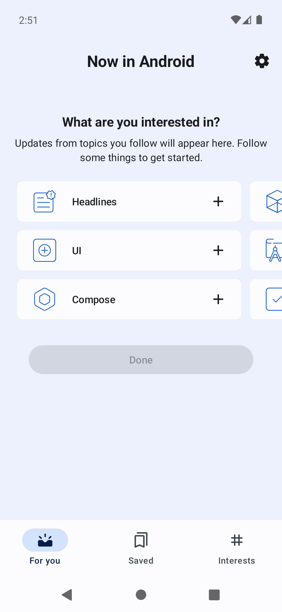

# Composeのユニットテストについて学ぶ

このセクションでは、Jetpack Composeによって構築されたUIをテストする方法を学ぶ。
Jetpack Composeでは、Composable関数に対するユニットテストによって、UIに対するテストを実現できる。

- [テスト対象の概要](#system-under-test)
- [Composeのユニットテストの書き方を理解する](#compose-unit-test)
- [実践: Composeのユニットテストを書いてみる](#writing-test)
    - [UIコンポーネントの状態を検証するテスト](#assertions-api)
    - [UIコンポーネントを操作した結果を検証するテスト](#actions-api)
    - [Scrollableなコンポーネントのテスト](#scrollable)

## <a id="system-under-test"></a>テスト対象の概要

- テスト対象クラス：[ForYouScreen](../../feature/foryou/src/main/java/com/google/samples/apps/nowinandroid/feature/foryou/ForYouScreen.kt)

### `ForYouScreen`の画面仕様

|                       初期状態                   |チェック済み状態|フィード|
|:------------------------------------------------:|:---:|:---:|
||||


`ForYouScreen`は全体的に縦スクロール可能となっている。

アプリを起動した直後の画面が**初期状態**のスクリーンショットである。
初期状態では複数のトピック(`Headlines`, `UI`, `Compose`, ...)が3行ずつ横方向に表示されている。
このトピック一覧の部分を**オンボーディング**セクションと呼ぶ。

### オンボーディング

オンボーディングセクションの特徴は次のとおり。

- 横スクロール可能である
- トピックの一覧が表示されている
- 何もチェックされていない場合は`Done`ボタンがdisabled状態になっている
- トピックの各要素はタップ可能で、タップするとチェックがつく

### チェック済み状態

<!-- textlint-disable japanese/no-doubled-joshi -->
オンボーディングセクション内のトピックにチェックが付いた状態が、**チェック済み状態**のスクリーンショットである。
チェック済み状態の特徴は次のとおり。
<!-- textlint-enable -->

- トピックにチェックがつくと`Done`ボタンがenabled状態になる
- 任意のトピックをチェックすると`Done`ボタンの下に関連する記事の一覧が表示される
- トピックは複数チェックできる
- `Done`ボタンをタップするとオンボーディングセクションが消滅し、記事の一覧だけの画面になる

### <a id="feed"></a>フィード

オンボーディングセクションのトピックをチェックすると、`Done`ボタンの下に関連する記事の一覧が表示される。
その記事の一覧部分を**フィード**と呼ぶ。
また、`Done`ボタンを押すと、オンボーディングセクションが消滅し、フィードだけの画面になる(**フィード**のスクリーンショット参照)。

フィードの特徴は次のとおり。

- フォロー中のトピックがあるか、オンボーディングセクションでトピックにチェックを入れると、`Done`ボタンの下に表示される
- ブックマークボタンや関連トピック(記事の下部に`HEADLINES`などと表示されている部分)はタップ可能である
- 各記事が表示されているカード全体もタップできる。タップするとその記事のWebページが表示される

## <a id="compose-unit-test"></a>Composeのユニットテストの書き方を理解する

- テストクラス：[ForYouScreenTest](../../feature/foryou/src/androidTestExercise/java/com/google/samples/apps/nowinandroid/feature/foryou/ForYouScreenTest.kt)

### テストの方針

ComposeのユニットテストではViewModelの結合は行わず、空のActivityを起動してテストする。
[公式ドキュメント](https://developer.android.com/jetpack/compose/state?hl=ja#state-hoisting)にしたがって適切に状態ホイスティングがなされているComposable関数は、色々な状態を外から渡せる構造になっているためテスタビリティが高い。

ただし、状態ホイスティングを用いると、UIの変更につながる情報は、すべてComposable関数の引数として渡されるUI Stateから得ることになる。
UI Stateの変更は通常ViewModelから通知されるため、ViewModelを結合しないComposeのユニットテストでは「ViewModelによるUI Stateの変更によってUIが変化すること」というテストは書けない。
代わりに、引数に渡されたUI Stateの内容に応じて、UIが期待どおり表示されていることを確認するテストを書く。

### テストのセットアップ

#### 依存ライブラリの追加

Compose Testing APIをテストで使えるように、次の依存ライブラリを追加する。

```gradle
dependencies {
    androidTestImplementation("androidx.compose.ui:ui-test-junit4:$compose_version")
    // createAndroidComposeRule()を使う場合に必要となる。createComposeRule()しか使わない場合は不要。
    debugImplementation("androidx.compose.ui:ui-test-manifest:$compose_version")
}
```

<!-- textlint-disable ja-no-redundant-expression -->
これはInstrumented Testでテストする場合の宣言だが、Robolectricを使ってLocal Testでテストすることもできる。
その場合は`androidTestImplementation`を`testImplementation`に読み替えること。
<!-- textlint-enable -->


#### テストクラスの宣言

Composeのテストでは`createComposeRule`関数や`createAndroidComposeRule`関数呼び出しによって取得できる`ComposeTestRule`を利用する。
この`ComposeTestRule`を通して、ツリー上から特定のコンポーネントを探したり、それに対するアクションやアサーションを実行できる。

テストしたいComposable関数を、`ComposeTestRule`の`setContent`内で呼び出すことで、テスト対象を自由に選択できる。

```kotlin
class ForYouScreenTest {
    @get:Rule
    val composeTestRule = createAndroidComposeRule<ComponentActivity>()

    @Test
    fun my_first_compose_test() {
        composeTestRule.setContent {
            TODO("ここでテストしたいComposable関数をを呼び出す")
        }
    }
}
```

### Compose Testing APIの概要

Composeのテストに使われるAPIには、大きく4つカテゴリーに分類できる。

- **Finders**：目的のUIコンポーネントを、Composeの**セマンティックツリー**から特定するAPI
- **Assertions**：(Finders APIによって特定した)UIコンポーネントの属性が期待どおりであることを検証するAPI
- **Actions**：(Finders APIによって特定した)UIコンポーネントを操作するAPI
- **Matchers**：あるUIコンポーネントが満たすべき条件(Matcher)を返すAPI。
  このAPIによって返されるMatcherは、Finders APIの検索条件や、Assertions APIが「期待どおりであるか判定する条件」として利用される


本ハンズオンでは、個々のAPIの詳しい説明はしない。
[Compose testing cheatsheet](https://developer.android.com/jetpack/compose/testing-cheatsheet)
がカテゴリー別にCompose Testing APIを分類した早見表となっているので、このチートシートを見ながらテストを書くとよい。

### Finders APIを理解する

Composeのテストでは、構築されたセマンティックツリー(後述)から任意のコンポーネント(セマンティックツリーの用語では**ノード**と呼ぶ)を見付けて、そのコンポーネントに対してアサーションやアクションを行う。
Finders APIを使うと、目的のノードをセマンティックツリーから見付けることができる。

`contentDescription`に`"Loading for you…"`と設定されているUIコンポーネントを探すには次のように書く。

```kotlin
composeTestRule.setContent {
    ForYouScreen(...)
}


composeTestRule
    .onNodeWithContentDescription("Loading for you…")
```

代表的なFinders APIをいくつか紹介する。

#### `onNode()`関数

`onNodeWithText()`や`onNodeWithContentDescription()`の他に、`onNode()`というメソッドが存在する。
`onNode()`メソッドの引数に任意のMatcherを渡すことで、ツリーから任意の条件に合致するノードを探すことができる。

clickableなノードをみつけるコード例は次のとおり。

```kotlin
composeTestRule
    .onNode(hasClickAction())
```

複数のMatcherをANDやORで組み合わせることもできる。
オフであり、かつ、clickableなノードをみつけるコード例は次のとおり。

```kotlin
composeTestRule
    .onNode(hasClickAction() and isOff())
```

#### `onAllNodes()`関数

`onNode()`関数はMatcherにマッチする1つのノード(最初にマッチしたもの)を取得できるのに対して、`onAllNodes()`関数ではMatcherにマッチするすべてのノードを取得できる。

たとえばリストがあり、そのリストには`contentDescription`属性が`"You can click this Item!"`となっているリストアイテムが複数あるとする。
そのようなリストアイテム**すべて**について、クリック可能であることを検証するコードは次のようになる。


```kotlin
composeTestRule
    .onAllNodes(hasContentDescription("You can click this Item!"))
    .assertAll(hasClickAction())
```

#### 親要素や子要素にアクセスする関数

`onNode()`関数などでみつけたノードの親要素や子要素を見付けるには`onParent()`や`onChild()`などを使う。


- 親要素にアクセスする例  
  ```kotlin
  composeTestRule
      .onNodeWithText("test")
      .onParent()
  ```
- 子要素(複数の子がある場合は先頭)にアクセスする例  
  ```kotlin
  composeTestRule
      .onNodeWithText("test")
      .onChild() // 子要素のツリーの1番先頭
  ```
- すべての子要素にアクセスする例  
  ```kotlin
  composeTestRule
     .onNodeWithText("test")
     .onChildren() // この場合は全ての子要素
  ```

### セマンティックツリーを理解する

前で軽く触れたように、Finders APIが目的のUIコンポーネントを探す対象はセマンティックツリーである。
Jetpack Composeでは、Composable関数の実行によってUIツリーを構築するが、それと一緒に**セマンティックツリー**も構築する。

セマンティックツリーには描画に関する情報はない。
代わりにコンポーザブルの意味に関する情報が含まれており、ユーザー補助サービス(アクセシビリティ)とテストフレームワークから利用される。

そのため、ユーザー補助サービスとテストフレームワークの両方から認識されやすいセマンティックツリーになるように、UIを構築する必要がある。

#### <a id="print-to-log"></a>セマンティックツリーの観察

Composeのテストを書いていると、どうしても目的のノードが見付けられなかったり、ツリー構造が想定と異なる事象に悩まされることがある。
`printToLog()`メソッドを使うとセマンティックツリーのログを出力できるので、そのような時のデバッグの手段として利用できる。
ログからどんなノードがどんな値を持っているのか、ツリー構造が想定どおりか、などを確認できる。


```kotlin
composeTestRule.setContent {
    ForYouScreen(...)
}

composeTestRule.onRoot().printToLog("Log") // printToLogの引数にはlogcatのタグを指定する
```

```text
Log     : printToLog:
Log     : Printing with useUnmergedTree = 'false'
Log     : Node #1 at (l=0.0, t=299.0, r=1080.0, b=2208.0)px
Log     :  |-Node #4 at (l=0.0, t=299.0, r=1080.0, b=2208.0)px, Tag: 'forYou:feed'
Log     :  | VerticalScrollAxisRange = 'ScrollAxisRange(value=0.0, maxValue=0.0, reverseScrolling=false)'
Log     :  | CollectionInfo = 'androidx.compose.ui.semantics.CollectionInfo@f4fc348'
Log     :  | Actions = [IndexForKey, ScrollBy, ScrollToIndex]
Log     :  |-Node #7 at (l=458.0, t=299.0, r=623.0, b=464.0)px, Tag: 'forYou:loadingWheel'
Log     :     |-Node #8 at (l=480.0, t=321.0, r=601.0, b=442.0)px
Log     :       ContentDescription = '[Loading for you…]'
```

たとえば、このログからは次のことが分かる。

- `Node #4`はスクロールできる
- `Node #8`の`contentDescription`属性は`"Loading for you…"`である


#### タグを使って一意のノードにする

Composeの`Modifier`には`testTag()`というメソッドが存在する。
このメソッドを使うと、対応するセマンティックツリーのノードに**テストタグ**を付けられる。

テストタグに一意な文字列を設定すると、そのテストタグを検索条件にすることで目的のノードを簡単に見付けられるようになる。

次のコードでは`LazyVerticalGrid`に`"forYou:feed"`というテストタグを付与している。

```kotlin
LazyVerticalGrid(
    columns = Adaptive(300.dp),
    contentPadding = PaddingValues(16.dp),
    horizontalArrangement = Arrangement.spacedBy(16.dp),
    verticalArrangement = Arrangement.spacedBy(24.dp),
    modifier = modifier
        .fillMaxSize()
        .testTag("forYou:feed"),
    state = state
)
```

このときのツリー構造は次のようになる。
`Node #4`に`"forYou:feed"`という`Tag`が付いていることが読み取れる。

```text
Log     : printToLog:
Log     : Printing with useUnmergedTree = 'false'
Log     : Node #1 at (l=0.0, t=299.0, r=1080.0, b=2208.0)px
Log     :  |-Node #4 at (l=0.0, t=299.0, r=1080.0, b=2208.0)px, Tag: 'forYou:feed'
Log     :    VerticalScrollAxisRange = 'ScrollAxisRange(value=0.0, maxValue=6.0, reverseScrolling=false)'
Log     :    CollectionInfo = 'androidx.compose.ui.semantics.CollectionInfo@e37367e'
Log     :    Actions = [IndexForKey, ScrollBy, ScrollToIndex]
Log     :     |-Node #6 at (l=44.0, t=343.0, r=1036.0, b=2456.0)px, Tag: 'news:expandedCard'
Log     :       Role = 'Button'
Log     :       Focused = 'false'
Log     :       Text = '[...]'
Log     :       HorizontalScrollAxisRange = 'ScrollAxisRange(value=0.0, maxValue=0.0, reverseScrolling=false)'
Log     :       Actions = [OnClick, RequestFocus, GetTextLayoutResult, ScrollBy]
Log     :       MergeDescendants = 'true'
Log     :        |-Node #17 at (l=871.0, t=926.0, r=981.0, b=1036.0)px
Log     :        | Role = 'Checkbox'
Log     :        | Focused = 'false'
Log     :        | ToggleableState = 'On'
Log     :        | ContentDescription = '[Unbookmark]'
Log     :        | Actions = [OnClick, RequestFocus]
Log     :        | MergeDescendants = 'true'
Log     :        |-Node #27 at (l=88.0, t=2291.0, r=248.0, b=2401.0)px
Log     :          Role = 'Button'
Log     :          Focused = 'false'
Log     :          ContentDescription = '[UI is followed]'
Log     :          Text = '[UI]'
Log     :          Actions = [OnClick, RequestFocus, GetTextLayoutResult]
Log     :          MergeDescendants = 'true'
```

このテストタグを条件にして目的のノードを取得するテストコードは次のとおり。

```kotlin
composeTestRule.setContent {
    ForYouScreen(...)
}

composeTestRule
    .onNodeWithTag("forYou:feed")
```

このテストコードであれば、画面デザイン変更によってUIの階層構造が変化しても(タグさえ変更されなければ)コードを修正する必要がない。

## <a id="writing-test"></a>実践: Composeのユニットテストを書いてみる

- `demoExerciseDebug`ビルドバリアントで
  [`feature/foryou/src/androidTestExercise/java/com/google/samples/apps/nowinandroid/feature/foryou/ForYouScreenTest.kt`](../../feature/foryou/src/androidTestExercise/java/com/google/samples/apps/nowinandroid/feature/foryou/ForYouScreenTest.kt)
  を開いて作業する
- `demoAnswerDebug`ビルドバリアントに切り替えると解答例を確認できる

### <a id="assertions-api"></a>UIコンポーネントの状態を検証するテスト

Assertions APIを使って、UIコンポーネントの状態を検証するテストを書いてみよう。
Finders APIを使って、セマンティックツリーから目的のノードを見付けられたら、
そのノードに対してAssertions APIを呼び出せる。

#### 存在の検証

`assertExists()`を使うと、目的のノードがセマンティックツリー上に存在していることを確認できる。


```kotlin
@Test
fun `Loading中にCircularProgressIndicatorが存在していること`() {
    composeTestRule.setContent {
        BoxWithConstraints {
            ForYouScreen(
                isSyncing = false,
                onboardingUiState = OnboardingUiState.Loading,
                feedState = NewsFeedUiState.Loading,
                onTopicCheckedChanged = { _, _ -> },
                saveFollowedTopics = {},
                onNewsResourcesCheckedChanged = { _, _ -> }
            )
        }
    }

    composeTestRule
        // Loading for you…というcontentDescriptionをもつノードを探す
        .onNodeWithContentDescription("Loading for you…")
        // ツリー上に存在していることを確認する
        .assertExists()
}
```

#### ボタンのenabled属性の検証

UIコンポーネントのenabled属性を検証するには`assertIsEnabled()`・`assertIsNotEnabled()`を使う。

```kotlin
@Test
fun `初期状態ではDoneボタンがdisableになっていること`() {
    composeTestRule.setContent {
        ForYouScreen(
            isSyncing = false,
            onboardingUiState = OnboardingUiState.Shown(topics = testTopics),
            feedState = NewsFeedUiState.Success(emptyList()),
            onTopicCheckedChanged = { _, _ -> },
            saveFollowedTopics = {},
            onNewsResourcesCheckedChanged = { _, _ -> }
        )
    }

    composeTestRule
        // Doneと書かれたノードを探す
        .onNodeWithText("Done")
        // disabledである(=enabledではない)ことを確認する
        .assertIsNotEnabled()
}
```

#### その他のAssertions API

上記以外にもさまざまなAssertions APIが存在する。

- `assertIsDisplayed()`・`assertIsNotDisplayed()`
    - 画面上に表示されているかどうかを検証する
    - Column等で構築されたUIの場合、ツリー上には存在するが画面上に表示されていない場合があるので、画面上に表示されてるか検証する場合にはこちらを利用する
- `assertIsOn()`・`assertIsOff()`
    - チェックボックスのON・OFFを検証する
- `assertHasClickAction`・`assertHasNoClickAction`
    - クリック可能かどうかを検証する

#### 練習問題1
  
テストクラス`ForYouScreenTest`の次のテストメソッドについて、`// TODO` 部分を埋めてテストを完成させよう。

- テストメソッド：`Headlinesと書かれたトピックがチェックされていないこと()`
- テスト概要：オンボーディングセクション中の`Headlines`と書かれたトピックがチェックされていないことを確認する

「[セマンティックツリーの観察](#print-to-log)」を参考に、まずはツリー構造がどうなっているのか確認してみよう。
ツリー構造がわかったらテストを書いてみよう。

### <a id="actions-api"></a>UIコンポーネントを操作した結果を検証するテスト

Actions APIを使って、UIコンポーネントの操作を実現できる。
ViewModelと結合したテストであれば、操作の結果UIの状態が変化するため、前述のAssertions APIと組み合わせれば変化したUIの状態を検証できる。

なお、本セクションで扱っているComposeのユニットテストはViewModelと結合していないため、操作によってUIが変化することはない。
代わりに`onClick`アクションなどが呼ばれたこと検証することになる(練習問題2)。

#### クリックする

`performClick()`を使うと、目的のノードに対応するコンポーネントをクリックできる。

```kotlin
composeTestRule.setContent {
    ForYouScreen(...)
}

composeTestRule
  .onNodeWithText("Done")
  .performClick()
```

#### 練習問題2

テストクラス`ForYouScreenTest`の次のテストメソッドについて、`// TODO` 部分を埋めてテストを完成させよう。

- テストメソッド：`SingleTopicButtonを押した時にonClickが呼ばれること()`
- テスト概要：次のように`SingleTopicButton`が配置されている。それをクリックしたときに`onClick`アクションが呼ばれることを確認する  
  ```kotlin
  var onClickCalled = false
  composeTestRule.setContent {
      BoxWithConstraints {
          SingleTopicButton(
              name = "UI",
              topicId = "TOPIC_ID_1",
              imageUrl = "",
              isSelected = false,
              onClick = { _, _ ->
                  onClickCalled = true
              }
          )
      }
  }

  ```

このコードで`onClick`アクションに設定されているλ式が呼ばれると`onClickCalled`が`true`になる。
それを利用して`onClick`アクションが呼ばれたことを確認しよう。

### <a id="scrollable"></a>Scrollableなコンポーネントのテスト

Composableがスクロール可能で、かつスクロール後に表示されるUIコンポーネントを検証したい場合は、`performScrollTo()`というAPIを用いる。
`performScrollTo()`は、目的のノードが画面内に現れるまでスクロールする。

```kotlin
@Test
fun scrollTest() {
    composeTestRule.setContent {
        ScrollableScreen()
    }

    composeTestRule
        .onNodeText("item1")
        .performScrollTo()
}
// ※このコードははNow In Androidアプリには存在しない
```

このコードは、`item1`と書かれたコンポーネントがあるところまでスクロールする。

ただし、`performScrollTo()`はすでにセマンティックツリーが構築されているものの中からしか探すことができない。
すなわち、`verticalScroll`や`horizontalScroll`を適用している場合にしか利用できない。

<!-- textlint-disable japanese/no-doubled-joshi -->
`LazyColumn`や`LazyRow`を使ってリストが構築されている場合は、リストアイテムが画面に表示される直前にUIが構築される。
そのため、リストの下の方にあるコンポーネントまで`performScrollTo()`でスクロールしようとしても、目的のノードが見付からずエラーになってしまう。
<!-- textlint-enable -->

そのようなケースでは代わりに`performScrollToNode()`を用いる。
`performScrollToNode()`であれば、まだセマンティックツリー内に存在していないノードであっても、それに対応するコンポーネントが表示されるまでスクロールできる。

`performScrollToNode()`メソッドは、`hasScrollToNodeAction()`にマッチする(スクロール可能な)ノードに対して呼びだす必要がある。
スクロールによって画面内に現れて欲しいノードに対してではないことに注意すること。

```kotlin
@Test
fun scrollToNodeTest() {
    composeTestRule.setContent {
        LazyScrollableScreen()
    }

    composeTestRule.onNode(hasScrollToNodeAction())
        .performScrollToNode(hasText("item1")
}
// ※このコードははNow In Androidアプリには存在しない
```

#### 練習問題3

テストクラス`ForYouScreenTest`の次のテストメソッドについて、`// TODO` 部分を埋めてテストを完成させよう。

- テストメソッド：`クリック可能なフィードの1つ目が画面上に表示されていて、2つ目までスクロールできること()`
- テスト概要：1つめのフィードが画面上に表示されており、2つ目のフィードまでスクロールできることを確認する

「[セマンティックツリーの観察](#print-to-log)」を参考に、まずはツリー構造がどうなっているのか確認してみよう。

クリック可能なフィードの1つ目には`Android Basics with Compose`という文字列が、2つ目には`Thanks for helping us reach 1M YouTube Subscribers`という文字列がそれぞれ含まれている。  
それを踏まえて、次の手順をテストコードに落とし込もう。


1. `Android Basics with Compose`というテキストを含むノードを探し、クリック可能であることを検証する  
   (ヒント：[onNodeWithTextのAPIリファレンス](https://developer.android.com/reference/kotlin/androidx/compose/ui/test/SemanticsNodeInteractionsProvider#%28androidx.compose.ui.test.SemanticsNodeInteractionsProvider%29.onNodeWithText%28kotlin.String,kotlin.Boolean,kotlin.Boolean,kotlin.Boolean%29)を見て、テキストの一部にマッチさせる方法を確認しよう)
2. `performScrollToNode()`を使って、
   `Thanks for helping us reach 1M YouTube Subscribers`というテキストを含むノードが画面に表示されるまでスクロールする
   (ヒント：`performScrollTo()`を使ったコードとの違いを意識しよう)
3. `Thanks for helping us reach 1M YouTube Subscribers`というテキストを含むノードが画面上に表示されていることと、クリック可能であることを検証する

## まとめ

Jetpack Composeによって構築されたUIについて、ViewModelや実Activityと結合せずにテストする方法を説明した。

まず、Composeのテストに使用するCompose Testing APIを解説し、Assertions APIやActions APIの使い方を練習問題を解きながら学んだ。
さらに発展的な内容として、スクロールが絡むテストの方法を紹介した。
