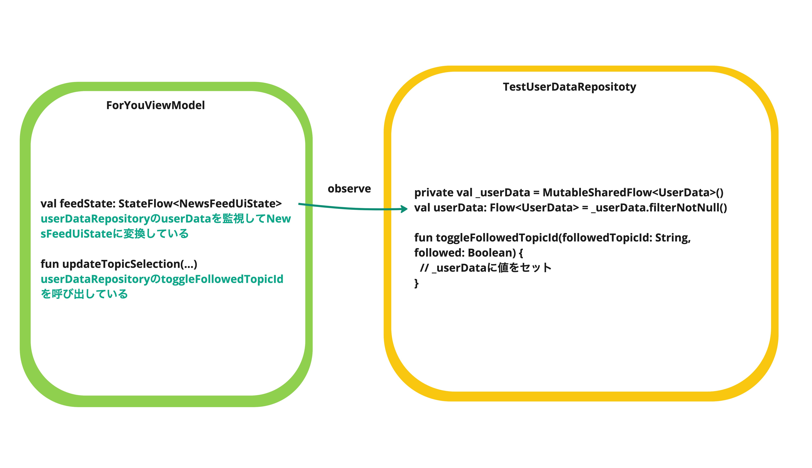

# ViewModelを結合してComposeをテストする


このセクションでは、Jetpack Composeによって構築されたUIを**ViewModelと結合した状態で**テストする方法を学ぶ。

<!-- textlint-disable japanese/no-doubled-joshi -->
直前のセクションからの続きとなっているため、本セクションのハンズオンに取りかかる前に「[Composeのユニットテストについて学ぶ](UIElementTest_Compose.md)」を読んでおいてほしい。
<!-- textlint-enable -->

ViewModelまで結合すると、ユーザーインタラクションによってUI Stateが変更され、その結果UIが変化するようになる。  
したがって、(ViewModelと結合しない)ユニットテストでは不可能だった「UI操作の結果、UIが期待どおりに変化すること」というテストが書けるようになる。

- [テスト対象の概要](#system-under-test)
- [ViewModelと結合したComposeのテストの書き方を理解する](#viewmodel-compose-test)
  - [テストの方針](#strategy)
  - [テストの初期データをセットアップする](#setup)
  - [セマンティクスツリーを確認する](#semantic-tree)
  - [フィードにタグをつける](#test-tag)
  - [テストの書き方](#writing-tests)
  - [練習問題](#exercise)

## <a id="system-under-test"></a>テスト対象の概要

- テスト対象クラス：[ForYouScreen](../../feature/foryou/src/main/java/com/google/samples/apps/nowinandroid/feature/foryou/ForYouScreen.kt)
- 関連ViewModel：[ForYouViewModel](../../feature/foryou/src/main/java/com/google/samples/apps/nowinandroid/feature/foryou/ForYouViewModel.kt)

### `ForYouScreen`で使われているUI Stateとデータの流れ

テスト対象クラス`ForYouScreen`では、UI Stateとして`NewsFeedUiState`と`OnboardingUiState`が使われている。

```kotlin
@Composable
internal fun ForYouRoute(
    modifier: Modifier = Modifier,
    viewModel: ForYouViewModel = hiltViewModel()
) {
    val onboardingUiState: OnboardingUiState by viewModel.onboardingUiState.collectAsStateWithLifecycle()
    val feedState: NewsFeedUiState by viewModel.feedState.collectAsStateWithLifecycle()
    ...

    ForYouScreen(
        onboardingUiState = onboardingUiState,
        feedState = feedState,
        ...
    )
}
```

それぞれの`ForYouScren`における使われ方は次のとおり。

- `NewsFeedUiState`
  - sealed interfaceとして定義されており、`Loading`と`Success`の2つの状態をもつ
  - `Success`のときは、`List<UserNewsResource>`型のプロパティ`feed`をもつ
  - 状態が`Success`で、かつ`feed`が空でなければ[フィード](UIElementTest_Compose.md#feed)が表示される
- `OnboardingUiState`
  - sealed interfaceとして定義されており、`Loading`、`LoadFailed`、`NotShown`、`Shown`の状態をもつ
  - `Shown`のときは`List<FollowableTopic>`型のプロパティ`topics`をもつ
  - ユーザーがフォローしているトピックがあれば、`FollowableTopic`の`isFollowed`が`true`となり、
    `isFollowed`が`true`ならばオンボーディングのトピックボタンのチェックがつく  
    ([`ForYouScreen.kt`](../../feature/foryou/src/main/java/com/google/samples/apps/nowinandroid/feature/foryou/ForYouScreen.kt)の`TopicSelection`関数)

一方、`ForYouViewModel`は`UserDataRepository`の`userData.followedTopics`を監視している。
次のように、その値が変更されると`NewsFeedUiState`と`OnboardingUiState`が変更され、
変更後の値が`ForYouViewModel`の`feedState`プロパティと`onboardingUiState`プロパティを通じて通知される。

```kotlin
// ForYouViewModel

val feedState: StateFlow<NewsFeedUiState> =
    userDataRepository.userData
        .map { userData ->
            ...
            getSaveableNewsResources(
                filterTopicIds = userData.followedTopics
            ).mapToFeedState()
        }
        .stateIn(...)

val onboardingUiState: StateFlow<OnboardingUiState> =
    combine(
        shouldShowOnboarding,
        getFollowableTopics() // GetFollowableTopicsUseCase.invoke()が呼ばれる
    ) { ... }
        .stateIn(...)
```
```kotlin
// GetFollowableTopicsUseCase

operator fun invoke(sortBy: TopicSortField = NONE): Flow<List<FollowableTopic>> {
    return combine(
        userDataRepository.userData,
        topicsRepository.getTopics()
    ) { userData, topics ->
        val followedTopics = topics
            .map { topic ->
                FollowableTopic(
                    topic = topic,
                    isFollowed = topic.id in userData.followedTopics
                )
            }
        when (sortBy) {
            NAME -> followedTopics.sortedBy { it.topic.name }
            else -> followedTopics
        }
    }
}
```

オンボーディングのトピックボタンがタップされると、次のようにデータが流れて`UserDataRepository`の`userData.followedTopics`が更新される。

1. `onTopicCheckedChanged`引数として渡されている`ForYouViewModel`の`updateTopicSelection`が呼ばれる
2. `UserDataRepository`の`toggleFollowedTopicId`が呼ばれた結果`userData`の`followedTopics`が変更される

その結果、前述の流れで2つのUI Stateが更新され、`ForYouScreen`が更新を`ForYouViewModel`から受け取り、
最終的に`ForYouScreen`のフィードやトピックボタンのチェックマークが更新されることになる。

## <a id="viewmodel-compose-test"></a>ViewModelと結合したComposeのテストの書き方を理解する

- テストクラス：[ForYouScreenWithViewModelTest](../../feature/foryou/src/androidTestExercise/java/com/google/samples/apps/nowinandroid/feature/foryou/ForYouScreenWithViewModelTest.kt)

### <a id="strategy"></a>テストの方針

ViewModelと結合したComposeのテストでは、UI操作の結果ViewModelのメソッドが呼び出され、
最終的にUI Stateの変更通知をComposeが受け取り、UIが期待どおりに変化することを確認したい。

もし、呼び出されたViewModelのメソッド内部の処理が**ViewModelに閉じている場合**(Repositoryに依存せずにUI Stateを更新している場合)、そのようなテストはViewModelさえ結合すれば実現できる。

逆に、内部の処理が**Repositoryに依存している**ケースでは、そのRepositoryとして何と結合してテストするのかを考えなければならない。
もちろん、実Repositoryと結合すれば目的のテストは実現できるが、ViewModelがUI Stateの変更を通知できるようになっていればRepositoryをテストダブルに置き換えてもよい。

ここでは、ViewModelと結合したComposeのテストで検証すべきことを、
ViewModel側のテストにおけるアプローチ([「ViewModelをテストする」の「各アプローチのまとめ」](ViewModel.md#各アプローチのまとめ)参照)別に考える。

#### ViewModel側でFake Repositoryや実Repositoryを利用してテストしている場合

今回テストしたい処理は次のような流れになる。
その一連の流れのうち、ステップ2から4はViewModel側のテストで確認できていることになる(Fake Repositoryの場合はステップ3はFake実装になる)。

1. UI操作によってViewModelのメソッドが呼び出される
2. ViewModelのメソッド内部でRopositoryのメソッドが呼び出される
3. Repositoryが公開しているFlowが更新され、ViewModelに通知される
4. ViewModelがRepositoryからの通知にもとづいてUI Stateを更新する
5. Composeが更新されたUI Stateを受け取る
6. 更新されたUI Stateに応じて画面が変化する

さらに「[Composeのユニットテストについて学ぶ](UIElementTest_Compose.md)」で触れたようにUI Stateのバリエーションがテストされていれば、ステップ6も確認できていることになる。
そのように考えると、ViewModelと結合したComposeのテストで確認すべきはステップ1・ステップ5となる。

これらのステップは、ComposeのロジックのうちViewModelとつながっている部分であるため、そのつながりが正しく実装されていることを確認するテストが考えられる。
その場合、テスト観点は次のようなものになる。

- 各UIコンポーネントが操作されたときに画面が更新されるか？  
  (UI操作に対応するViewModelのメソッドが呼び出されていることを確認したい)
- 各UI Stateの更新によって画面が更新されるか？  
  (UI Stateの更新通知にComposeが反応することを確認したい)
- そのほか、最上位のComposable関数がViewModelを受け取ってから下流のComposable関数にUI Stateを渡すまでの間に特別なロジックがあれば、そのロジックが正しいか？


#### ViewModel側でFake以外のテストダブルを利用してテストしている場合

ViewModel側のテストでは、ViewModelのメソッド呼び出しに応じてUI Stateが更新される一連の流れがテストできていない状態である。
そのため、ViewModelと結合したComposeのテストで一覧の流れをテストできるのが望ましい。

このケースの大半ではFake Repositoryを用意していないと思われるため、実Repositoryと結合してテストを書き、ViewModelでテストできなかった範囲をカバーするアプローチが考えられる。
あるいは、ViewModelと結合したComposeのテストではその確認は行わず、実際のActivityと結合したテストなど、より結合範囲の広いテストで代替する案もある。

いずれにせよ[ViewModelと結合しないユニットテスト](UIElementTest_Compose.md)でUI Stateのバリエーションによるテストをしておくと安心できる。


#### 本セクションで取るアプローチ

本セクションでは、Fake Repositoryを使った例として、すでに用意されている`TestUserDataRepository`などを使う。



```kotlin
class TestUserDataRepository : UserDataRepository {
    /**
     * The backing hot flow for the list of followed topic ids for testing.
     */
    private val _userData = MutableSharedFlow<UserData>(replay = 1, onBufferOverflow = DROP_OLDEST)

    private val currentUserData get() = _userData.replayCache.firstOrNull() ?: emptyUserData

    override val userData: Flow<UserData> = _userData.filterNotNull()

    override suspend fun setFollowedTopicIds(followedTopicIds: Set<String>) {
        _userData.tryEmit(currentUserData.copy(followedTopics = followedTopicIds))
    }

    override suspend fun toggleFollowedTopicId(followedTopicId: String, followed: Boolean) {
        currentUserData.let { current ->
            val followedTopics = if (followed) current.followedTopics + followedTopicId
            else current.followedTopics - followedTopicId

            _userData.tryEmit(current.copy(followedTopics = followedTopics))
        }
    }
    ...
}
```

また、ViewModelが参照するRepositoryをFake Repositoryに置き換える必要があることから、テスト対象のComposable関数の引数にViewModelインスタンスを渡せる設計になっていることが望ましい。

Now in Androidアプリでは、`ForYouRoute()`のような、最後に`Route`が付いているComposable関数がその条件を満たしている。

```kotlin
@Composable
internal fun ForYouRoute(
    modifier: Modifier = Modifier,
    viewModel: ForYouViewModel = hiltViewModel()
) { ... }
```

### <a id="setup"></a>テストの初期データをセットアップする

テストの初期データとして、以下をセットアップ時に登録しておく。

- どのトピックもフォローしていないユーザー(`emptyUserData`)
- 複数のトピック(`testTopics`)
- トピックに紐づいたニュース(`testNewsResource`)

```kotlin
@Before
fun setup() {
    userDataRepository.setUserData(emptyUserData)
    topicsRepository.sendTopics(testTopics)
    newsRepository.sendNewsResources(testNewsResource)
}
```

### <a id="semantic-tree"></a>セマンティクスツリーを確認する
<details><summary>ニュースが表示されていない場合</summary>

テストクラス`ForYouScreenWithViewModelTest`の`showTree_noNews`メソッドを実行すると確認できる。

```text
noNews  : printToLog:
noNews  : Printing with useUnmergedTree = 'false'
noNews  : Node #1 at (l=0.0, t=283.0, r=1080.0, b=2337.0)px
noNews  :  |-Node #2 at (l=0.0, t=283.0, r=1080.0, b=2337.0)px, Tag: 'forYou:feed'
noNews  :    VerticalScrollAxisRange = 'ScrollAxisRange(value=0.0, maxValue=0.0, reverseScrolling=false)'
noNews  :    CollectionInfo = 'androidx.compose.ui.semantics.CollectionInfo@4e9c316'
noNews  :    Actions = [IndexForKey, ScrollBy, ScrollToIndex]
noNews  :     |-Node #11 at (l=0.0, t=325.0, r=1080.0, b=1347.0)px, Tag: 'onboarding'
noNews  :        |-Node #12 at (l=0.0, t=388.0, r=1080.0, b=445.0)px
noNews  :        | Text = '[What are you interested in?]'
noNews  :        | Actions = [GetTextLayoutResult]
noNews  :        |-Node #13 at (l=42.0, t=466.0, r=1038.0, b=570.0)px
noNews  :        | Text = '[Updates from topics you follow will appear here. Follow some things to get started.]'
noNews  :        | Actions = [GetTextLayoutResult]
noNews  :        |-Node #14 at (l=0.0, t=570.0, r=1080.0, b=1200.0)px
noNews  :        | HorizontalScrollAxisRange = 'ScrollAxisRange(value=0.0, maxValue=0.0, reverseScrolling=false)'
noNews  :        | CollectionInfo = 'androidx.compose.ui.semantics.CollectionInfo@9fcf497'
noNews  :        | Actions = [IndexForKey, ScrollBy, ScrollToIndex]
noNews  :        |  |-Node #20 at (l=63.0, t=633.0, r=882.0, b=780.0)px
noNews  :        |  | Focused = 'false'
noNews  :        |  | Selected = 'false'
noNews  :        |  | Text = '[Headlines]'
noNews  :        |  | Actions = [OnClick, RequestFocus, GetTextLayoutResult]
noNews  :        |  | MergeDescendants = 'true'
noNews  :        |  |  |-Node #24 at (l=746.0, t=655.0, r=851.0, b=760.0)px
noNews  :        |  |    Role = 'Checkbox'
noNews  :        |  |    Focused = 'false'
noNews  :        |  |    ToggleableState = 'Off'
noNews  :        |  |    ContentDescription = '[Headlines]'
noNews  :        |  |    Actions = [OnClick, RequestFocus]
noNews  :        |  |    MergeDescendants = 'true'
noNews  :        |  |-Node #28 at (l=63.0, t=812.0, r=882.0, b=959.0)px
noNews  :        |  | Focused = 'false'
noNews  :        |  | Selected = 'false'
noNews  :        |  | Text = '[Android Studio]'
noNews  :        |  | Actions = [OnClick, RequestFocus, GetTextLayoutResult]
noNews  :        |  | MergeDescendants = 'true'
noNews  :        |  |  |-Node #32 at (l=746.0, t=834.0, r=851.0, b=939.0)px
noNews  :        |  |    Role = 'Checkbox'
noNews  :        |  |    Focused = 'false'
noNews  :        |  |    ToggleableState = 'Off'
noNews  :        |  |    ContentDescription = '[Android Studio]'
noNews  :        |  |    Actions = [OnClick, RequestFocus]
noNews  :        |  |    MergeDescendants = 'true'
noNews  :        |  |-Node #36 at (l=63.0, t=991.0, r=882.0, b=1137.0)px
noNews  :        |    Focused = 'false'
noNews  :        |    Selected = 'false'
noNews  :        |    Text = '[Compose]'
noNews  :        |    Actions = [OnClick, RequestFocus, GetTextLayoutResult]
noNews  :        |    MergeDescendants = 'true'
noNews  :        |     |-Node #40 at (l=746.0, t=1012.0, r=851.0, b=1117.0)px
noNews  :        |       Role = 'Checkbox'
noNews  :        |       Focused = 'false'
noNews  :        |       ToggleableState = 'Off'
noNews  :        |       ContentDescription = '[Compose]'
noNews  :        |       Actions = [OnClick, RequestFocus]
noNews  :        |       MergeDescendants = 'true'
noNews  :        |-Node #16 at (l=105.0, t=1232.0, r=975.0, b=1337.0)px
noNews  :          Role = 'Button'
noNews  :          Text = '[Done]'
noNews  :          [Disabled]
noNews  :          Actions = [OnClick, GetTextLayoutResult]
noNews  :          MergeDescendants = 'true'
```
</details>

<details><summary>ニュースがある場合</summary>

テストクラス`ForYouScreenWithViewModelTest`の`showTree_hasNews`メソッドを実行すると確認できる。

```text
hasNews : printToLog:
hasNews : Printing with useUnmergedTree = 'false'
hasNews : Node #1 at (l=0.0, t=283.0, r=1080.0, b=2337.0)px
hasNews :  |-Node #2 at (l=0.0, t=283.0, r=1080.0, b=2337.0)px, Tag: 'forYou:feed'
hasNews :    VerticalScrollAxisRange = 'ScrollAxisRange(value=0.0, maxValue=0.0, reverseScrolling=false)'
hasNews :    CollectionInfo = 'androidx.compose.ui.semantics.CollectionInfo@cd7b9f3'
hasNews :    Actions = [IndexForKey, ScrollBy, ScrollToIndex]
hasNews :     |-Node #11 at (l=0.0, t=325.0, r=1080.0, b=1347.0)px, Tag: 'onboarding'
hasNews :     |  |-Node #12 at (l=0.0, t=388.0, r=1080.0, b=445.0)px
hasNews :     |  | Text = '[What are you interested in?]'
hasNews :     |  | Actions = [GetTextLayoutResult]
hasNews :     |  |-Node #13 at (l=42.0, t=466.0, r=1038.0, b=570.0)px
hasNews :     |  | Text = '[Updates from topics you follow will appear here. Follow some things to get started.]'
hasNews :     |  | Actions = [GetTextLayoutResult]
hasNews :     |  |-Node #14 at (l=0.0, t=570.0, r=1080.0, b=1200.0)px
hasNews :     |  | HorizontalScrollAxisRange = 'ScrollAxisRange(value=0.0, maxValue=0.0, reverseScrolling=false)'
hasNews :     |  | CollectionInfo = 'androidx.compose.ui.semantics.CollectionInfo@77466b0'
hasNews :     |  | Actions = [IndexForKey, ScrollBy, ScrollToIndex]
hasNews :     |  |  |-Node #20 at (l=63.0, t=633.0, r=882.0, b=780.0)px
hasNews :     |  |  | Focused = 'false'
hasNews :     |  |  | Selected = 'true'
hasNews :     |  |  | Text = '[Headlines]'
hasNews :     |  |  | Actions = [OnClick, RequestFocus, GetTextLayoutResult]
hasNews :     |  |  | MergeDescendants = 'true'
hasNews :     |  |  |  |-Node #24 at (l=746.0, t=655.0, r=851.0, b=760.0)px
hasNews :     |  |  |    Role = 'Checkbox'
hasNews :     |  |  |    Focused = 'false'
hasNews :     |  |  |    ToggleableState = 'On'
hasNews :     |  |  |    ContentDescription = '[Headlines]'
hasNews :     |  |  |    Actions = [OnClick, RequestFocus]
hasNews :     |  |  |    MergeDescendants = 'true'
hasNews :     |  |  |-Node #28 at (l=63.0, t=812.0, r=882.0, b=959.0)px
hasNews :     |  |  | Focused = 'false'
hasNews :     |  |  | Selected = 'false'
hasNews :     |  |  | Text = '[Android Studio]'
hasNews :     |  |  | Actions = [OnClick, RequestFocus, GetTextLayoutResult]
hasNews :     |  |  | MergeDescendants = 'true'
hasNews :     |  |  |  |-Node #32 at (l=746.0, t=834.0, r=851.0, b=939.0)px
hasNews :     |  |  |    Role = 'Checkbox'
hasNews :     |  |  |    Focused = 'false'
hasNews :     |  |  |    ToggleableState = 'Off'
hasNews :     |  |  |    ContentDescription = '[Android Studio]'
hasNews :     |  |  |    Actions = [OnClick, RequestFocus]
hasNews :     |  |  |    MergeDescendants = 'true'
hasNews :     |  |  |-Node #36 at (l=63.0, t=991.0, r=882.0, b=1137.0)px
hasNews :     |  |    Focused = 'false'
hasNews :     |  |    Selected = 'false'
hasNews :     |  |    Text = '[Compose]'
hasNews :     |  |    Actions = [OnClick, RequestFocus, GetTextLayoutResult]
hasNews :     |  |    MergeDescendants = 'true'
hasNews :     |  |     |-Node #40 at (l=746.0, t=1012.0, r=851.0, b=1117.0)px
hasNews :     |  |       Role = 'Checkbox'
hasNews :     |  |       Focused = 'false'
hasNews :     |  |       ToggleableState = 'Off'
hasNews :     |  |       ContentDescription = '[Compose]'
hasNews :     |  |       Actions = [OnClick, RequestFocus]
hasNews :     |  |       MergeDescendants = 'true'
hasNews :     |  |-Node #16 at (l=105.0, t=1232.0, r=975.0, b=1337.0)px
hasNews :     |    Role = 'Button'
hasNews :     |    Focused = 'false'
hasNews :     |    Text = '[Done]'
hasNews :     |    Actions = [OnClick, RequestFocus, GetTextLayoutResult]
hasNews :     |    MergeDescendants = 'true'
hasNews :     |-Node #49 at (l=42.0, t=1410.0, r=1038.0, b=1970.0)px
hasNews :       Focused = 'false'
hasNews :       Text = '[Pixel Watch, Nov 8, 2021 • Article 📚, ]'
hasNews :       HorizontalScrollAxisRange = 'ScrollAxisRange(value=0.0, maxValue=0.0, reverseScrolling=false)'
hasNews :       Actions = [OnClick, RequestFocus, GetTextLayoutResult, ScrollBy]
hasNews :       MergeDescendants = 'true'
hasNews :        |-Node #58 at (l=881.0, t=1495.0, r=986.0, b=1600.0)px
hasNews :        | Role = 'Checkbox'
hasNews :        | Focused = 'false'
hasNews :        | ToggleableState = 'Off'
hasNews :        | ContentDescription = '[Bookmark]'
hasNews :        | Actions = [OnClick, RequestFocus]
hasNews :        | MergeDescendants = 'true'
hasNews :        |-Node #68 at (l=84.0, t=1813.0, r=310.0, b=1918.0)px
hasNews :          Role = 'Button'
hasNews :          Focused = 'false'
hasNews :          ContentDescription = '[Headlines is followed]'
hasNews :          Text = '[HEADLINES]'
hasNews :          Actions = [OnClick, RequestFocus, GetTextLayoutResult]
hasNews :          MergeDescendants = 'true'
```
</details>

### <a id="test-tag"></a>フィードにタグをつける
フィードが表示されているかどうかをテストするにあたって、`onNodeWithText`や`onNodeWithContentDescription`でノードを探すのが難しいためタグをつける。

変更するファイル：[`NewsResourceCard.kt`](../../core/ui/src/exercise/java/com/google/samples/apps/nowinandroid/core/ui/NewsResourceCard.kt)

```diff
 @Composable
 fun NewsResourceCardExpanded(
     userNewsResource: UserNewsResource,
     isBookmarked: Boolean,
     onToggleBookmark: () -> Unit,
     onClick: () -> Unit,
     modifier: Modifier = Modifier
 ) {
     val clickActionLabel = stringResource(R.string.card_tap_action)
     Card(
         onClick = onClick,
         shape = RoundedCornerShape(16.dp),
         colors = CardDefaults.cardColors(containerColor = MaterialTheme.colorScheme.surface),
         // Use custom label for accessibility services to communicate button's action to user.
         // Pass null for action to only override the label and not the actual action.
         modifier = modifier.semantics {
             onClick(label = clickActionLabel, action = null)
-        }
+        }.testTag("news:expandedCard")
     ) {
         Column {
             if (!userNewsResource.headerImageUrl.isNullOrEmpty()) {
```

タグを付けてから再度`showTree_hasNews`メソッドを実行すると、次のようなツリーログが出力される。
`news:expandedCard`という`Tag`が追加されていることを確認しよう。

<details><summary>タグを付けた後のツリーログ</summary>

```text
hasNews : printToLog:
hasNews : Printing with useUnmergedTree = 'false'
hasNews : Node #1 at (l=0.0, t=283.0, r=1080.0, b=2337.0)px
hasNews :  |-Node #2 at (l=0.0, t=283.0, r=1080.0, b=2337.0)px, Tag: 'forYou:feed'
hasNews :    VerticalScrollAxisRange = 'ScrollAxisRange(value=0.0, maxValue=0.0, reverseScrolling=false)'
hasNews :    CollectionInfo = 'androidx.compose.ui.semantics.CollectionInfo@cd7b9f3'
hasNews :    Actions = [IndexForKey, ScrollBy, ScrollToIndex]
hasNews :     |-Node #11 at (l=0.0, t=325.0, r=1080.0, b=1347.0)px, Tag: 'onboarding'
hasNews :     |  |-Node #12 at (l=0.0, t=388.0, r=1080.0, b=445.0)px
hasNews :     |  | Text = '[What are you interested in?]'
hasNews :     |  | Actions = [GetTextLayoutResult]
hasNews :     |  |-Node #13 at (l=42.0, t=466.0, r=1038.0, b=570.0)px
hasNews :     |  | Text = '[Updates from topics you follow will appear here. Follow some things to get started.]'
hasNews :     |  | Actions = [GetTextLayoutResult]
hasNews :     |  |-Node #14 at (l=0.0, t=570.0, r=1080.0, b=1200.0)px
hasNews :     |  | HorizontalScrollAxisRange = 'ScrollAxisRange(value=0.0, maxValue=0.0, reverseScrolling=false)'
hasNews :     |  | CollectionInfo = 'androidx.compose.ui.semantics.CollectionInfo@77466b0'
hasNews :     |  | Actions = [IndexForKey, ScrollBy, ScrollToIndex]
hasNews :     |  |  |-Node #20 at (l=63.0, t=633.0, r=882.0, b=780.0)px
hasNews :     |  |  | Focused = 'false'
hasNews :     |  |  | Selected = 'true'
hasNews :     |  |  | Text = '[Headlines]'
hasNews :     |  |  | Actions = [OnClick, RequestFocus, GetTextLayoutResult]
hasNews :     |  |  | MergeDescendants = 'true'
hasNews :     |  |  |  |-Node #24 at (l=746.0, t=655.0, r=851.0, b=760.0)px
hasNews :     |  |  |    Role = 'Checkbox'
hasNews :     |  |  |    Focused = 'false'
hasNews :     |  |  |    ToggleableState = 'On'
hasNews :     |  |  |    ContentDescription = '[Headlines]'
hasNews :     |  |  |    Actions = [OnClick, RequestFocus]
hasNews :     |  |  |    MergeDescendants = 'true'
hasNews :     |  |  |-Node #28 at (l=63.0, t=812.0, r=882.0, b=959.0)px
hasNews :     |  |  | Focused = 'false'
hasNews :     |  |  | Selected = 'false'
hasNews :     |  |  | Text = '[Android Studio]'
hasNews :     |  |  | Actions = [OnClick, RequestFocus, GetTextLayoutResult]
hasNews :     |  |  | MergeDescendants = 'true'
hasNews :     |  |  |  |-Node #32 at (l=746.0, t=834.0, r=851.0, b=939.0)px
hasNews :     |  |  |    Role = 'Checkbox'
hasNews :     |  |  |    Focused = 'false'
hasNews :     |  |  |    ToggleableState = 'Off'
hasNews :     |  |  |    ContentDescription = '[Android Studio]'
hasNews :     |  |  |    Actions = [OnClick, RequestFocus]
hasNews :     |  |  |    MergeDescendants = 'true'
hasNews :     |  |  |-Node #36 at (l=63.0, t=991.0, r=882.0, b=1137.0)px
hasNews :     |  |    Focused = 'false'
hasNews :     |  |    Selected = 'false'
hasNews :     |  |    Text = '[Compose]'
hasNews :     |  |    Actions = [OnClick, RequestFocus, GetTextLayoutResult]
hasNews :     |  |    MergeDescendants = 'true'
hasNews :     |  |     |-Node #40 at (l=746.0, t=1012.0, r=851.0, b=1117.0)px
hasNews :     |  |       Role = 'Checkbox'
hasNews :     |  |       Focused = 'false'
hasNews :     |  |       ToggleableState = 'Off'
hasNews :     |  |       ContentDescription = '[Compose]'
hasNews :     |  |       Actions = [OnClick, RequestFocus]
hasNews :     |  |       MergeDescendants = 'true'
hasNews :     |  |-Node #16 at (l=105.0, t=1232.0, r=975.0, b=1337.0)px
hasNews :     |    Role = 'Button'
hasNews :     |    Focused = 'false'
hasNews :     |    Text = '[Done]'
hasNews :     |    Actions = [OnClick, RequestFocus, GetTextLayoutResult]
hasNews :     |    MergeDescendants = 'true'
hasNews :     |-Node #49 at (l=42.0, t=1410.0, r=1038.0, b=1970.0)px, Tag: 'news:expandedCard'
hasNews :       Focused = 'false'
hasNews :       Text = '[Pixel Watch, Nov 8, 2021 • Article 📚, ]'
hasNews :       HorizontalScrollAxisRange = 'ScrollAxisRange(value=0.0, maxValue=0.0, reverseScrolling=false)'
hasNews :       Actions = [OnClick, RequestFocus, GetTextLayoutResult, ScrollBy]
hasNews :       MergeDescendants = 'true'
hasNews :        |-Node #58 at (l=881.0, t=1495.0, r=986.0, b=1600.0)px
hasNews :        | Role = 'Checkbox'
hasNews :        | Focused = 'false'
hasNews :        | ToggleableState = 'Off'
hasNews :        | ContentDescription = '[Bookmark]'
hasNews :        | Actions = [OnClick, RequestFocus]
hasNews :        | MergeDescendants = 'true'
hasNews :        |-Node #68 at (l=84.0, t=1813.0, r=310.0, b=1918.0)px
hasNews :          Role = 'Button'
hasNews :          Focused = 'false'
hasNews :          ContentDescription = '[Headlines is followed]'
hasNews :          Text = '[HEADLINES]'
hasNews :          Actions = [OnClick, RequestFocus, GetTextLayoutResult]
hasNews :          MergeDescendants = 'true'
```
</details>

### <a id="writing-tests"></a>テストの書き方

#### トピック未選択、かつフォローしているトピックがない場合はフィードが表示されないことを検証する

- テストメソッド：`トピック未選択かつフォロー中のトピックがない場合、フィードが表示されていないこと()`

初期状態ではどのトピックも選択されておらず、フォローしているトピックもないため、初期状態でフィードが表示されていないことを確認する。

1. テストタグ`news:expandedCard`がついているノードをすべて抽出する
2. その結果、その条件を満たすノードが0個であることを確認する

コード例は次のとおり

```kotlin
@Test
fun `トピック未選択かつフォロー中のトピックがない場合、フィードが表示されていないこと`() {
    composeTestRule.setContent {
        ForYouRoute(
            viewModel = viewModel
        )
    }

    composeTestRule
        .onAllNodes(hasTestTag("news:expandedCard"))
        .assertCountEquals(0)
}
```

#### Headlinesと書かれたトピックをクリックするとチェック済みになることを検証する

- テストメソッド：`Headlinesと書かれたトピックをクリックするとチェック済みになること()`

オンボーディングセクションの`Headlines`と書かれたトピックをクリックすると、チェック済み状態になることを確認する。

このテストは、ユーザーインタラクションによってUIが変化するテストの例になっている。  
ViewModelまで結合しているため、Actions APIを使って実際にコンポーネントをクリックすると、ViewModelとRepositoryのメソッドが呼ばれ、UI Stateが変化する。
UI Stateが変化した結果、UIが変化することを確認できる。

1. オンボーディングセクションの`Headlines`トピックにチェックが付いていないことを確認する
2. オンボーディングセクションの`Headlines`トピックをクリックする
3. オンボーディングセクションの`Headlines`トピックにチェックが付いていることを確認する

テストコードは次のとおり。

```kotlin
@Test
fun `Headlinesと書かれたトピックをクリックするとチェック済みになること`() {
    composeTestRule.setContent {
        ForYouRoute(
            viewModel = viewModel
        )
    }
  
    composeTestRule
        // Headlinesトピックを見つける
        .onNodeWithContentDescription("Headlines")
        // チェックが付いていないことを確認
        .assertIsOff()
        // クリックする
        .performClick()

    composeTestRule
        // Headlinesトピックを見つける
        .onNodeWithContentDescription("Headlines")
        // チェックが付いていることを確認
        .assertIsOn()
}
```

#### トピックを選択するとDoneボタンがenabled状態になることを検証する

- テストメソッド：`Headlinesと書かれたトピックを選択するとDoneボタンがenabled状態になること()`


直前で紹介したテストに、さらに`Done`ボタンの状態確認を加えた例になっている。

1. 前提条件が満たされていることを確認するため、`Done`というテキストをもつボタン(`Done`ボタン)がdisabled状態であることを確認する
2. オンボーディングセクションの`Headlines`トピックにチェックが付いていないことを確認する
3. オンボーディングセクションの`Headlines`トピックをクリックする
4. オンボーディングセクションの`Headlines`トピックにチェックが付いていることを確認する
5. `Done`ボタンがenabled状態であることを確認する

テストコードは次のとおり。

```kotlin
@Test
fun `Headlinesと書かれたトピックを選択するとDoneボタンがenabled状態になること`() {
    composeTestRule.setContent {
        ForYouRoute(
            viewModel = viewModel
        )
    }

    composeTestRule
        // Doneと書かれたボタンを見つける
        .onNodeWithText("Done")
        // disabled状態であることを確認
        .assertIsNotEnabled()

    composeTestRule
        // Headlinesトピックを見つける
        .onNodeWithContentDescription("Headlines")
        // チェックが付いていないことを確認
        .assertIsOff()
        // クリックする
        .performClick()

    composeTestRule
        // Headlinesトピックを見つける
        .onNodeWithContentDescription("Headlines")
        // チェックが付いていることを確認
        .assertIsOn()

    composeTestRule
        // Doneと書かれたボタンを見つける
        .onNodeWithText("Done")
        // enabled状態であることを確認
        .assertIsEnabled()
}
```

### <a id="exercise"></a>練習問題

テストクラス`ForYouScreenWithViewModelTest`の次のメソッドについて、`// TODO` 部分を埋めてテストを完成させよう。


- `demoExerciseDebug`ビルドバリアントで
  [`feature/foryou/src/androidTestExercise/java/com/google/samples/apps/nowinandroid/feature/foryou/ForYouScreenWithViewModelTest.kt`](../../feature/foryou/src/androidTestExercise/java/com/google/samples/apps/nowinandroid/feature/foryou/ForYouScreenWithViewModelTest.kt)
  を開いて作業する
- `demoAnswerDebug`ビルドバリアントに切り替えると解答例を確認できる

#### 練習1

- テストメソッド：`Headlinesと書かれたトピックを選択したときに、PixelWatchと書かれたフィードが表示されること()`
- テスト概要：オンボーディングセクション内の`Headlines`と書かれたトピックを選択したときに、`Pixel Watch`と書かれた記事がフィードに表示されることを確認する

セマンティックツリーを確認してから、次のステップ1〜4を実装してテストを完成させよう

1. 前提条件が満たされていることを確認するため、`Pixel Watch`というテキストをもつノードがツリー内に**存在しない**ことを確認する
2. オンボーディングセクションの`Headlines`トピックにチェックが付いていないことを確認する
3. オンボーディングセクションの`Headlines`トピックをクリックする
4. `Pixel Watch`というテキストをもつノードが**表示されている**ことを確認する

**(注意)**  
Compose Testing APIでは「存在しない」ノードに対しては「表示されていない」ことは確認できない。
そのため「ツリー上に存在しない」ことを確認したいのか「ツリー上には存在しているが、表示されていない」ことを確認したいのかは、セマンティックツリーをよく見て判断する必要がある。

#### 練習2

- テストメソッド：`enabled状態のDoneボタンを押した時に、オンボーディングのセクションが非表示になること()`
- テスト概要：enabled状態になっている`Done`ボタンをクリックすると、オンボーディングセクションが非表示となることを確認する

セマンティックツリーを確認してから、次のステップ1〜4を実装してテストを完成させよう

1. 前提条件が満たされていることを確認するため、オンボーディングセクションが表示されていることを確認する
2. この時点では`Done`ボタンがdisabled状態であることを確認する
3. `Done`ボタンをenabled状態にする
4. `Done`ボタンをクリックする
5. オンボーディングセクションが**存在しない**ことを確認する

**(ヒント)**
- オンボーディングセクションにはテストタグが付与されている。ログに出力したセマンティックツリー内を検索してみよう
- `Done`ボタンをenabled状態にするにはどうすればよいのか、練習1を思い出そう

## まとめ

Jetpack Composeによって構築されたUIをViewModelと結合した状態でテストする方法を説明した。

`ForYouRoute`で使われているUI Stateを題材に、ユーザー操作を契機にどのようにUIが変化するのかを確認したあと、テスト方針の考え方を説明した。
ViewModelのテストに対するアプローチを考慮してテスト方針を考える必要がある点に注意しよう。

次に、画面のセマンティックツリーとテストコードを見ながら、Compose Testing APIを使ったUI操作の方法やUIの変化を検証する方法を学んだ。
- 目的のノードを特定するのが難しいときは、プロダクトコード側でテストタグを積極的に付けよう
- 見た目は同じでも、「ツリー上に存在しない」ノードと「ツリー上には存在しているが、表示されていない」ノードは異なるので、assertするときには注意しよう
