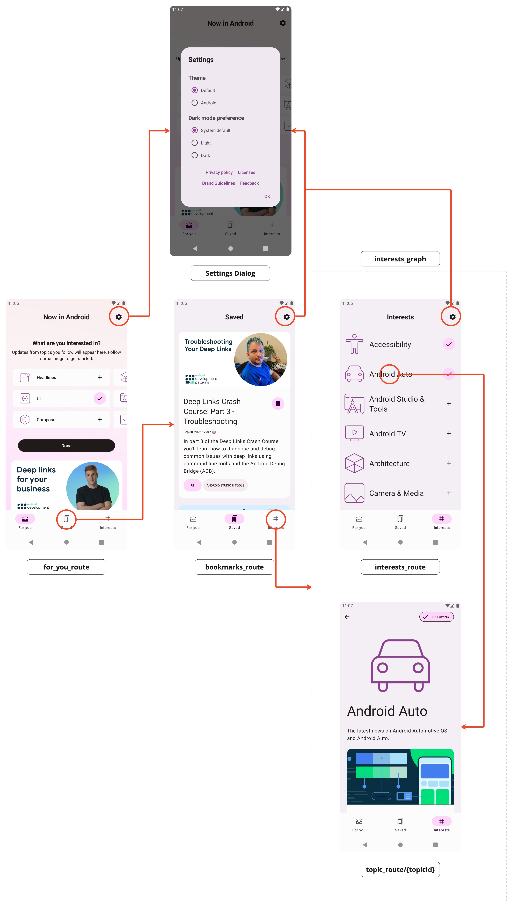
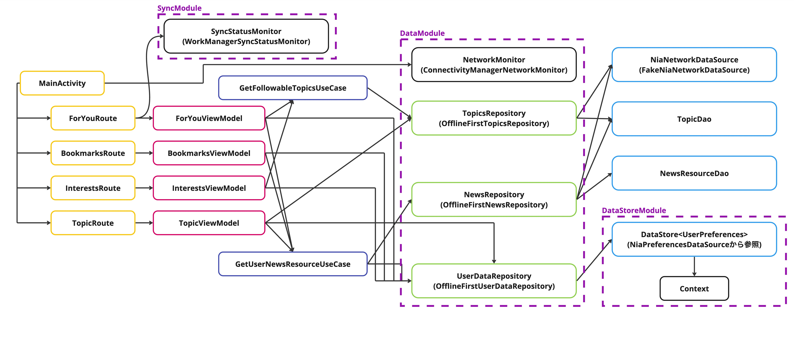
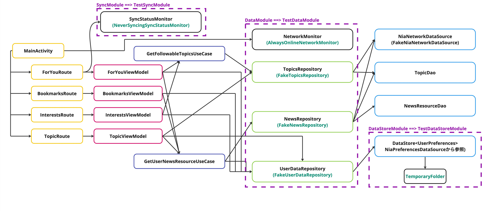
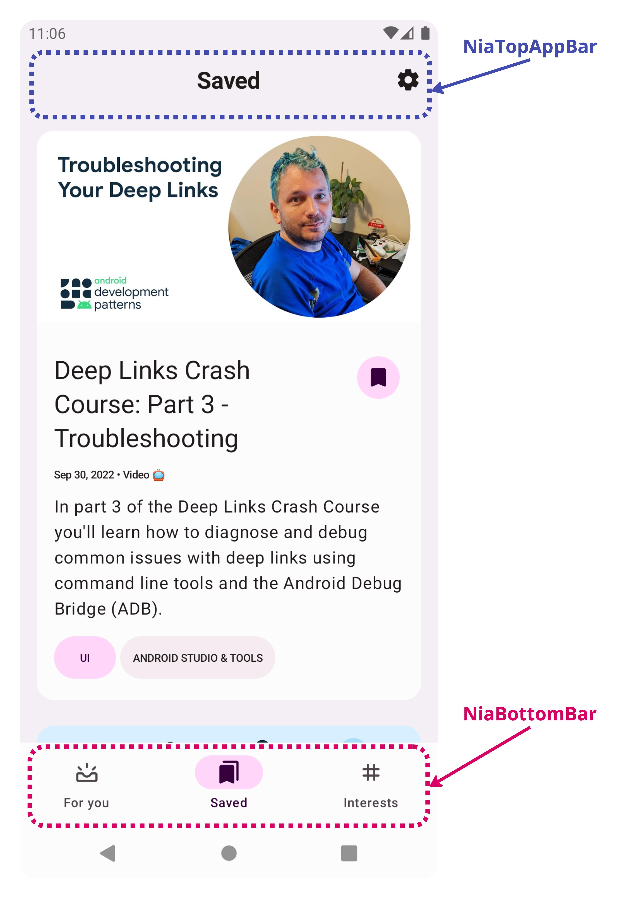
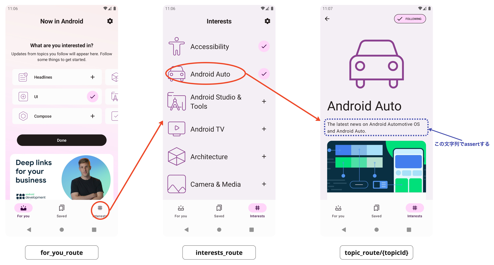

# ComposeのNavigationをテストする

本節では[Jetpack Composeを使用したNavigation](https://developer.android.com/jetpack/compose/navigation?hl=ja)をテストする方法を学ぶ。

最初に、前提知識として必要なテストコードにおけるHiltの使い方を学び、その後にテスト対象とテストの書き方について説明していく。

- [テストコードに対するHiltを使った依存性の注入](#hilt)
- [テスト対象アプリの概要](#app_overview)
- [実践: Navigationのテストを書いてみる](#writing_tests)

## <a id="hilt"></a>テストコードに対するHiltを使った依存性の注入

Navigationのテストでは、より結合度の高い状態でのテストが必要になることがある。
そこで問題になってくるのは、プロダクトコード側でHiltによって注入されるオブジェクトの扱いである。

テストコードからHiltを扱う方法は[Hiltテストガイド](https://developer.android.com/training/dependency-injection/hilt-testing)に詳しいが、そのうちポイントとなる点を見ていく。
なお、本ハンズオンのアプリでは、すでにこれらのセットアップは済ませてある。

### 事前準備

#### Gradleへの依存ライブラリの追加

```gradle
dependencies {
    androidTestImplementation("com.google.dagger:hilt-android-testing:2.44")
    // Javaコードの場合はandroidTestAnnotationProcessorにする
    kaptAndroidTest("com.google.dagger:hilt-android-compiler:2.44")
}
```

#### カスタムテストランナーの設定

`src/androidTest`ソースセット配下に次のようなカスタムテストランナークラスを作成する。

```kotlin
package com.google.samples.apps.nowinandroid.core.testing

...

/**
 * A custom runner to set up the instrumented application class for tests.
 */
class NiaTestRunner : AndroidJUnitRunner() {
    override fun newApplication(cl: ClassLoader?, name: String?, context: Context?): Application {
        return super.newApplication(cl, HiltTestApplication::class.java.name, context)
    }
}
```

次に、作成したテストクラス名 (`com.google.samples.apps.nowinandroid.core.testing.NiaTestRunner`) を
Gradleスクリプトの`testInstrumentationRunner`で宣言する。

```kotlin
android {
    defaultConfig {
        testInstrumentationRunner =
            "com.google.samples.apps.nowinandroid.core.testing.NiaTestRunner"
    }
}

```

テスト用アプリケーションクラスを別途用意している場合の対処方法は[公式ドキュメント](https://developer.android.com/training/dependency-injection/hilt-testing#custom-application)参照のこと。


### テストクラスへの宣言

テストコードでHiltを使うには、テストクラスを次のように宣言する。

```kotlin
@HiltAndroidTest
class RealNavHostControllerNavigationTest {
    @get:Rule(order = 0)
    val hiltRule = HiltAndroidRule(this)

    @get:Rule(order = 1)
    val composeTestRule = createAndroidComposeRule<MainActivity>()
    
    ...
}

```

- テストクラスに`@HiltAndroidTest`アノテーションを付ける
- JUnit 4のRuleとして提供されている `HiltAndroidRule` を宣言する。複数のRuleを宣言する場合は`HiltAndroidRule`を最初に適用する必要があるため`order`引数で適用順を宣言する(`0`が一番最初に適用される)

### 依存クラスの置き換え

プロダクトコードで注入されている依存クラスを別のもの(モックやFakeなど)に置き換えたい場合は、上記に加えて次のようにする。

#### `@Module`で宣言されたモジュールを置き換える

##### テストコードすべてにわたって置き換える

テストコードすべてにわたって同じもので置き換えたいときは`@TestInstallIn`アノテーションを使う。
次のように書くことで、すべてのテストにわたって`replaces`で指定されたモジュールがここで宣言されたモジュールに置き換えられる。

```kotlin
@Module
@TestInstallIn(
    components = [SingletonComponent::class],
    replaces = [DataModule::class]
)
interface TestDataModule {
    @Binds
    fun bindsTopicRepository(
        fakeTopicsRepository: FakeTopicsRepository
    ): TopicsRepository
    ...
}
```

この例では、`DataModule`モジュールを`TestDataModule`モジュールに置き換えている。

##### 特定のテストクラスだけで置き換える

特定のテストクラスだけで置き換えたい場合は、個々のテストクラスで`@UninstallModules`と`@InstallIn`を使う。

```kotlin
@UninstallModules(DataModule::class)
@HiltAndroidTest
class RealNavHostControllerNavigationTest {
    // OfflineFirst〜のリポジトリをFake〜のリポジトリに差し替える
    @Module
    @InstallIn(SingletonComponent::class)
    interface TestDataModule {
        @Binds
        fun bindsTopicRepository(
            fakeTopicsRepository: FakeTopicsRepository
        ): TopicsRepository
        ...
    }
    ...
}
```

この例では、このテストクラスに限って、
`DataModule`を`RealNavHostControllerNavigationTest.TestDataModule`に置き換えている。

どちらの場合でもモジュール単位での置き換えしかできない点に注意が必要。

モジュール内の特定のRepositoryだけを置き換えることはできないので、
テストコードを書くときに置き換えたい粒度でモジュールを宣言しておく(または必要に迫られる度に分割する)必要がある。

### ViewModelを置き換える

`hiltViewModel()`で注入されているViewModelを置き換えるには、`@BindValue`を使う。

```kotlin
@HiltAndroidTest
class TestNavHostControllerNavigationTest {
    ...
    @BindValue
    val bookmarksViewModel: BookmarksViewModel = BookmarksViewModel(
        userDataRepository = mockk(relaxed = true),
        getSaveableNewsResources =  GetUserNewsResourcesUseCase(
            newsRepository = mockk(relaxed = true),
            userDataRepository = mockk(relaxed = true)
        )
    )
    ...
}
```

この例では、このテストクラス内に限って、`BookmarksViewModel`内部で使うRepositoryをRelaxed Mockに置き換えている。

## <a id="app_overview"></a>テスト対象アプリの概要

Navigationのテストを書くにあたって必要となる、テスト対象アプリの画面遷移とHilt依存グラフの概要を説明する。

### <a id="app_routes"></a>テスト対象アプリの画面遷移

アプリ起動直後に表示される画面にはボトムナビゲーションがあり、次の3つの画面間を切り替えられるようになっている。
- `for_you_route`画面(For youタブ)
- `bookmarks_route`画面(Savedタブ)
- `interests_graph`画面(Interestsタブ)

`interests_graph`画面(Interestsタブ)は内部にネストした遷移グラフをもつ。そのため、次の2つの画面をタブの切り替えなしに行き来できる。
- `interests_route`画面
- `topic_route/{topicId}`画面

また、`for_you_route`画面・`bookmarks_route`画面・`interests_graph`の`interests_route`画面では、右上の歯車マークをタップするとSettingsダイアログが表示される。



Composeを使用したNavigationでは、画面(destination)を**route**という文字列で表現する。
上記で`for_you_route`などの表記がそれぞれのrouteを表す。

コード上では、[`NiaNavHost.kt`](../../app/src/main/java/com/google/samples/apps/nowinandroid/navigation/NiaNavHost.kt)に画面遷移が定義されている。

```kotlin
@Composable
fun NiaNavHost(
    navController: NavHostController,
    onBackClick: () -> Unit,
    modifier: Modifier = Modifier,
    startDestination: String = forYouNavigationRoute
) {
    NavHost(
        navController = navController,
        startDestination = startDestination,
        modifier = modifier,
    ) {
        forYouScreen()
        bookmarksScreen()
        interestsGraph(
            navigateToTopic = { topicId ->
                navController.navigateToTopic(topicId)
            },
            nestedGraphs = {
                topicScreen(onBackClick)
            }
        )
    }
}
```

ここで、たとえば`forYouNavigationRoute`や`forYouScreen()`は、[`ForYouNavigation.kt`](../../feature/foryou/src/main/java/com/google/samples/apps/nowinandroid/feature/foryou/navigation/ForYouNavigation.kt)で次のように定義されている。

```kotlin
const val forYouNavigationRoute = "for_you_route"

fun NavGraphBuilder.forYouScreen() {
    composable(route = forYouNavigationRoute) {
        ForYouRoute()
    }
}
```

これによって `"for_you_route"`というrouteでは`ForYouRoute()`がComposeされる。

### <a id="app-structure"></a>テスト対象アプリのHilt依存グラフ

テスト対象アプリのHiltの依存グラフは次のとおり。
紫色の破線枠が、Hiltのモジュールを表している。



この依存グラフが、テスト実行時には(`@TestInstallIn`によって)次のように差し替わる。  
差し替わったHiltモジュールには(`DataModule ==> TestDataModule`のように)`==>`記号で差し替え後のモジュール名を表記し、それによって差し替わったクラスは緑色で表記した。  
(例: `TopicsRepository`インターフェイスの実装クラス`OfflineFirstTopicsRepository`は、テスト実行時には`FakeTopicsRepository`に差し替わる)



なお、テスト実行時の依存グラフ右下にある`TemporaryFolder`は、JUnit 4の[TemporaryFolder Rule](https://github.com/junit-team/junit4/wiki/Rules#temporaryfolder-rule)を指している。
TemporaryFolderを使うことによって、1つのテストケースごとに`NiaPreferenceDataSource`のファイルが作成・削除されるようになっている。

## <a id="writing_tests"></a>実践: Navigationのテストを書いてみる

### テストの方針

Navigateionのテストでは「意図とおりに画面遷移すること」を確認することが目的となるが、
画面遷移をどのレベルで確認するかによって2つの選択肢がある。

- **パターン①**： 画面遷移を司るクラスである`NavHostController`の状態が正しく変化することを確認する
- **パターン②**： 画面遷移の結果、画面に表示されているUIが正しく変化することを確認する

それぞれのパターンにおけるメリットとデメリットを次の表にまとめた。

| パターン | メリット | デメリット |
|-------|-------|-------|
| パターン① | 遷移先のUI Elements(画面レイアウト)に依存しないテストになるため、遷移先画面のデザイン変更に影響されない | `NavHostController`の状態(`currentDestination.route`)で画面遷移の成否を判断するため、本当に正しい画面が表示されているか<br>(そのrouteに正しいComposable関数が結び付いているか)<br>の検証はしていないことになる |
| パターン② | 画面遷移後に、本当に正しい画面が表示されているか(画面レイアウトが正しいか)検証できる | 画面レイアウトの正しさをもって画面遷移の成否を判断するため、遷移先の画面デザイン変更に弱い<br>(画面デザインの変更によってテストが失敗する可能性がある) |

どちらも一長一短あるため、プロジェクトの事情に応じて2つのパターンを使い分けるとよい。以降では、この2つのパターンそれぞれにおけるテストの書き方を見てみる。

### パターン①: `NavHostController`の状態が正しく変化することをテストする

- テストクラス：[`TestNavHostControllerNavigationTest`](../../app/src/androidTestExercise/java/com/google/samples/apps/nowinandroid/ui/TestNavHostControllerNavigationTest.kt)

このテストクラスは、`NavHostController`の状態が正しく変化することを確認するパターン①の方針でテストが書かれている。

Navigationライブラリでは、`NavHostController`クラスの`currentDestination.route`を確認することで、
「現在どの画面(route)にいるか」を知ることができる。

また、テスト用に提供されている`TestNavHostController`クラスの`setCurrentDestination`メソッドを使うと、
任意の画面に直接遷移させることができる。

この2つを組み合わせることで、次の方法で画面遷移をテストできる。

1. 遷移元の画面に`setCurrentDestination`を使って遷移する
2. 画面遷移を引き起すようにUIを操作する
3. 遷移先を表す`currentDestination.route`が、期待とおりであることを確認する

#### テストのセットアップ

##### 依存ライブラリの追加

`TestNavHostController`クラスをテストで使えるように、次の依存ライブラリを追加する。

```gradle
dependencies {
  androidTestImplementation("androidx.navigation:navigation-testing:2.5.3")
}
```

##### <a id="pattern1-testclass"></a>テストクラスの宣言

Now in Androidアプリでは、[`NiaApp()`](../../app/src/main/java/com/google/samples/apps/nowinandroid/ui/NiaApp.kt)関数の引数で(`rememberNiaAppState()`を介して)`NavHostController`を指定できるようになっている。

```kotlin
@Composable
fun NiaApp(
    windowSizeClass: WindowSizeClass,
    networkMonitor: NetworkMonitor,
    appState: NiaAppState = rememberNiaAppState(
        networkMonitor = networkMonitor,
        windowSizeClass = windowSizeClass
    ),
) { ... }

@Composable
fun rememberNiaAppState(
    windowSizeClass: WindowSizeClass,
    networkMonitor: NetworkMonitor,
    coroutineScope: CoroutineScope = rememberCoroutineScope(),
    navController: NavHostController = rememberNavController()
): NiaAppState { ... }
```

テストクラスでは、空のActivityをベースに`ComposeTestRule`を作り、その中で直接`NiaApp()`関数を呼び出せばよい。
そうすれば`NiaApp()`関数呼び出し時に`TestNavHostController`を指定できる。

```kotlin
@HiltAndroidTest
class TestNavHostControllerNavigationTest {

    @get:Rule(order = 0)
    val hiltRule = HiltAndroidRule(this)

    @BindValue @get:Rule(order = 1)
    val tmpFolder: TemporaryFolder = TemporaryFolder.builder().assureDeletion().build()

    // HiltComponentActivityは、@AndroidEntryPointアノテーションがついた空のComponentActivity
    @get:Rule(order = 2)
    val composeTestRule = createAndroidComposeRule<HiltComponentActivity>()

    // 必要に応じてViewModelを差し替えても良い
    @BindValue
    val bookmarksViewModel: BookmarksViewModel = BookmarksViewModel(
        userDataRepository = mockk(relaxed = true),
        getSaveableNewsResources =  GetUserNewsResourcesUseCase(
            newsRepository = mockk(relaxed = true),
            userDataRepository = mockk(relaxed = true)
        )
    )

    private lateinit var testNavHostController: TestNavHostController
    ...

    @Before
    fun setUp() {
        ...
        composeTestRule.setContent {
            val networkMonitor = TestNetworkMonitor()
            val windowSizeClass = ...
            testNavHostController = rememberTestNavController()
            NiaApp(
                windowSizeClass = windowSizeClass,
                networkMonitor = networkMonitor,
                appState = rememberNiaAppState(
                    windowSizeClass = windowSizeClass,
                    networkMonitor = networkMonitor,
                    navController = testNavHostController
                )
            )
        }
    }
    ...
}

@Composable
private fun rememberTestNavController(): TestNavHostController {
    val context = LocalContext.current
    val navController = remember {
        TestNavHostController(context).apply {
            navigatorProvider.addNavigator(ComposeNavigator())
        }
    }
    return navController
}
```

上記のコードで行っていることは次のとおり

- 最優先(`order = 0`)で`HiltAndroidRule`を宣言する
- 「[テスト対象アプリのHilt依存グラフ](#app-structure)」で触れた`TemporaryFolder`を`@BindValue`で注入する
- 空のActivityと結合した状態でテストするために`createAndroidComposeRule<HiltComponentActivity>()`で`ComposeTestRule`を宣言する
- (必要に応じて)テスト対象が内部で使っているViewModelを差し替える
  - Now in Androidアプリでは差し替えなくても動作するが、差し替えたいときの例として記載している
- `setUp()`メソッドでテスト対象となる画面を構築する。そこで`NiaApp()`に`TestNavHostController`を渡す

なお、`ComposeTestRule`がデフォルトで利用する`ComponentActivity`には`@AndroidEntryPoint`アノテーションが付いていないため、Hilt用のActivityとしては利用できない。
そのため、次のような[`HiltComponentActiity`](../../ui-test-hilt-manifest/src/main/java/com/google/samples/apps/nowinandroid/uitesthiltmanifest/HiltComponentActivity.kt)を用意する必要がある(Now in Androidアプリでは`ui-test-hilt-manifest`モジュールに用意されている)。

```kotlin
/**
 * A [ComponentActivity] annotated with [AndroidEntryPoint] for use in tests, as a workaround
 * for https://github.com/google/dagger/issues/3394
 */
@AndroidEntryPoint
class HiltComponentActivity : ComponentActivity()
```

#### テストの書き方

##### <a id="pattern1-test1"></a>`TestNavHostController`クラスの`currentDestination`プロパティを使って画面遷移を検証する

- テストメソッド：`SavedをタップするとBookmarks画面になっていること()`

このテストはボトムナビゲーションの「Saved」をタップするとBookmarks画面に遷移することを確認する例になっている。

1. `"Saved"`と表示されている箇所をタップする
2. `testNavHostController.currentDestination?.route`が`"bookmarks_route"`になっていることを確認する。これによってBookmarks画面に遷移したかどうかを判定できる

このステップ2にあるように、
`TestNavHostController`の`currentDestination?.route`に格納されている文字列を見ることで「現在どの画面(route)が表示されているか」を知ることができる。

関係するテストコードは次のとおり。

```kotlin
private lateinit var saved: String
...

@Before
fun setUp() {
    composeTestRule.activity.apply {
        saved = getString(BookmarksR.string.saved) // 表示テキスト "Saved"
        ...
    }
    ...
}

@Test
fun `SavedをタップするとBookmarks画面になっていること`() {
    composeTestRule.apply {
        // Savedと表示されている箇所をタップする
        onNodeWithText(saved).performClick()
        Truth
            .assertThat(testNavHostController.currentDestination?.route)
            .isEqualTo("bookmarks_route")
    }
}
```

##### <a id="pattern1-test2"></a>`TestNavHostController`クラスの`setCurrentDestination`メソッドを使って任意の画面に遷移する

- テストメソッド：`Interests画面で個々のトピックをタップするとトピック詳細画面になっていること()`

このテストは、「[テスト対象アプリの画面遷移](#app_routes)」で触れた`interests_graph`画面内部における、ネストしたグラフの遷移を確認する例になっている。

「Interests」タブ内のInterests画面(`interests_route`画面)で個々のトピックをタップするとトピック詳細画面(`topic_route/{topicId}`画面)に遷移することを確認している

1. <!-- textlint-disable japanese/no-doubled-joshi -->
   `TestNavHostController`クラスの`setCurrentDestination`メソッドを使って`interests_route`画面に遷移した状態にする。
   <!-- textlint-enable -->
2. トピック一覧([`TopicsTabContent`](../../feature/interests/src/main/java/com/google/samples/apps/nowinandroid/feature/interests/TabContent.kt)関数内の`LazyColumn`)には`interests:topic`テストタグが付与されている。  
   そのテストタグ内にある "Android Auto" というテキストを見付け、そこをタップする
3. `testNavHostController.currentDestination?.route`が`"topic_route/{topicId}"`になっていることを確認する。  
   ここで確認するrouteの文字列は、画面遷移を引き起す`navigate()`メソッドに渡される引数とは違う点に注意すること
   - `navigate()`メソッドに渡される引数：`"topic_route/15"`のような`{topicId}`が実際のトピックIDに置き換えられたもの
   - `testNavHostController.currentDestination?.route`に設定されている値：置き換え前の文字列である`"topic_route/{topicId}"`のまま

このステップ1にあるように、
`TestNavHostController`クラスの`setCurrentDestination`メソッドに遷移させたい画面(routeの文字列)を指定することで、直接その画面に遷移させることができる。
このメソッドはUIスレッドで呼び出す必要がある点に注意すること。

関係するテストコードは次のとおり。

```kotlin
import com.google.samples.apps.nowinandroid.feature.interests.navigation.interestsRoute
...


@Test
fun `Interests画面で個々のトピックをタップするとトピック詳細画面になっていること`() {
        composeTestRule.apply {
            // [TestNavHostController.setCurrentDestination] を使えばいきなり特定の画面から始められる
            // Interests画面に遷移する
            runOnUiThread {
                testNavHostController.setCurrentDestination(destRoute = interestsRoute)
            }

            // `interests:topic`タグ内にある "Android Auto" というテキストを見付け、そこをタップする
            onNodeWithTag("interests:topics")
                .onChildren()
                .filterToOne(hasText("Android Auto"))
                .performClick()

            // destinationが "topic_route/{topicId}" (トピック詳細画面) となることを確認する
            Truth
                .assertThat(testNavHostController.currentDestination?.route)
                .isEqualTo("topic_route/{topicId}")
        }
    }
}
```

#### 練習問題

テストクラス`TestNavHostControllerNavigationTest`の次のメソッドについて、`// TODO` 部分を埋めてテストを完成させよう。

- `demoExerciseDebug`ビルドバリアントで
  [`app/src/androidTestExercise/java/com/google/samples/apps/nowinandroid/ui/TestNavHostControllerNavigationTest.kt`](../../app/src/androidTestExercise/java/com/google/samples/apps/nowinandroid/ui/TestNavHostControllerNavigationTest.kt)
   を開いて作業する
- `demoAnswerDebug` ビルドバリアントに切り替えると解答例を確認できる

##### 練習1

- テストメソッド：`InterestsをタップするとInterests画面になっていること()`
- テスト概要：ボトムナビゲーションの「Interests」をタップするとInterests画面に遷移すること

「テストの書き方」で紹介した「[`TestNavHostController`クラスの`currentDestination`プロパティを使って画面遷移を検証する](#pattern1-test1)」を参考に、ステップ1〜2を実装してテストを完成させよう。

1. `"Interests"`と表示されている箇所をタップする
2. `testNavHostController.currentDestination?.route`が`"interests_route"`になっていることを確認する


### パターン②: 画面に表示されているUIが正しく変化することをテストする

- テストクラス： [`RealNavHostControllerNavigationTest`](../../app/src/androidTestExercise/java/com/google/samples/apps/nowinandroid/ui/RealNavHostControllerNavigationTest.kt)

このテストクラスは、画面遷移の結果、画面に表示されているUIが正しく変化することを確認するパターン②の方針でテストが書かれている。

この方針では、プロダクトコードの`NavHostController`そのまま使用する。
UI操作によって画面遷移を引き起こし、「あるUIコンポーネントを操作するとある画面に変化する」というテストを書くことになる。

#### テストのセットアップ

パターン①の「[テストクラスの宣言](#pattern1-testclass)」とほとんど同じだが、`NiaApp()`関数の引数で`NavHostController`を置き換えない点が異なる。

```kotlin
@HiltAndroidTest
class RealNavHostControllerNavigationTest {

    ...

    @Before
    fun setup() {
        ...
        composeTestRule.setContent {
            val networkMonitor = TestNetworkMonitor()
            val windowSizeClass = calculateWindowSizeClass(activity = composeTestRule.activity)
            NiaApp(
                windowSizeClass = windowSizeClass,
                networkMonitor = networkMonitor,
            )
        }
    }

}
```

#### テストの書き方

##### <a id="pattern2-test1"></a>遷移後の画面だけに表示されるUIコンポーネントを確認することで画面遷移を検証する

- テストメソッド：`Savedタブをタップすると、TopAppBarにSavedと表示されること()`

このテストは[パターン①のテストメソッド`SavedをタップするとBookmarks画面になっていること()`](#pattern1-test1)と同じく、ボトムナビゲーションの「Saved」をタップするとBookmarks画面に遷移することを確認する例になっている。
パターン①では、Bookmarks画面に遷移したことを確認するために`testNavHostController.currentDestination?.route`の値を見ていたが、パターン②ではこの方法は使えない。
代わりに、画面に表示されている「タイトル」が`Saved`に変化することを確認する。

次の図が示すように、Bookmarks画面には`Saved`というテキストが2箇所に存在する。
- `NiaTopAppBar`配下にある`Saved`
- `NiaBottomBar`配下にある`Saved`



その2つが区別できるように、
NiaTopAppBarにはテストタグ`NiaTopAppBar`が、NiaBottomBarにはテストタグ`NiaBottomBar`が、それぞれプロダクトコード側に付与してある。

それらのテストタグを頼りにテストコードを書くと次のようになる

```kotlin
private lateinit var saved: String

@Before
fun setup() {
    composeTestRule.activity.apply {
        saved = getString(BookmarksR.string.saved) // 表示テキスト "Saved"
        ...
    }
}

@Test
fun `Savedタブをタップすると、TopAppBarにSavedと表示されること`() {
    composeTestRule.apply {
        // NiaBottomBarにある`Saved`をクリックする
        onNode(hasText(saved) and hasAnyAncestor(hasTestTag("NiaBottomBar")))
            .performClick()

        // NiaTopAppBarに`Saved`というテキストが表示されていることを確認する
        // 確認方法①: この方法だと直接の子供しか探せない
        onNodeWithTag("NiaTopAppBar")
            .onChildren()
            .filterToOne(hasText(saved)).assertIsDisplayed()

        // 確認方法②: この方法だと、子孫にtextがあっても探せるので汎用性が高い
        onNode(hasText(saved) and hasAnyAncestor(hasTestTag("NiaBottomBar")))
            .assertIsDisplayed()
    }
}
```

このコード例では、NiaTopAppBarに`Saved`というテキストが表示されていることを確認する方法を2つ示した(コメントに記載した「確認方法①」と「確認方法②」)。

目的のノードが(直接の子供または親のように)1世代しか離れていない場合は「確認方法①」が利用できる。
確認方法①では、`onChildren()`で直接の子ノードを列挙し、`hasText(saved)`という条件に合致するノードを`filterToOne()`で絞り込んでいる。

この書き方は直感的で分かりやすいが、直接の子供または親のノードしか探せないため汎用性が低い。
たとえば、画面デザイン変更によって目的のノードが2世代以上離れた箇所に移動してしまったときには、このコードは書き直しになる。

やや読み解くのにコツがいるものの、より汎用性の高い方法が「確認方法②」である。
確認方法②では**複数世代の先祖**を探す`hasAnyAncestor`を条件に使っている。

複数世代の先祖・子孫関係を条件に使う場合には`hasAnyAncestor`や`hasAnyDescendant`が利用できるが、
これらのメソッドを使う場合は**今発見したい(操作したい、またはassertしたい)ノードを中心人物に据える**ことがポイントとなる。
このケースの中心人物はassertしたいテキスト(`Saved`と表示されているノード)であるが、その中心人物から見るとテストタグは「祖先」にあたるため`hasText(saved) and hasAnyAncestor(hasTestTag("NiaBottomBar")`という条件式になる。

##### <a id="pattern2-test2"></a>UI操作によって目的の画面まで遷移する

- テストメソッド：`Interests画面で個々のトピックをタップするとトピック詳細画面になっていること()`

このテストは[パターン①の同名テストメソッド](#pattern1-test2)と同じく、
「Interests」タブ内のInterests画面で個々のトピックをタップするとトピック詳細画面に遷移することを確認する例になっている。

このケースではInterests画面からテストを始める必要があるが、パターン①で便利に使えていた`TestNavHostController.setCurrentDestination`は利用できない。
代わりにアプリ起動直後の画面からのUI操作によって、テストの前提となるInterests画面まで遷移させる必要がある。



また、トピックの詳細画面に遷移したことの判定も、画面に表示されている要素で行う。

```kotlin
private lateinit var interests: String

@Before
fun setup() {
    composeTestRule.activity.apply {
        interests = getString(FeatureInterestsR.string.interests)
        ...
    }
}

@Test
fun `Interests画面で個々のトピックをタップするとトピック詳細画面になっていること`() {
    composeTestRule.apply {
        // NiaBottomBarのInterestsをタップしてInterests画面に遷移する
        onNode(hasText(interests) and hasAnyAncestor(hasTestTag("NiaBottomBar")))
            .performClick()
        // トピックのリストから`Android Auto`をタップし、そのトピックの詳細画面に遷移する
        onNodeWithText("Android Auto").performClick()
        // トピックの詳細にに表示されるテキスト
        // 「The latest news on Android Automotive OS and Android Auto.」
        // が表示されていることを確認する。
        //
        // 「ViewModelを結合してComposeをテストする」で触れたように、
        // プロダクトコード側に「news:expandedCard」テストタグを付けて、そちらを条件にassertするとより安定度が増す。
        onNodeWithText("The latest news on Android Automotive OS and Android Auto.").assertIsDisplayed()
    }
}

```

##### ダイアログが表示されることを確認する

- テストメソッド：`Settingsアイコンをタップすると、Settingsダイアログが表示されること()`

このテストでは、右上の歯車マークをタップするとSettingsダイアログが表示されることを確認する例になっている。

ダイアログが表示されていることを確認するには`isDialog()`マッチャーを使う。
なお、ダイアログを表示しても`NavHostController`の`currentDestination`は変化しないため、パターン①のやり方だとうまくいかない。

```kotlin
private lateinit var settings: String

@Before
fun setup() {
    composeTestRule.activity.apply {
        settings = getString(SettingsR.string.top_app_bar_action_icon_description)
        ...
    }
}


@Test
fun `Settingsアイコンをタップすると、Settingsダイアログが表示されること`() {
    composeTestRule.apply {
        // 歯車アイコン (contentDescriptionが"Settings") をタップする
        onNodeWithContentDescription(settings).performClick()
        // ダイアログ内に "Settings" が表示されていることを確認する
        onNode(hasText(settings) and hasAnyAncestor(isDialog()))
            .assertIsDisplayed()
    }
}
```

#### 練習問題

テストクラス`RealNavHostControllerNavigationTest`の次のメソッドについて、`// TODO` 部分を埋めてテストを完成させよう。

- `demoExerciseDebug`ビルドバリアントで
  [`app/src/androidTestExercise/java/com/google/samples/apps/nowinandroid/ui/RealNavHostControllerNavigationTest.kt`](../../app/src/androidTestExercise/java/com/google/samples/apps/nowinandroid/ui/RealNavHostControllerNavigationTest.kt)
   を開いて作業する
- `demoAnswerDebug` ビルドバリアントに切り替えると解答例を確認できる


##### 練習1

- テストメソッド：`Interestsタブをタップすると、TopAppBarにInterestsと表示されること()`
- テスト概要：ボトムナビゲーションの「Interests」をタップするとInterests画面に遷移すること

「[遷移後の画面だけに表示されるUIコンポーネントを確認することで画面遷移を検証する](#pattern2-test1)」で紹介した書き方を参考に、ステップ1〜2を実装してテストを完成させよう。

1. ボトムナビゲーション(`NiaBottomBar`テストタグ)内で`"Interests"`と表示されているタブをタップする
2. TopAppBar(`NiaTopAppBar`テストタグ)内に`"Interests"`と表示されているUI要素があることを確認する


##### 練習2

- テストメソッド：`Interestsタブの詳細画面から別タブに遷移し、Interestsタブに戻ると、詳細画面が表示されたままになっていること()`
- テスト概要：Interestsタブでトピック詳細画面を表示した状態でForYouタブに遷移し、再度Interestsタブに遷移すると、トピック詳細画面が表示されたままになっていること

ステップ1〜4を実装してテストを完成させよう

1. 「[UI操作によって目的の画面まで遷移する](#pattern2-test2)」で紹介した書き方を参考にトピック詳細画面へ遷移する
2. ボトムナビゲーション(`NiaBottomBar`テストタグ)内で`"For you"`と表示されているタブをタップする
3. ボトムナビゲーション(`NiaBottomBar`テストタグ)内で`"Interests"`と表示されているタブをタップする
4. 次の方法で詳細画面が表示されていることを確認する
   - 「[ViewModelを結合してComposeをテストする ＞ フィードにタグをつける](UIElementTest_ComposeWithViewModel.md#フィードにタグをつける)」を参考に、
     [プロダクトコード側](../../core/ui/src/exercise/java/com/google/samples/apps/nowinandroid/core/ui/NewsResourceCard.kt)に`news:expandedCard`テストタグを付け、次のassertが成功するようにする  
      ```kotlin
      // トピックの詳細にしか存在しないテストタグ`news:expandedCard`のノードが表示されていることを確認する
      onNodeWithTag("news:expandedCard").assertIsDisplayed()
      ```

### (参考) 実Activityと結合してテストする

前述のパターン①と②では、空のActivityをホストとしてテストを書いていたが、実Activityをホストにもできる。
特に次のようなケースでは、忠実度の観点で実Activityの方が望ましかったり、実Activityでないと確認できなかったりする。

- バックスタックの状態を検証したいケース
- 複数のActivityにまたがった画面遷移を検証したいケース

Now in Androidアプリの[`NavigationTest`](../../app/src/androidTest/java/com/google/samples/apps/nowinandroid/ui/NavigationTest.kt)が実Activityをホストとしたテストの例になっている。
本ハンズオンでは詳しくは触れないが、参考になるテストメソッドを紹介する。

- `homeDestination_back_quitsApp()`
    - For you画面でバックキーを押すとアプリが終了することを確認している
- `navigationBar_backFromAnyDestination_returnsToForYou()`
    - For you以外のタブを表示している状態でバックキーを押すと、アプリが終了せずFor you画面に戻ることを確認している

複数のActivityをまたがった遷移をする例は本アプリにはないが、そのようなケースでもパターン②に準じてテストできる。
同一Activity内で遷移するケースと同様に、遷移先の画面の表示要素を検証すればよい。

ただし、(`app`モジュールではなく)`feature`モジュールに対してテストしているようなケースだと、遷移先のActivityが同一モジュール内に存在しないことがある。
そのケースでは当該`feature`モジュールから遷移先Activityを参照できないため、画面遷移のためのインターフェイス(いわゆるRouterインターフェイス)を注入しているはずである。
そのRouterインターフェイスをモックに差し替え、Routerインターフェイスのメソッドに渡された引数を検証するとよい。


## まとめ

本節では、Jetpack Composeを使用したNavigationをテストする方法を説明した。
冒頭でテストコードにおけるHiltの使い方を説明してから、Navigationのテスト方針として次の2つの選択肢を紹介し、それぞれのメリット・デメリットを説明した。

- `TestNavHostController`を使って、`NavHostController`の状態を確認することをもって画面遷移を検証する
- `TestNavHostController`の助けを借りずに、画面に表示されているUIが正しく変化することを確認することで画面遷移を検証する

また、実Activityと結合したテストが必要になるケースについても簡単に紹介した。
