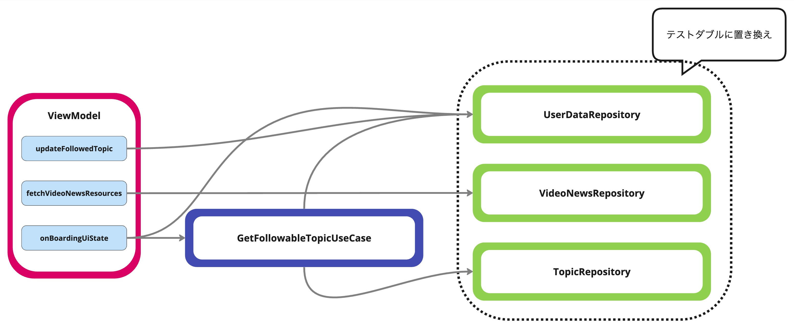

# ViewModelをテストする

## 目次

- ViewModelからのsuspend関数呼び出しをテストする
- データ取得の結果、UI Stateが更新されることをテストする
- 通信中のローディングをテストする
- ViewModel内のエラーハンドリングをテストする
- データ更新の結果、Flowの更新を受け取ってUI Stateが変更される実装をテストする

## ハンズオンの対象コード

### テスト対象クラス`VideoNewsViewModel`

- [VideoNewsViewModel](../../feature/foryou/src/main/java/com/google/samples/apps/nowinandroid/feature/foryou/VideoNewsViewModel.kt)
  - テストコードは[VideoNewsViewModelTest](../../feature/foryou/src/testExercise/java/com/google/samples/apps/nowinandroid/feature/foryou/VideoNewsViewModelTest.kt)

VideoNewsViewModelは次のような実装と、依存関係を持っている。

<br>
<br>

<br>
<br>

テスト対象の実装は次のとおり。

- `updateFollowedTopic`
  - UserDataRepositoryのsuspend関数を呼び出してユーザー情報を更新する
- `fetchVideoNewsResources`
  - VideoNewsRepositoryから取得したデータを使って、UI State(VideoNewsUiState)を作成する
- `onBoardingUiState`
  - UserDataRepositoryのFlowをから作成されたUI State


### `VideoNewsViewModel`のテスト方針

前出の図のとおり、テストコードではRepositoryをテストダブルに置き換えて実装する。UseCaseはテストダブルに置き換えず、プロダクトコードをそのまま利用する。

### 練習問題で修正するファイルと解答例

<!-- textlint-disable japanese/sentence-length -->
- `demoExerciseDebug`ビルドバリアントで [`feature/foryou/src/testExercise/java/com/google/samples/apps/nowinandroid/feature/foryou/VideoNewsViewModelTest.kt`](../../feature/foryou/src/testExercise/java/com/google/samples/apps/nowinandroid/feature/foryou/VideoNewsViewModelTest.kt) を開いて作業する
- `demoAnswerDebug` ビルドバリアントに切り替えると解答例を確認できる
<!-- textlint-disable japanese/sentence-length -->


## ViewModelからのsuspend関数呼び出しをテストする

`updateFollowedTopic`は、viewModelScopeでCoroutineを起動してRepositoryのsuspend関数 `toggleFollowedTopicId`を呼び出している。

```kotlin
fun updateFollowedTopic(topicId: String, isBookMarked: Boolean) {
    viewModelScope.launch {
        userDataRepository.toggleFollowedTopicId(topicId, isBookMarked)
    }
}
```

テストでは、テストコードから`updateFollowedTopic`を呼び出し、Repositoryのメソッド`toggleFollowedTopicId`に渡された引数を検証すればよい。

次のコードでは、`mockk`を利用して引数の検証をしている。

```kotlin
@Test
fun updateFollowedTopic() { // updateFollowedTopic自体はsuspend関数でないため、runTestはなくてもよい
    
    // リポジトリのインスタンスをmockkで作成
    val testUserDataRepository = mockk<UserDataRepository>(relaxed = true)

    val viewModel = VideoNewsViewModel(
        testUserDataRepository,
        ..
    )

    viewModel.updateFollowedTopic("ID", true)

    // coVerifyでsuspend関数の呼び出しを検証
    // ここでは、toggleFollowedTopicIdが引数"ID", trueで実行されたことを検証している
    coVerify { 
        testUserDataRepository.toggleFollowedTopicId("ID", true)
    }
}
```

<!-- textlint-disable japanese/no-doubled-joshi -->
しかし、このコードをLocal Testで実行すると、`Module with the Main dispatcher had failed to initialize.`というエラーになってしまう。これは、viewModelScopeがMainDispatcher(`Dispatchers.Main.immediate`)で実行されるためである。Local TestはAndroidデバイス上ではなくローカルのJVMで実行されるため、Androidのメインスレッド(MainDispatcher)を使うことができない。<br>
そのため、MainDispatcherをLocal Test上でも動作するDispatcherに差し替える必要がある。
<!-- textlint-enable -->

MainDispatcherを差し替えるためには、`kotlinx.coroutines.test`で提供されているヘルパーを利用する。

```kotlin
@Before
fun setUp() {
    Dispatchers.setMain(UnconfinedTestDispatcher())
}

@After
fun tearDown() {
    Dispatchers.resetMain()
}
```

差し替えるDispatcherはUnconfinedTestDispatcherを使用する。これは、DispatcherにUnconfinedTestDispatcherを指定してlaunchをした際の実行順が、`Dispatchers.Main.immediate`でlaunchしたときの実行順と同じになるためである。

```kotlin

// ViewModelScopeでlaunchした場合
// in launch block -> below launch blockの順
fun viewModelScope() {
    viewModelScope.launch {
        println("in launch block")
    }
    println("below launch block")
}

// ディスパッチャにUnconfinedTestDispatcherを指定
// in launch block -> below launch blockの順
fun unconfinedTestDispatcher() = runTest {
    launch(UnconfinedTestDispatcher()) {
        println("in launch block")
    }
    println("below launch block")
}

// ディスパッチャにStandardTestDispatcherrを指定
// below launch block -> in launch blockの順(明示的にrunCurrent等をしない場合)
fun standardTestDispatcher() = runTest {
    launch(StandardTestDispatcher()) {
       println("in launch block")
    }
    println("below launch block")
}
```

このようにviewModelScopeのDispatcherをUnconfinedTestDispatcherで置き換えることで、テストコード上でviewModelScopeを扱えるようになった。<br>
また、これ以降のテストコードでは、セットアップでMainDispatcherがUnconfinedTestDispatcherに置き換わっている前提で解説をする。


### 練習問題

`// TODO`部分を埋めてテストを完成させよう。
- `setup`でMain DispatcherをUnconfinedTestDispatcherで置き換える


## データ取得の結果、UI Stateが更新されることをテストする


`fetchVideoNewsResources`のテストを実装する。まずは、Repositoryから取得したデータが正しくUI Stateに反映されているかを検証する。
ここではRepositoryから取得したデータをそのままUI Stateのフィールドにセットしているだけだが、実際のアプリでは取得したデータを元に、より複雑なUI Stateが作られる。


```kotlin
fun fetchVideoNewsResources() {
    viewModelScope.launch {
        _videoNewsUiState.update { it.copy(isLoading = true) }

        try {
            // リポジトリからデータを取得
            val videoNewsResources = videoNewsRepository.getVideoNewsResources()

            // 取得したデータをUI Stateに反映
            _videoNewsUiState.update {
                it.copy(
                    videoNewsResources = videoNewsResources,
                    errorMessage = null
                )
            }
        } catch (e: Exception) {
            _videoNewsUiState.update { it.copy(errorMessage = e.message) }
        }
        _videoNewsUiState.update { it.copy(isLoading = false) }
    }
}
```

UI StateはState Flowで公開されているため、テストコードでは`StateFlow#value`を使ってデータ取得完了後のUI Stateを確認できる。

```kotlin
@Test
fun fetchVideoNewsResources() {
    ..
    
    // テストしたいメソッドの呼び出し
    viewModel.fetchVideoNewsResources()

    // StateFlowのvalueをassertする
    Truth.assertThat(viewModel.videoNewsUiState.value).isEqualTo(
        VideoNewsUiState(
            isLoading = false,
            videoNewsResources = listOf(testVideoNewsResource, testVideoNewsResource2),
            errorMessage = null
        )
    )
}
```

[API通信をするコードのテストを実装しながらCoroutineのテストについて学ぶ ](./DataLayerTest_Coroutine.md)で紹介したように、StateFlowの変更をcollectすることも可。しかし、valueを直接確認するほうがテストの実装はシンプルにできる。

### 練習問題

`// TODO`部分を埋めてテストを完成させよう。
- テストメソッド： `fetchVideoNewsResources_データ取得の結果、UI Stateが更新されることをテストする`
- テスト概要： `fetchVideoNewsResources`を呼び出したら、APIから取得したニュースの一覧がUI Stateに反映されることを確認する


## 通信中のローディングをテストする

引き続き`fetchVideoNewsResources`のテストを実装する。`fetchVideoNewsResources`は通信開始時にローディングを表示し、通信処理が完了するとローディングを非表示にする。<br>
ViewModelの中で非同期処理が実行されると、1つのメソッドの中で複数回UI Stateを更新する場合がある。<br>このような場合、非同期処理にdelayを差し込めるようにすることでメソッド途中のUI Stateを見ることができるようになる。

```kotlin
@Test
fun fetchVideoNewsResources() = runTest {

    // fetchVideoNewsResources内で呼び出しをしているリポジトリのスタブ
    val testVideoNewsRepository = TestVideoNewsRepository(
        getVideoNewsResourcesFunc = {
            // delayをいれる
            delay(10)
            listOf(testVideoNewsResource, testVideoNewsResource2)
        })

    val viewModel = VideoNewsViewModel(
        testVideoNewsRepository,
    )

    // テストしたメソッドの呼び出し
    viewModel.fetchVideoNewsResources()

    // スタブに設定したdelayの箇所で中断している
    // そのため、UI Stateはローディングが表示されている状態になっている
    Truth.assertThat(viewModel.videoNewsUiState.value.isLoading).isEqualTo(true)

    // 中断していたコルーチンを再開
    advanceUntilIdle()

    // UI Stateはローディングが非表示になっている
    Truth.assertThat(viewModel.videoNewsUiState.value).isEqualTo(
        VideoNewsUiState(
            isLoading = false,
            videoNewsResources = listOf(testVideoNewsResource, testVideoNewsResource2),
            errorMessage = null
        )
    )
}
```

### 練習問題

`// TODO`部分を埋めてテストを完成させよう。
- テストメソッド： `fetchVideoNewsResources_通信中のローディングをテストする`
- テスト概要： `fetchVideoNewsResources`でAPI通信をしている間は、UI Stateの`isLoading`がtrueになっていることを確認する


## ViewModel内のエラーハンドリングをテストする

`fetchVideoNewsResources`のエラー発生時のテストを実装する。テスト用のRepositoryでエラーを返すように設定した上でテストしたいメソッドを呼びだし、その後のUI Stateを検証すればよい。<br>

また、エラーが発生後にリトライをする手段がある場合は、そのケースもテストするのが望ましい。エラー表示を非表示にするといったUI Stateの更新漏れが発生しやすいためである。

```kotlin
@Test
fun fetchVideoNewsResources() {

    // fetchVideoNewsResources内で呼び出しをしているリポジトリのスタブ
    val testVideoNewsRepository = TestVideoNewsRepository(
        getVideoNewsResourcesFunc = {
            // エラーを返すようにする
            throw ApiException("エラー発生")
        })

    val viewModel = VideoNewsViewModel(
        testVideoNewsRepository,
    )

    viewModel.fetchVideoNewsResources()

    // UI Stateをアサートする
    Truth.assertThat(viewModel.videoNewsUiState.value).isEqualTo(
        VideoNewsUiState(
            isLoading = false,
            videoNewsResources = emptyList(),
            errorMessage = "エラー発生"
        )
    )
}
```

### ViewModelScope内でのExceptionの振る舞い

Repositoryからエラーがthrowされるようになっている場合、ViewModelScope内でtry-catchをし忘れるとアプリがクラッシュする。そういったエラーハンドリング漏れがないかを確認するためにも、エラーのケースをテストするのは有用である。<br>
しかし、kotlin 1.8.10未満では、テストコード上ではViewModelScope内でExceptionがthrowされてもJunitのランナーに伝搬しない。

次のコードはExceptionがthrowされたことによりテストが失敗するのを期待するが、Kotlin 1.8.10未満ではテストが成功してしまう。この挙動により、エラーのテストを書いていたとしてもViewModelScope内でのtry-catchを漏れに気がつかない可能性がある。
Kotlin 1.8.10以上の場合はきちんとテストが失敗するため、エラーハンドリング漏れを検知できる。

```
class NewsViewModel : ViewModel() {

    fun bookmarkNews(newsResourceId: String, bookmarked: Boolean) {
        viewModelScope.launch {
            throw IOException()
        }
    }
}

@Test
fun bookmarkNews() {
    val viewModel = NewsViewModel()
    viewModel.bookmarkNews("id", true)
}
```

### 練習問題

`// TODO`部分を埋めてテストを完成させよう。
- テストメソッド： `fetchVideoNewsResources_ViewModel内のエラーハンドリングをテストする`
- テスト概要： `fetchVideoNewsResources`でAPIからエラーが帰ってきたときにUI Stateの`errorMessage`にエラーメッセージが反映されることを確認する


## データ更新の結果、Flowの更新を受け取ってUI Stateが変更される実装をテストする

`onBoadingUiState`はチュートリアル表示を管理するUI Stateで、UserDataRepositoryで公開されているFlowを変換してUI StateのStateFlowを作る。<br>
最初に画面が表示されたとき、UI Stateは`OnboardingUiState.Loading`から`OnboardingUiState.Shown`(チュートリアル表示)に変わる。その後、ユーザーの非表示にするアクション(dismissOnBoarding)によって`OnboardingUiState.NotShown`(チュートリアル非表示)に遷移する。


<br>
<br>

<br>
<br>

```kotlin
val onBoardingUiState: StateFlow<OnboardingUiState> =
    // UserDataRepositoryで公開しているuserData:Flow<UserData>を購読して、UI Stateに変換する
    userDataRepository.userData
        .map {
            if (it.shouldHideOnboarding) {
              // UserData#shouldHideOnboardingがtrueだったら、チュートリアルを非表示
              OnboardingUiState.NotShown
            } else {
                // GetFollowableTopicsユースケースの呼び出し
                // トピックの一覧とユーザーがフォローしているトピックのIDから、FollowableTopicの一覧を生成する
                // FollowableTopicは、トピックとユーザーのフォロー状態(Boolean)を管理するdataクラス
                val followableTopics = getFollowableTopics().first()

                // FollowableTopicの一覧をチュートリアルに表示
                OnboardingUiState.Shown(topics = followableTopics)
            }
        }
        .stateIn(
            scope = viewModelScope,
            started = SharingStarted.WhileSubscribed(5_000),
            initialValue = OnboardingUiState.Loading
        )
```

ユーザーがチュートリアルを非表示にするアクションをしたときは、`VideoNewsViewModel#dismissOnBoarding`が呼ばれる。

```kotlin
fun dismissOnBoarding() {
  viewModelScope.launch {
    userDataRepository.setShouldHideOnboarding(true)
  }
}
```

その後、`OnboardingUiState.NotShown`(チュートリアル非表示)に変更されるまでの処理の流れは次のようになる。(UserDataRepositoryより先の実装は省略)


<br>
<br>

<br>
<br>


この`onBoadingUiState`の変化をテストする。<br>

テストにはUserDataRepositoryのFake実装であるTestUserDataRepositoryを使う。Fakeは、実オブジェクトそっくりに振る舞うテスト用の実装である。このFakeはUserDataをオンメモリキャッシュで管理し、UserDataを更新するメソッドが呼ばれるとオンメモリキャッシュの更新と、公開しているFlowの更新をする。


```kotlin
// Fakeの実装抜粋

class TestUserDataRepository : UserDataRepository {

    override val userData: Flow<UserData> = _userData.filterNotNull()

    private val _userData = MutableSharedFlow<UserData>(replay = 1, onBufferOverflow = DROP_OLDEST)
  
    private val currentUserData get() = _userData.replayCache.firstOrNull() ?: emptyUserData

    override suspend fun setShouldHideOnboarding(shouldHideOnboarding: Boolean) {
        currentUserData.let { current ->
            _userData.tryEmit(current.copy(shouldHideOnboarding = shouldHideOnboarding))
        }
    }
     ..
```

ViewModelのテストでこのFake実装を使えば、ユーザーの操作によってFlowが更新された際に自動でUI Stateも更新される。そのため、セットアップが完了した後はViewModelの操作と状態に集中してテストを実装できる。<br>
テストコードは次のようになる。

```kotlin
@Test
fun onBoardingUiState() = runTest {

    // 初期状態のユーザーをFakeのリポジトリにセットしておく
    // 初期状態のユーザーはshouldHideOnboardingがfalse
    val testUserDataRepository = TestUserDataRepository()
    testUserDataRepository.setUserData(emptyUserData)

    val viewModel = VideoNewsViewModel(
        testUserDataRepository,
        TestVideoNewsRepository(),
        GetFollowableTopicsUseCase(..)
    )

    // 初期状態
    Truth.assertThat(viewModel.onBoardingUiState.value).isEqualTo(OnboardingUiState.Loading)

    // onBoardingUiStateはSharingStarted.WhileSubscribedでホット化されているため、
    // collectをして変更が流れるようにする
    backgroundScope.launch(UnconfinedTestDispatcher(testScheduler)) {
        viewModel.onBoardingUiState.collect()
    }

    // チュートリアルが表示される状態(OnboardingUiState.Shown)になっている
    Truth.assertThat(viewModel.onBoardingUiState.value)
        .isEqualTo(OnboardingUiState.Shown(listOf(
            FollowableTopic(sampleTopic1, false),
            FollowableTopic(sampleTopic2, false)
        )))

    //　ユーザーのインタラクションでチュートリアルを非表示にする
    viewModel.dismissOnBoarding()

    // OnboardingUiState.NotShownに変更される
    Truth.assertThat(viewModel.onBoardingUiState.value).isEqualTo(OnboardingUiState.NotShown)
}
```

> **StateFlowがstateInで作られておりSharingStarted.WhileSubscribedを利用している場合**<br>
> `StateFlow#value`の変更を受け取るためにcollectをして購読者がいる状態にする必要がある。
> 先にcollectをしておかないと、onBoardingUiStateは初期値OnboardingUiState.Loadingのまま、それ以降の変更を受け取ることができない。


### 練習問題

`// TODO`部分を埋めてテストを完成させよう。
- テストメソッド： `データ更新の結果、Flowの更新を受け取ってUI Stateが変更される実装をテストする`
- テスト概要： チュートリアル表示中(`OnboardingUiState.Shown`)に、チュートリアルを非表示にするアクションをするとチュートリアル非表示(`OnboardingUiState.NotShown`)の状態になる

### Flowを返すRepositoryをどうやって準備するか

FakeのRepositoryを利用することで、ViewModelのテストではDataレイヤーと結合しなくてもデータの取得と保存のテストを一貫して実装できるようになる。これにより、ユーザーのシナリオに近いユニットテストを書くことができる。<br>
一方で、FakeのRepositoryは自分で実装をする必要があり、実装コストがかかる。また、Fakeがきちんと実オブジェクトそっくりに振る舞う実装になっているかを別途検証する必要もある。

ここからは、Fake Repository以外の手段とそれぞれのメリット・デメリットを紹介する。

- Fake以外のテストダブルを利用する
- ViewModelとデータレイヤーの実装を結合する


#### Fake以外のテストダブルを利用する

同じようなテストを、モックライブラリ(mockK)を利用して実装すると次のようになる。

```kotlin
@Test
fun onBoardingUiState() = runTest {

    // リポジトリでFlowを返すように設定
    val userFlow = MutableSharedFlow<UserData>(replay = 1)
    val testUserDataRepository = mockk<UserDataRepository>(relaxed = true) {
      every {
        userData
      } returns userFlow
    }
    userFlow.emit(emptyUserData)

    val viewModel = VideoNewsViewModel(
      testUserDataRepository,
      TestVideoNewsRepository(),
      GetFollowableTopicsUseCase(..)
    )

    Truth.assertThat(viewModel.onBoardingUiState.value).isEqualTo(OnboardingUiState.Loading)

    backgroundScope.launch(UnconfinedTestDispatcher(testScheduler)) {
      viewModel.onBoardingUiState.collect()
    }
    
    // チュートリアルが表示される状態(OnboardingUiState.Shown)になっている
    Truth.assertThat(viewModel.onBoardingUiState.value)
      .isEqualTo(
        OnboardingUiState.Shown(
          listOf(
            FollowableTopic(sampleTopic1, false),
            FollowableTopic(sampleTopic2, false)
          )
        )
      )
      
    //　ユーザーのインタラクションでチュートリアルを非表示にする
    viewModel.dismissOnBoarding()

    // リポジトリ呼び出しの引数を検証する
    coVerify {
      testUserDataRepository.setShouldHideOnboarding(true)
    }

    // Fakeを使ったテストとの比較用コード
    // OnboardingUiState.NotShownになることまで検証しようとした場合
    // ただし、上のテストコードとの繋げる必要性はなくなるため、保存と取得を別のテストにしたほうがよい
    userFlow.emit(emptyUserData.copy(shouldHideOnboarding = true))

    Truth.assertThat(viewModel.onBoardingUiState.value).isEqualTo(OnboardingUiState.NotShown)
  } 
```

セットアップの方法こそ違うものの、チュートリアル表示の状態(`OnboardingUiState.Shown`)になるところまでは、Fakeで実装されたテストと同様に確認ができる。しかし、ユーザーがチュートリアルを閉じたときに、チュートリアルを非表示の状態(`OnboardingUiState.NotShown`)にするためには再度スタブの設定が必要になる。<br>
そのため、ユーザーのアクションによる更新と、それによるUI Stateの更新は別のテストとして実装する。

モックライブラリでデータ更新にあわせてFlowを更新するようにも実装できるが、モックライブラリの知識が必要になり、Fakeの実装よりも複雑な設定が必要になる。また、Repositoryが複数ViewModelから利用される場合、各テストで個別に設定をすると、1つのFakeを用意したほうがトータルのコストは少なくなる可能性がある。

#### ViewModelとデータレイヤの実装を結合する

ViewModelのテストで実RepositoryやRoom、DataSourceと結合すると、それらのクラスが持っているFlowの実装をそのまま利用できる。

ただし、ViewModelから実Repositoryを利用するためには、実Repositoryのインスタンスを作成するハードルを超える必要がある。 マルチモジュール構成のアプリでは、ViewModelから見るとRepositoryの実装の詳細は隠蔽されており、実Repositoryのインスタンスを作成するのに必要な依存を参照できない可能性がある。<br>
たとえば、最低限の引数から実Repositoryのインスタンスを返すテストヘルパーをViewModelから参照できるモジュールに用意することで、ViewModelのテストコードから実Repositoryのインスタンスを作りやすいようにする。

```kotlin
suspend fun createUserRepository(
    pbFile: File,
    coroutineScope: CoroutineScope,
    initialData: UserPreferences,
): UserDataRepository {
    val dataStore = DataStoreFactory.create(
        serializer = UserPreferencesSerializer(),
        scope = coroutineScope,
        produceFile = { pbFile }
    )

    val niaPreferencesDataSource = NiaPreferencesDataSource(dataStore)
    dataStore.updateData { initialData }
    return OfflineFirstUserDataRepository(niaPreferencesDataSource)
}
```

ViewModelのテストコードでは、次のようにセットアップする。

```kotlin
@get:Rule
val tmpFolder: TemporaryFolder = TemporaryFolder.builder().assureDeletion().build()

@Test
fun onBoardingUiState() = runTest {

    // DataStoreに初期状態のユーザーを登録する
    val userPreferences = userPreferences {
        shouldHideOnboarding = false
    }
    val testUserDataRepository = createUserRepository(
        tmpFolder.newFile("user.pb"),
        coroutineScope = this + UnconfinedTestDispatcher(testScheduler),
        initialData = userPreferences
    )

    // 以降はFakeのテストとほぼ同じのため省略
}
```
<!-- textlint-disable japanese/no-doubled-joshi -->
データレイヤの実装を利用する方法は、FakeRepositoryを用意しなくてもユーザーの操作によってFlowが更新される実装のテストを書くことができる(API通信を行う部分についてはテストダブルを用意することをお勧めする)。<br>
ただし、Repositoryは複数のデータソースを扱う可能性があり、ViewModelのテストに必要なデータを用意するコストが高くなる可能性がある。また、データソースがRoomの場合、Robolectricでの実行が必要になる。
<!-- textlint-enable -->

#### 各アプローチのまとめ

これまで紹介した各アプローチについて、メリット/デメリットをまとまる。また、それぞれのアプローチを選択したときに、UI elementsのテスト(いわゆるUIテスト)ではどのようなアプローチが考えられるかを整理する。

|アプローチ | メリット・デメリット/UI elementsのテストでのアプローチ| 
|:--| :--|
|**FakeRepositoryを用意する** | **メリット**<br> ユーザーのアクションに応じてFlowが更新されるケースのテストができる。<br><br>**デメリット**<br>Fake Repositoryを用意するコストがかかる。<br><br>**考えられるUI elementsのテストでのアプローチ**<br>ユーザーアクションによるUI Stateの更新はViewModelのテストでカバーできている。そのため、UI elementsでは、静的なUI Stateを使った表示のバリエーションのテストに集中できる。| 
|**Fake以外のテストダブルを利用する** | **メリット**<br>ViewModelのテストを書き始めるのに事前の実装が不要で、テストに応じて柔軟な設定をすることができる。<br><br>**デメリット**<br>ユーザーのアクションに応じてFlowが更新されるケースのテストは、ユーザーのアクションとFlowの更新を別でテストすることになる。<br><br>**考えられるUI elementsのテストでのアプローチ**<br>UI elementsのテストでデータレイヤーまで結合することで、ユーザーシナリオに近いテストを作成できるようにする。<br>もしくは、保存とFlowの更新を繋げたテストはViewModelのテストでもUI elementsのテストでも実装しないと割り切る。|
|**実Repositoryを利用する**| **メリット**<br> ユーザーのアクションに応じてFlowが更新されるケースのテストができる。<br><br>**デメリット**<br>必要なデータを用意するコストがFakeよりも高くなる可能性がある。<br>データソースがRoomの場合、Robolectricでの実行が必要になる。<br><br>**考えられるUI elementsのテストでのアプローチ**<br>ユーザーアクションによるUI Stateの更新はViewModelのテストでカバーできている。そのため、UI elementsでは、静的なUI Stateを使った表示のバリエーションのテストに集中できる。| 

## まとめ

このハンズオンでは、ViewModelのテストの書き方を紹介した。

 - テストでもviewModelScopeを扱えるようにするため、Dispatchers.MainをUnconfinedTestDispatcherに置き換える
 - StateFlowで公開されたUI Stateは`StateFlow#value`で検証できる
 - ローディング中の状態等、処理の途中のUI Stateを検証するためには、非同期処理をする箇所にdelayを差し込めるようにする
 - データ更新の結果、Flowの更新を受け取ってUI Stateが変更される実装をテストする場合には次のポイントに注意する
   - StateFlowがstateInで作られておりSharingStarted.WhileSubscribedを利用している場合は、先にcollectしておく必要がある
   - Flow返すRepositoryをどうするか(Fakeを用意する・Fake以外のテストダブルに置き換える・実Repositoryを使用する)によって、ViewModelのテストで確認できる範囲が変わる
 
