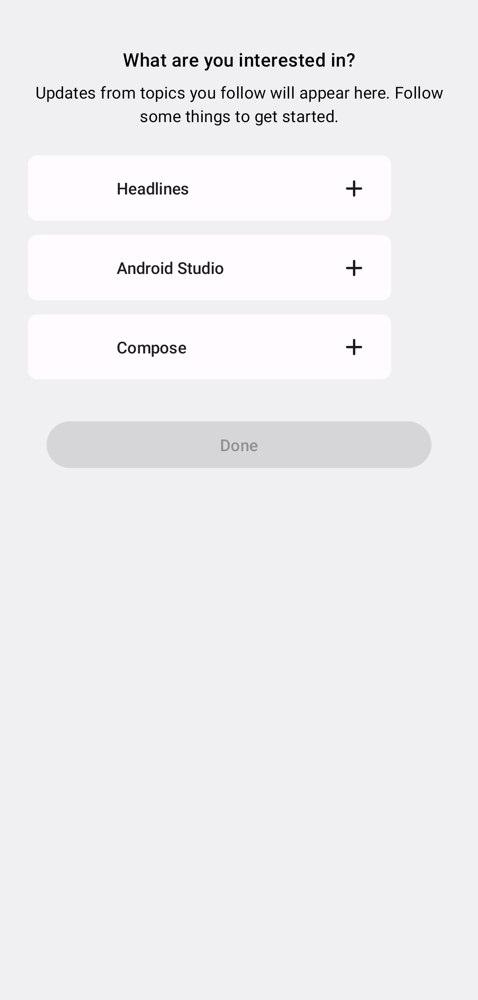
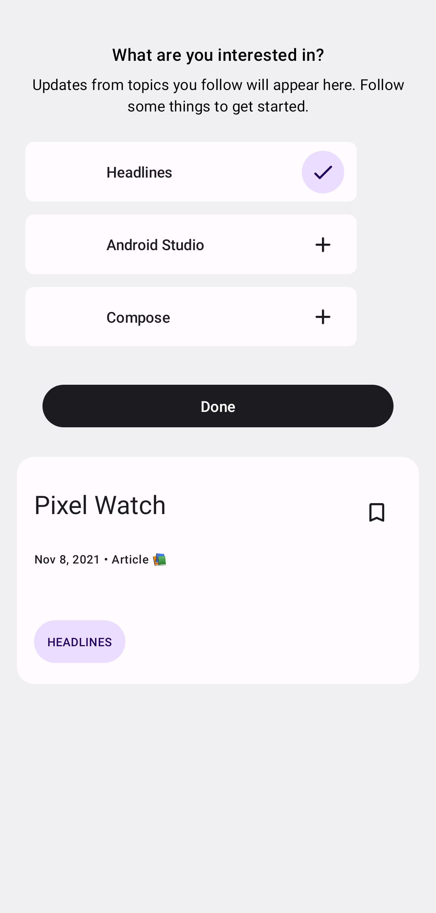
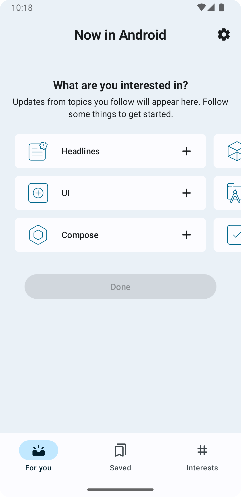
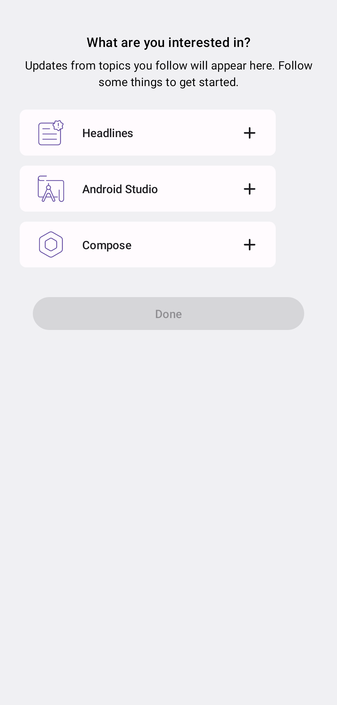

# さまざまなケースでComposeの画面スクリーンショットを撮る

ここまでで、Composeのプレビュー画面について、スクリーンショットを保存してVisual Regression Testを運用する基本的な方法を学んできた。

本節では、より応用的なトピックとして、次のようなケースでスクリーンショットを保存するテクニックを紹介する。

- 1つのプレビュー画面のスクリーンショットを、さまざまな環境の下で保存する
  - [実現の仕組み](#mechanism)
  - [スクリーンショット取得のための環境セットアップ](#environment-setup)
  - [画面サイズでスクリーンショットを撮る](#screen-size)
  - [さまざまなフォントスケールでスクリーンショットを撮る](#font-scale)
  - [ナイトモード(ダークモード)でのスクリーンショットを撮る](#night-mode)
- [UIテストの中で画面のスクリーンショットを保存する](#ui-interaction)
- [Coilを使って画像を非同期のロードする画面のスクリーンショットを保存する](#coil)

## 1つのプレビュー画面のスクリーンショットを、さまざまな環境の下で保存する

### <a id="mechanism"></a>実現の仕組み

実現方法はユースケースによって2種類ある。

- 1つの`@Preview`アノテーションにつき、複数パターンのスクリーンショットを保存したい
  - 例：すべてのプレビュー画面について、ダークモードのスクリーンショットとライトモードのスクリーンショットの両方を保存したい
- 特定のプレビュー画面のみ、通常とは異なる環境でスクリーンショットを保存したい
  - 例：`@Preview(widthDp = 800)` と指定されているときは、画面幅800dpのスクリーンショットを保存したい

#### ユースケース1：1つの`@Preview`アノテーションにつき、複数パターンのスクリーンショットを保存する

このユースケースは、「[Composeのプレビュー画面でVisual Regression Testを行う](VisualRegressionTest_Preview.md)」で紹介した`ParameterizedRobolectricTestRunner`の仕組みを使うと自然に実現できる。

```kotlin
@RunWith(ParameterizedRobolectricTestRunner::class)
@GraphicsMode(GraphicsMode.Mode.NATIVE)
@Config(qualifiers = RobolectricDeviceQualifiers.Pixel7)
class AllPreviewScreenshotTest(
    private val testCase: TestCase
) {

    // あとで composeTestRule.activityRule が必要になるため createAndroidComposeRule を使う
    @get:Rule
    val composeTestRule = createAndroidComposeRule<ComponentActivity>()

    ...

    @Test
    fun testLightMode() {
        val filePath = "${testCase.showkaseBrowserComponent.componentKey}.png"
        // ライトモードでスクリーンショットを保存するように環境を設定する
        // updateScreenshotEnvironmentの実装は後述
        updateScreenshotEnvironment("notnight")

        // 変更した環境を適用するためにActivityを再生成する
        composeTestRule.activityRule.scenario.recreate()

        // スクリーンショットをとる
        capturePreview(filePath)
    }

    @Test
    fun testDarkMode() {
        // テストメソッドごとにスクリーンショットのファイル名が重複しないように末尾に`_night`を入れたファイル名にする
        val filePath = "${testCase.showkaseBrowserComponent.componentKey}_night.png"
        // ダークモードでスクリーンショットを保存するように環境を設定する
        // updateScreenshotEnvironmentの実装は後述
        updateScreenshotEnvironment("night")

        // 変更した環境を適用するためにActivityを再生成する
        composeTestRule.activityRule.scenario.recreate()

        // スクリーンショットをとる
        capturePreview(filePath)
    }

    private fun capturePreview(filePath: String) {
        // 「Composeのプレビュー画面でVisual Regression Testを行う」で紹介したスクリーンショットを保存するコード
        ...
    }

    companion object {
        class TestCase(
            val showkaseBrowserComponent: ShowkaseBrowserComponent
        ) {
            override fun toString() = showkaseBrowserComponent.componentKey
        }


        @ParameterizedRobolectricTestRunner.Parameters(name = "[{index}] {0}")
        @JvmStatic
        fun components(): Iterable<Array<*>> = Showkase.getMetadata().componentList.map {
            arrayOf(TestCase(it))
        }
    }
}
```

Showkaseでは、次のコードで`@Preview`または`@ShowkaseComposable`が付いたComposable関数に関する情報(`ShowkaseBrowserComponent`)のリストが得られる。
ひとつのアノテーションにつき、ひとつの要素(`ShowkaseBrowserComponent`インスタンス)が対応している。

```kotlin
val showkaseBrowserComponentList: List<ShowkaseBrowserComponent> = Showkase.getMetadata().componentList
```

`ParameterizedRobolectricTestRunner`では、1つの`ShowkaseBrowserComponent`につき1回テストクラスが呼び出されるため、テストクラス内に複数のテストメソッドを定義すれば、それぞれのテストが呼び出されることになる。
そのため、1つのプレビュー画面で撮りたい各バリエーションについて、それに対応するテストメソッドを定義していけばよい。

#### ユースケース2：特定のプレビュー画面のみ、通常とは異なる環境でスクリーンショットを保存する

`@Preview`または`@ShowkaseComposable`アノテーションのオプション引数に指定された情報は、前述の`ShowkaseBrowserComponent`クラスのプロパティから取得できる。
`ShowkaseBrowserComponent`クラスには次のプロパティが定義されている。

```kotlin
data class ShowkaseBrowserComponent(
    val componentKey: String, 
    val group: String,
    val componentName: String,
    val componentKDoc: String,
    val component: @Composable () -> Unit,
    val styleName: String? = null,
    val isDefaultStyle: Boolean = false,
    val widthDp: Int? = null,
    val heightDp: Int? = null,
    val tags: List<String> = emptyList(),
    val extraMetadata: List<String> = emptyList()
)
```

これらのプロパティに格納されている情報を元に、テストコード側で条件分岐すれば、たとえば次のようなことが実現できる。

- `widthDp`と`heightDp`によって指定された画面サイズでスクリーンショットを撮る
- `group`に`"night"`という文字列が含まれるものについては、ナイトモード(ダークモード)でスクリーンショットを撮る

ところが、`@Preview`アノテーションのパラメーターのうち、`ShowkaseBrowserComponent`のプロパティに反映されるのは次の4つしかない。
そのため、この4つのパラメーターを使って「どのような環境(例：ダークモード)でスクリーンショットをとりたいのか」を表現しなければならない。

| `@Preview`アノテーションのパラメーター名 | 対応する`ShowkaseBrowserComponent`のプロパティ名 |
|----------------------------------------|--------------------------------------------------|
| `group`                                | `group`                                          |
| `name`                                 | `componentName`                                  |
| `widthDp`                              | `widthDp`                                        |
| `heightDp`                             | `heightDp`                                       |

たとえば、次のような2つの設定で、(Android Studio上に)プレビュー画面を表示しているケースを考える。

```kotlin
// 360x640の画面サイズ、ドイツ語、ナイトモードでプレビュー画面を表示する
@Preview(widthDp = 360, heightDp = 640, locale = "de", uiMode = Configuration.UI_MODE_NIGHT_YES)
// 1200x800の画面サイズ、日本語、ナイトモードでプレビュー画面を表示する
@Preview(widthDp = 1200, heightDp = 800, locale = "ja", uiMode = Configuration.UI_MODE_NIGHT_YES)
@Composable
fun MyComposable() { ... }
```

同じ設定下で表示した画面をスクリーンショットテストでも保存したいものの、`locale`と`uiMode`に指定されている値は`ShowkaseBrowserComponent`に反映されない。
そこで、`locale`と`uiMode`に指定されている値の情報を、(`ShowkaseBrowserComponent`に反映される)`group`パラメーターにも指定することを考える。
それらの情報を`-`区切りでエンコードするのであれば、次のように`@Preview`アノテーションの宣言を書き換えるとよい。

```kotlin
@Preview(group = "de-night", widthDp = 360, heightDp = 640, locale = "de", uiMode = Configuration.UI_MODE_NIGHT_YES)
@Preview(group = "ja-night", widthDp = 1200, heightDp = 800, locale = "ja", uiMode = Configuration.UI_MODE_NIGHT_YES)
@Composable
fun MyComposable() { ... }
```

このようにすることで、Android Studioのプレビュー画面では `widthDp`・`heightDp`・`locale`・`uiMode`の情報を使って画面を表示し、
スクリーンショットテストでは`widthDp`・`heightDp`・`group`の情報を使ってスクリーンショットを保存できるようになる。

何度も同じような宣言を書くのが大変な場合は、次のようにカスタムアノテーションを定義してもよい。

```kotlin
// MyCustomPreviewという名前のカスタムアノテーションを定義
@Preview(group = "de-night", widthDp = 360, heightDp = 640, locale = "de", uiMode = Configuration.UI_MODE_NIGHT_YES)
@Preview(group = "ja-night", widthDp = 1200, heightDp = 800, locale = "ja", uiMode = Configuration.UI_MODE_NIGHT_YES)
annotation class MyCustomPreviews


// カスタムアノテーションを、上記組み合わせでプレビューしたい関数に付与する
@MyCustomPreview
@Composable
fun MyComposable() { ... }
```

このユースケースのテストコードは次のようなイメージになる。

```kotlin
class AllPreviewScreenshotTest(
    private val testCase: TestCase
) {

  // あとで composeTestRule.activityRule が必要になるため createAndroidComposeRule を使う
  @get:Rule
  val composeTestRule = createAndroidComposeRule<ComponentActivity>()
  lateinit var context: Context

  @Before
  fun setUp() {
      context = ApplicationProvider.getApplicationContext()
  }

  ...

  @Test
  fun test() {
    ...
    val widthDp = testCase.showkaseBrowserComponent.widthDp
    val heightDp = testCase.showkaseBrowserComponent.heightDp
    // 画面サイズの変更
    if (widthDp != null || heightDp != null) {
        // 画面サイズを変更する。setDisplaySizeの実装は後述。
        setDisplaySize(widthDpp, heightDp)
    }

    // `group`が指定されていないときは"Default Group"という文字列になっている
    // そのときは`group`のパースをスキップする
    if (testCase.showkaseBrowser.group != "Default Group") {
      // group に指定されたハイフン区切りの文字列をパースする
      // たとえば
      // group = "de-night"
      // であれば
      // tagsは ["de", "night"] となる
      val tags = testCase.showkaseBrowser.group.split("-")

      // その他の情報の反映
      tags.forEach { tag ->
          // tagの指定内容にあわせて環境を変更する。
          // updateScreenshotEnvironmentの実装は後述
          updateScreenshotEnvironment(tag)
      }
    }
    // 変更した画面サイズや環境を適用するためにActivityを再生成する
    composeTestRule.activityRule.scenario.recreate()

    // スクリーンショットを撮る
    composeTestRule.setContent { 
        testCase.showkaseBrowserComponent.component()
    }
    composeTestRule.onRoot().captureRoboImage()
  }
}
```

特に次のポイントに注意すること。
- 画面サイズや環境を変更した後には`composeTestRule.activityRule.scenario.recreate()`を呼び出してActivityを再生成する必要がある
- `composeTestRule.activityRule`にアクセスするためには`createComposeRule()`ではなく`createAndroidComposeRule()`を使う必要がある

なお、`group`パラメーターにスクリーンショット取得環境の指定をエンコードする方法は、厳密にいえば`group`パラメーターの用途外利用となる。
とくに、ShowkaseブラウザでUIカタログを閲覧するときのグルーピングが意味をなさなくなってしまう点はデメリットかも知れない。
もし、その点が許容できない場合は、`@Preview`アノテーションとあわせて(Showkaseからしか認識されない)`@ShowkaseComposable`アノテーションを併記する方法もある。
詳細は割愛するが、その場合は画面サイズ以外の情報を`tags`パラメーターに指定するとよい。

### <a id="environment-setup"></a>スクリーンショット取得のための環境セットアップ

これまでに学んできた実現の仕組みに加えて、スクリーンショットを撮りたい環境別のセットアップ方法を学べば、特定の環境下でのスクリーンショット取得が実現できる。
ここでは、次の3つのケースについてセットアップ方法を説明する。

- [特定の画面サイズでスクリーンショットを撮る](#screen-size)
- [特定のフォントスケールでスクリーンショットを撮る](#font-scale)
- [ナイトモード(ダークモード)でスクリーンショットを撮る](#night-mode)

#### <a id="screen-size"></a>特定の画面サイズでスクリーンショットを撮る

スクリーンショットを撮りたい画面サイズ`widthDp`・`heightDp`が与えられたときに、画面サイズを変更する`setDisplaySize()`メソッドの実装を紹介する。
「ユースケース2」で紹介したテストコードとあわせて使えば、`@Preview`アノテーションの`widthDp`と`heightDp`の指示どおりの画面サイズでスクリーンショットを取得できる。

Robolectricが提供している動的に画面サイズを変更する`ShadowDisplay` APIを使って実現できる。

```kotlin
private fun setDisplaySize(widthDp: Int?, heightDp: Int?) {
  val display = ShadowDisplay.getDefaultDisplay()
  // 「ユースケース2」のテストクラスで宣言されていたcontextプロパティを使っている
  val density = context.resources.displayMetrics.density
  widthDp?.let {
      val widthPx = (widthDp * density).roundToInt()
      Shadows.shadowOf(display).setWidth(widthPx)
  }
  heightDp?.let {
      val heightPx = (heightDp * density).roundToInt()
      Shadows.shadowOf(display).setHeight(heightPx)
  }
}
```

なお「ユースケース2」で紹介したテストコードでは、テストクラスの`@Config`アノテーションで、デバイスとして`RobolectricDeviceQualifiers.Pixel7`が指定されている。
そのため、`widthDp`や`heightDp`が指定されていないときはPixel7の画面サイズでスクリーンショットが撮られることになる。

#### <a id="font-scale"></a>特定のフォントスケールでスクリーンショットを撮る

フォントスケールを変更した状態でスクリーンショットを撮るには、`CompositionLocalProvider`を使って`LocalDensity`を変更することで実現する。
`CompositionLocalProvider`や`LocalDensity.current`はComposable関数であるため、`composeTestRule.setContent{ ... }`の中で宣言する必要がある。

次に、フォントスケールを2倍にする(本来のフォントの2倍の大きさでレンダリングする)例を示す。

```kotlin
composeTestRule.setContent {
    val density = LocalDensity.current
    val customDensity = Density(fontScale = density.fontScale * 2, density = density.density)
    CompositionLocalProvider(
        LocalDensity provides customDensity
    ) {
        testCase.showkaseBrowserComponent.component()
    }
}
```

すべてのプレビュー画面について、通常のフォントサイズと、2倍のフォントサイズの2種類のスクリーンショットを撮りたいという「ユースケース1」のパターンでは、
片方のテストメソッドについてだけ上記の設定を入れるとよい。

```kotlin
@RunWith(ParameterizedRobolectricTestRunner::class)
@GraphicsMode(GraphicsMode.Mode.NATIVE)
@Config(qualifiers = RobolectricDeviceQualifiers.Pixel7)
class AllPreviewScreenshotTest(
    private val testCase: TestCase
) {


    @Test
    fun defaultFontScaleTest() {
        val filePath = "${testCase.showkaseBrowserComponent.componentKey}.png"
        // デフォルトのフォントスケールでスクリーンショットをとる
        takeScreenshot(filePath = filePath)
    }
    
    @Test
    fun doubledFontScaleTest() {
        val filePath = "${testCase.showkaseBrowserComponent.componentKey}_font2x.png"
        // 2倍のフォントスケールでスクリーンショットをとる
        takeScreenshot(filePath = filePath, fontMagnification = 2.0f)
    }

    private fun takeScreenshot(filePath: String, fontMagnification: Float = 1.0f) {
        composeTestRule.setContent {
            val density = LocalDensity.current
            val customDensity = Density(fontScale = density.fontScale * fontMagnification, density = density.density)
            CompositionLocalProvider(
                // 以前に紹介したようにLocalInspectionModeをtrueにする
                LocalInspectionMode provides true,
                // フォントを拡大したcustomDensityでLocalDensityを上書きする
                LocalDensity provides customDensity
            ) {
                testCase.showkaseBrowserComponent.component()
            }
        }
        // captureRoboImage(filePath)でスクリーンショットを撮る
        ...
    }

    companion object {
        ...
    }
}
```
#### <a id="night-mode"></a>ナイトモード(ダークモード)でスクリーンショットを撮る

Robolectricでは、「[Specifying Device Configuration](https://robolectric.org/device-configuration/)」に列挙されている項目(qualifierと呼ぶ)であれば、
`RuntimeEnvironment.setQualifiers()`を使うことで環境を一時的に変更できる。
ナイトモードに関しては、デフォルトではライトモード(`notnight`)で、`night`を指定するとナイトモードとなる。

次のように、先頭に`+`を付けてqualifier(ここでは`notnight`や`night`)を指定すると、デフォルトで指定されているqualifiersに追加で環境を指定できる。

「デフォルトで指定されているqualifiers」というのは、テストクラスの`@Config`で指定されている`qualifiers`引数のことである。
いままでのテストクラスでは`RobolectricDeviceQualifiers.Pixel7`を指定していたが、この具体的な値は次のように定義されている。

```kotlin
const val Pixel7 = "w411dp-h914dp-normal-long-notround-any-420dpi-keyshidden-nonav"
```

つまり
```kotlin
RuntimeEnvironment.setQualifiers("+night")
```

と指定することで、この`Pixel7`の設定に加えてナイトモードを指定したことになる。

前述の「ユースケース2」を想定して`@Preview`の`group`パラメーターに、ハイフン区切りのqualifierを指定することにすれば、
「ユースケース2」で紹介したテストコード中の`updateScreenshotEnvironment`に関連する部分は次のようになる。

```kotlin
@Test
fun test() {
    ...
    // `group`が指定されていないときは"Default Group"という文字列になっている
    // そのときは`group`のパースをスキップする
    if (testCase.showkaseBrowser.group != "Default Group") {
        // group に指定されたハイフン区切りの文字列をパースする
        // たとえば
        // group = "de-night"
        // であれば
        // tagsは ["de", "night"] となる
        val tags = testCase.showkaseBrowser.group.split("-")
        tags.forEach { tag ->
            // tagの指定内容にあわせて環境を変更する。
            updateScreenshotEnvironment(tag)
        }
    }
    ...
}

fun updateScreenshotEnvironment(tag: String) {
  RuntimeEnvironment.setQualifiers("+$tag")
}

```

### ここまでのまとめ

スクリーンショットを撮る2つのユースケース別に、テストの組み立て方を説明した。
- 1つのアノテーション(1つの`ShowkaseBrowserComponent`)につき、複数パターンのスクリーンショットを保存する
- 特定のプレビュー画面のみ、通常とは異なる環境でスクリーンショットを保存する

続けて、スクリーンショットを撮りたい環境のセットアップ手段として使える3つの方法を具体例と共に説明した。

- RobolectricのShadow APIを使って画面サイズを変更する
- `CompositionLocalProvider`を使ってフォントスケールを変更する
- Robolectricの`RuntimeEnvironment.setQualifiers()`を使ってナイトモード(ダークモード)にする

### 練習問題1〜3

- テストコード：[VariousPreviewScreenshotTest](../../app/src/testExercise/java/com/google/samples/apps/nowinandroid/VariousPreviewScreenshotTest.kt) (`demoExerciseDebug`バリアント)
- 解答例：[VariousPreviewScreenshotTest](../..//app/src/testAnswer/java/com/google/samples/apps/nowinandroid/VariousPreviewScreenshotTest.kt) (`demoAnswerDebug`バリアント)
- テストを実行したときのスクリーンショット格納先：[screenshots](../../screenshots)ディレクトリ

前回作成した`AllPreviewScreenshotTest`を、`VariousPreviewScreenshotTest`というクラス名で`app/src/testExercise`配下にコピーしている。
次の内容を実現できるように、そのテストコードを改造しよう。

<!-- textlint-disable japanese/sentence-length -->
改造した結果は、プレビュー関数[InterestsScreenPopulated](../../feature/interests/src/main/java/com/google/samples/apps/nowinandroid/feature/interests/InterestsScreen.kt)の5枚のスクリーンショット(`screenshots/com.google.samples.apps.nowinandroid.feature.interests_InterestsScreenPopulated_*.png`)で判断できる。
<!-- textlint-enable -->

- 練習問題1：「ユースケース2」のテストコードを参考に、`@Preview`の`widthDp`と`heightDp`が指定されたときに画面サイズを変更してスクリーンショットを撮るようにしてみよう
    - プレビュー関数`InterestsScreenPopulated`に付与されている[`@DevicePreviews`](../../core/ui/src/main/java/com/google/samples/apps/nowinandroid/core/ui/DevicePreviews.kt)アノテーション定義には`widthDp`や`heightDp`が指定されているにもかかわらず、改造前の状態では4枚とも同じ画面サイズのスクリーンショットになっている。
      テストコードを修正して、`widthDp`・`heightDp`の指示どおりの画面サイズでスクリーンショットを撮るようにしよう
- 練習問題2：いままで取得していた各スクリーンショットについて、フォントスケールを2倍にしたときのスクリーンショットも合わせて保存するようにしてみよう(「ユースケース1」のパターン)
     - フォントスケール1倍となっている5枚のスクリーンショットに加えて、フォントスケール2倍のスクリーンショット5枚(合計10枚)を撮るようにしよう
- 練習問題3：練習問題1をさらに改良し、`@Preview`の`group`パラメーター(ハイフン区切り)に`night`が含まれていたらナイトモードでスクリーンショットを撮るようにしてみよう
     - `@DevicePreviews`の定義内で`night`が含まれているものは1つだけである。
       その1つに対応するスクリーンショットをナイトモードのスクリーンショットにしよう
       (ナイトモードのスクリーンショットは、練習問題2によってフォントスケール別に2枚保存されるはずである)

## <a id="ui-interaction"></a>UIテストの中で画面のスクリーンショットを保存する

Roborazziは、プレビュー画面以外であってもスクリーンショットを取得できる。
たとえば、Jetpack Composeによって構築された画面のUIを`ComposeTestRule`で操作した結果をスクリーンショットとして保存できる(UI操作の方法は「[ViewModelを結合してComposeをテストする](./UIElementTest_ComposeWithViewModel.md)」参照)。


```kotlin
@RunWith(AndroidJUnit4::class)
@GraphicsMode(GraphicsMode.Mode.NATIVE)
class UserInteractionTest {
    @get:Rule
    val composeTestRule = createComposeRule()

    @Test
    fun test() {
        composeTestRule.setContent {
            // テストしたいComposable関数
            MyComposable()
        }
        // OKボタンクリック
        composeTestRule.onNodeWithText("OK").performClick()
        // スクリーンショット取得
        composeTestRule.onRoot().captureRoboImage()

    }
}

```

このコードでは、`MyComposable()`の画面を表示し、「OK」と書かれたコンポーネントをクリックした後の画面のスクリーンショットを保存している。


### 練習問題4

- テストコード：[ForYouScreenVisualRegressionTest](../../feature/foryou/src/testExercise/java/com/google/samples/apps/nowinandroid/feature/foryou/ForYouScreenVisualRegressionTest.kt)
- 解答例：[ForYouScreenVisualRegressionTestEx4](../../feature/foryou/src/testAnswer/java/com/google/samples/apps/nowinandroid/feature/foryou/ForYouScreenVisualRegressionTestEx4.kt)


現在のテストコードのままでテストを実行し、スクリーンショットが次のような結果になることを確認しよう。



次に、Content Descriptionに`Headlines`と書かれているコンポーネントをクリックしてから `captureRoboImage()` を呼ぶようにテストコードを書き換えよう。  
※ヒント：onNodeWithContentDescriptionメソッドとperformClickメソッドを利用する


最後に、再度テストを実行し、スクリーンショットが次のように変化することを確認しよう。  


## <a id="coil"></a>Coilを使って画像を非同期のロードする画面のスクリーンショットを保存する

練習問題4で撮影した`ForYouScreen`は、本来であれば`Headlines`などの見出しの左側にアイコンが表示されるはずだが、スクリーンショットだとアイコンは表示されていない。

| 練習問題4で撮影した画像 | アプリとして動作させたときの画像 |
|----------------------------|----------------------------------------|
|  |  |


このアイコンはCoilを使ってネットワークから非同期にダウンロードしたものが表示されているが、
RobolectricではCoilの非同期ダウンロードを正しく扱えないため、このようなスクリーンショットになってしまう。

この問題を解決するのが[`FakeImageLoaderEngine`](https://coil-kt.github.io/coil/testing/)である。
`FakeImageLoaderEngine`はCoilから提供されており、次の依存関係を追加することで利用できるようになる。

```
testImplementation("io.coil-kt:coil-test:2.6.0")
```

`FakeImageLoaderEngine`を使うと、画像をURLからダウンロードする代わりに、指定した画像(Androidの`Drawable`オブジェクト)を表示させることができる。
代替画像は、URLごとに異なるものを指定したり、すべて同じ画像にしたりできる。
Coilの公式ドキュメントに記載されている使用例は次のとおり(コメントは筆者追記)。

```kotlin
@Before
fun before() {
    val engine = FakeImageLoaderEngine.Builder()
        // 特定のURLと完全一致したときの代替画像を指定する
        .intercept("https://www.example.com/image.jpg", ColorDrawable(Color.RED))

        // URLが特定の条件を満たしたときの代替画像を指定する
        .intercept({ it is String && it.endsWith("test.png") }, ColorDrawable(Color.GREEN))

        // デフォルトの代替画像を指定する
        .default(ColorDrawable(Color.BLUE))
        .build()
    val imageLoader = ImageLoader.Builder(context)
        .components { add(engine) }
        .build()
    // ここで作ったFake ImageLoaderに差し替える
    Coil.setImageLoader(imageLoader)
}
```

なお、この方法でCoilのImageLoaderを差し替えたときは、`tearDown`メソッドで`Coil.reset()`を呼んで差し替えたImageLoaderを元に戻さなければならない点に注意すること。

```kotlin
@After
fun tearDown() {
    Coil.reset()
}
```

### 練習問題5

- テストコード：練習問題4で作成した`ForYouScreenVisualRegressionTest`
- 解答例：[ForYouScreenVisualRegressionTestEx5](../../feature/foryou/src/testAnswer/java/com/google/samples/apps/nowinandroid/feature/foryou/ForYouScreenVisualRegressionTestEx5.kt)

練習問題4で作成した`ForYouScreenVisualRegressionTest`について、次のようなルールで代替画像を設定し、
アイコンが表示されるようにしてみよう。

※依存ライブラリ `io.coil-kt:coil-test:2.6.0` の追加は設定済み

| URL | 代替画像 |
|-----|-----------|
| URLに`Android-Studio`が含まれているとき | `R.drawable.ic_topic_android_studio` |
| URLに`Compose`が含まれているとき | `R.drawable.ic_topic_compose` |
| URLに`Headlines`が含まれているとき | `R.drawable.ic_topic_headlines` |

リソースID(`R.drawable.xxxx`)から`Drawable`オブジェクトを生成するには`context.getDrawable()`を使う。

```kotlin
val context = ApplicationProvider.getApplicationContext<Context>()
val drawable = context.getDrawable(R.drawable.xxxx)
```

うまくいけば、次のようなスクリーンショットが撮れるはずである。


