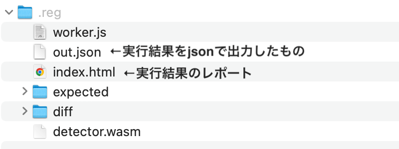
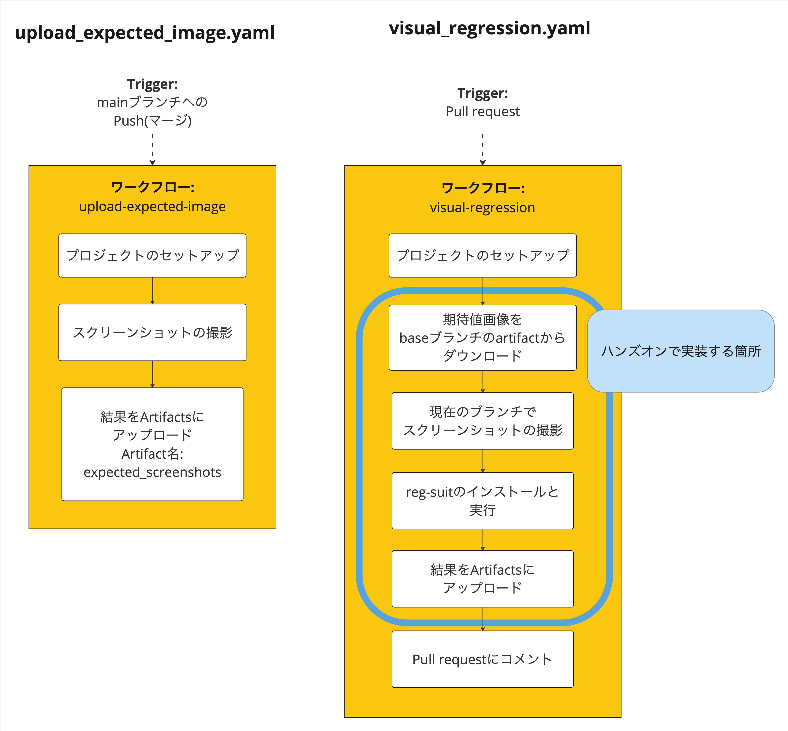
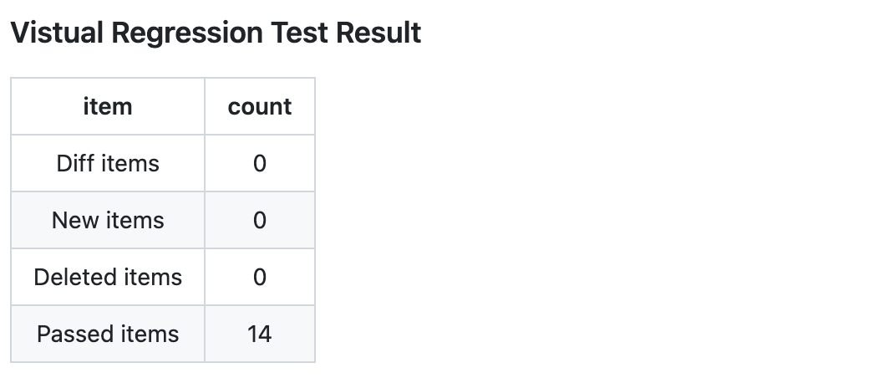

# Visual Regression TestをCIで実行する

このハンズオンでは、CI上でVisual Regression Testを実行するワークフローの実装方法を紹介する。

-  Visual Regression Testの特徴
-  reg-suit(画像比較ツール)の紹介
-  Visual Regression Testワークフロー実装時の選択肢
-  Visual Regression Testワークフローの実装

## Visual Regression Testの特徴

Visual Regression Testには次のようなメリットとデメリットがある。

### メリット
 - レンダリング結果の変更検知が自動的にでき、見た目に関する問題の見逃しを防ぐ
   - 通常UIテストでは検査対象はテストコードで記述した操作やアサートだけになるが、Visual Regression Testの場合はスクリーンショットを取得した範囲すべてが検査対象になる
   - たとえば、あるボタンが前バージョンと比較してユーザーの操作が難しくなるほど小さくなっていた場合、UIテストでは操作ができれば成功してしまう、Visual Regression Testではこの差分を検知できる
 - UIテストと比較すると実装コストが低い
   - UIテストの場合は、画面の中から操作対象や検査対象を決定し、テストコードに記述する必要がある。Visual Regression Testは検証したい状態が作れれば、あとはスクリーンショットを取得するだけでよい

### デメリット
 - 画像と画像同士の比較のため、誤検知(偽陽性)が発生しやすい。実行環境・フォント・人の目ではわからないほどのピクセル単位のレンダリング結果のズレ等、誤検知につながる要因が多い。また誤検知自体の修正が難しい場合もある
   - たとえば、スクロールバーのような表示後に自動的にフェードアウトするようなUIパーツがあった場合に、画像を取得タイミングによってスクロールバーの濃さの差分が出るといった問題があった
 - UIは当然意図して変更されることもあるので、変更を検知したとしても、必ずしも失敗ではない。その変更が意図したものなのか、そうでないのかの判断には目視確認が必要
   - 特に共通のUIパーツを更新した場合など、大量の変更が検知された場合は目視確認をするコストが高くなる


## reg-suit(画像比較ツール)の紹介

Visual Regression Testを実行するためには、レンダリング結果の画像取得ツールと、画像同士の差分を比較をしてレポートをするツールが必要。

Roborazziはレンダリング結果の画像取得がメインのツールだが、画像比較とレポートの機能も持っている。一方、画像比較とレポートに特化したツールもあり、それが[reg-suit](https://github.com/reg-viz/reg-suit)である。

画像取得ツールと画像比較のツールを別にすることで、画像取得ツールが変わっても画像比較部分のワークフローを変えなくてもよいというメリットがある。また、Android開発以外でもワークフローの大部分を使い回せるため、今回は次のようにツールを使い分ける。

|役割|ツール |
| :--|:-- |
|レンダリング結果の画像取得|Roborazzi|
|画像比較とレポート作成|reg-suit|


### reg-suitのセットアップ

はじめに、reg-suitのセットアップをする。<br>
(※Node.jsが入っていない場合は、[ダウンロードページ](https://nodejs.org/en/download)からNode.jsを入手するか、任意の方法でNode.jsを利用できるようにする)

次のコマンドをリポジトリのルートディレクトリで実行し、reg-suitのインストールと設定を行う。

```bash
# reg-suitのインストール
npm install -D reg-suit

# reg-suitの初期化
npx reg-suit init
```

`reg-suit init`コマンドはreg-suitの設定を対話形式で行う。各設問について次のように設定する。

 - Plugin(s) to install
   - 今回はどのpluginも利用しないため、`a`(すべてのpluginの選択状態をトグルするコマンド)を2回押して、すべて非選択の状態にしてEnter
 - Working directory of reg-suit.
   - reg-suitの作業ディレクトリ。実行結果が出力される場所
   - デフォルト値の **.reg** のままでよい。未入力のままEnter
 - Append ".reg" entry to your .gitignore file.
   - `Y`を押してEnter
 - Directory contains actual images.
   - **screenshots**と入力してEnter
 - Threshold, ranges from 0 to 1. Smaller value makes the comparison more sensitive.
   - 差分の許容範囲の閾値
   - デフォルト値の0のままでよい。未入力のままEnter
 - Update configuration file
   - `Y`を押してEnter
 - Copy sample images to working dir
   - `Y`を押してEnter

設定が完了したら、次のファイルが出力されていることを確認する。

- リポジトリのルートディレクトリ/**regconfig.json**
- リポジトリのルートディレクトリ/**screenshots/sample.png**


### reg-suitの実行

reg-suitは`regconfig.json`に設定された、2つのディレクトリの画像同士を比較する。

|画像の種別|    配置するディレクトリ    |
|:----|:-----------|
|期待(変更前)画像|workingDir/expected<br>現在の設定: `.reg/exepected` | 
|実際の(変更後)画像 | actualDir<br>現在の設定: `screenshots`  |

`reg-suit run`コマンドを実行すると、画像比較の結果がworkingDir(現在の設定では.reg)に出力される。

```
npx reg-suit run
```




### 練習問題①

次の手順でreg-suitの動作を確認しよう。reg-suitを実行したら、実行結果のレポート(`.reg/index.html`)も確認しよう。


1. screenshotsディレクトリにsample.pngがある状態でreg-suitを実行する。`.reg/exepected`は空のままでよい
    - 実行結果は1件の画像追加
2. sample.pngを`.reg/exepected`配下にもコピーして、reg-suitを実行する
    - 実行結果は差分なし
3. screenshotsディレクトリのsample.pngを画像編集ソフト(Macのプレビューなど)で開いて何かしら変更を加える。その後reg-suitを実行する
    - 実行結果は1件の差分あり
    - レポートの差分を比較する機能をためしてみよう
4. screenshotsディレクトリのsample.pngを別名に変更して、reg-suitを実行する
    - 実行結果は1件の画像追加と1件の画像削除になる

#### reg-suitのレポートに何も表示されない場合

`regconfig.json`の**ximgdiff.invocationType**を`client`から`none`にする。`client`を指定している場合はWebアセンブリとWebワーカーを使ったレポートを作成するため、ブラウザによってはそれらが動作せず真っ白なレポートになる。

```json
{
  "core": {
    ..
    "ximgdiff": {
      "invocationType": "none" 
    }
  },
  "plugins": {}
}
```


## Visual Regression Testワークフロー実装時の選択肢

Visual Regressoin Testのワークフローを実装時には主に次のことを検討する。

- 期待値となる画像の保存先
- テスト結果レポートの保存先
- テスト結果をどのように通知するか

それぞれの項目について、どのような選択肢があるかを次に記載する。

### 期待値となる画像の保存先

|選択肢 |特徴|
|:---|:--- |
|S3・GCS|・reg-suitのpluginが用意されており、連携が簡単<br>・plugin利用時はreg-suitを実行するだけで自動的にストレージサービス上の画像との比較と、比較結果のアップができる<br>・容量に応じて追加のコストが必要になる|
|CIサービスのArtifacts|・Push時に記録したスクリーンショット画像をArtifactsに保存しておき、Pull RequestではbaseブランチのArtifactsをダウンロードして、差分を比較することができる<br>・Artifactsの容量制限には注意が必要だが、追加のコストなしに利用できるケースが多い|
|リポジトリ内に含む|・追加のコストは不要<br>・Gitのリポジトリ操作の時間に影響するため、LFSの利用を検討する|


### テスト結果レポートの保存先

|選択肢 |特徴|
|:---|:--- |
|S3・GCS|・基本的な特徴は「期待値となる画像の保存先」に記載したものと同様。reg-suitのPluginを使った場合、期待値画像とレポートの保存先を切り替えるといったことは難しい<br>・どちらのストレージサービスも静的なWebページのホスティングができるため、reg-suitを実行した結果生成されるインデックスページ(index.html)のリンクを開けばレポートを確認できる<br>・レポートへのアクセス権限をどうするかは別途検討必要がある|
|CIサービスのArtifacts|・Circle CIやPluginを適用させたJenkinsは静的なWebページのホスティングができる。そのため、Artifactに保存されたインデックスページのリンクを開けばレポートを確認できる<br>・一方、BitriseやGithub Actionsにはその機能がないため、一度reg-suitの実行結果をまとめたzipをダウンロードする必要がある|
|Github Pages|・追加のコストが不要で、レポートもダウンロードせずに確認できる<br>・Git LFSが使えないため、画像が増えてくるとGitのリポジトリ操作時間に大きな影響が出る可能性がある|

### テスト結果をどのように通知するか

Visual Regression Testは差分があったときにどうするのかを目視で確認する必要がある。そのため、画像の差分をPull Requestからすぐに見られるのが望ましい。これは、レポートがリンクを開くだけで見られるようになっているか(今回の場合はreg-suitを実行した結果生成されるインデックスページをホスティングできる場所に置いているか)どうかで実装コストが変わってくる。

レポートがリンクを開くだけで見られるようになっていれば、Pull RequestやSlackにそのリンクを通知するだけでよい。

そうでない場合に、Pull Requestからすぐに差分を確認できるようにするアプローチとして、DroidKaigi/conference-app-2023の[The Companion Branch Approach](https://github.com/DroidKaigi/conference-app-2023#the-companion-branch-approach)が参考になる。

### CIサービスについて

CIサービスは普段利用してるサービスを利用できるが、CIサービスの機能差によって次のような違いがある。それぞれの特徴を把握したうえで、画像やレポートの保存先を検討するとよい。

- 期待値となる画像の保存
  - Github Actionsでは、baseブランチのArtifactsの取得を容易にするような3rdパーティのActionがある
  - BitriseやCircle CIでは現在そういったものは見つかっておらず、APIを使ってダウンロードするようなスクリプトを記述する必要がある
- テスト結果レポートの保存先
  - Artifactにアップロードされた静的なWebページのホスティングができるサービスとできないサービスがある


## Visual Regression Testワークフローの実装


今回のハンズオンでは、実装が容易な次の構成での実装例を紹介する。

- CIサービス
  - Github Actions
- 期待値となる画像の保存先
  - Github ActionsのArtifacts
- テスト結果レポートの保存先
  - Github ActionsのArtifacts
  - 手元にダウンロードしてHTMLを開く
- テスト結果をどのように通知するか
  - Pull Requestにテスト結果をコメントする


ワークフローの全体像は次のとおり。




次のステップについて詳細を説明する。

- 期待値画像をbaseブランチのArtifactからダウンロードする
- 現在のブランチでスクリーンショット画像を取得する
- reg-suitのインストールと実行
- 結果をArtifactsにアップロード
- Pull requestにコメント


### 期待値画像をbaseブランチのArtifactからダウンロードする

Github Actionsでは[dawidd6/action-download-artifact](https://github.com/dawidd6/action-download-artifact)を利用すると、BaseブランチのArtifactsを簡単に取得できる。

upload_expected_image.yamlのワークフローでアップしたexpected_screenshotsという名前のArtifcatsを`.reg/expected`配下にダウンロードしたい場合は、次のように記述する。

```yaml
name: Visual Regression

..

jobs:
  visual-regression:
    ..

    steps:
      ..

      - uses: dawidd6/action-download-artifact@v3
        with:
          name: expected_screenshots # artifact名
          path: .reg/expected # ダウンロードしたArtifactsの展開先
          workflow: upload_expected_image.yaml # 画像をアップロードしているワークフローのファイル名
          branch: ${{ github.base_ref }} # baseブランチ名

```


#### 他CIサービスでの例

<details><summary> Bitrise</summary>

Bitriseの場合は、次のステップでbaseブランチのArtifactsをダウンロードできる。

- Build一覧取得APIでブランチを指定して検索した後に、jqコマンドで最新のBuild Slugを取得する
- Build Slugを使ってArtifactの一覧取得APIを実行し、jqコマンドでスクリーンショット画像のArtifact slugを取得する
- Artifact slugを使ってArtifact取得APIを実行し、jqコマンドでダウンロードURLを取得する
- ダウンロードURLで画像を取得し、.reg/expectedディレクトリに展開する

```bash
# install jq
sudo apt-get install jq

BASE_BRANCH=${BITRISEIO_GIT_BRANCH_DEST:-main}
SCREENSHOT_ZIP_FILE_NAME="deploy.zip"

# 直近のBaseブランチのBuild slugを取得
latest_base_build_slug=$(curl -X GET "https://api.bitrise.io/v0.1/apps/${BITRISE_APP_SLUG}/builds?branch=${BASE_BRANCH}&workflow=main&status=1" -H "accept: application/json"  -H "Authorization: $BITRISE_API_TOKEN"  | jq -r '.data [0].slug')

# 直近のBaseブランチのBuild slugのArtifact slugを取得する
expected_image_artifact_slug=$(curl -X GET "https://api.bitrise.io/v0.1/apps/${BITRISE_APP_SLUG}/builds/${latest_base_build_slug}/artifacts" -H "accept: application/json"  -H "Authorization: $BITRISE_API_TOKEN" | jq -r '.data[] | select( .title == $SCREENSHOT_ZIP_FILE_NAME) | .slug')

# Artifact slugからダウンロードURLを取得する
expected_image_artifact_url=$(curl -X GET "https://api.bitrise.io/v0.1/apps/${BITRISE_APP_SLUG}/builds/${latest_base_build_slug}/artifacts/${expected_image_artifact_slug}" -H "accept: application/json" -H "Authorization: $BITRISE_API_TOKEN" | jq -r '.data.expiring_download_url')

curl -X GET "${expected_image_artifact_url}" -o $SCREENSHOT_ZIP_FILE_NAME
unzip $SCREENSHOT_ZIP_FILE_NAME -d .reg/expected
```


</details>


### 現在のブランチでスクリーンショット画像を取得する

スクリーンショットの取得は、Roborazziのrecordタスクを実行すればよい。ハンズオン「Composeのプレビュー画面でVisual Regression Testを行う」を実施していれば、スクリーンショット画像はscreenshotsディレクトリに出力される。

```yaml
..
      - name: Record current screenshots
        run: ./gradlew :app:recordRoborazziDemoExerciseDebug
```

### reg-suitのインストールと実行

reg-suitのセクションで、reg-suitはセットアップ済みになっている。また、これまでのステップで`.reg/expected`には期待値の画像、screenshotsディテクトリには現在のブランチでスクリーンショットを取得した結果が保存されている。


そのためCIではインストールと実行だけすればよい。

```yaml
..
      - name: Setup Node.js
        uses: actions/setup-node@v3 # for Github.com use v4
        with:
          node-version: 'latest'

      - name: Install & Run reg-suit
        run: |
          npm install 
          npx reg-suit run
```

### 結果をArtifactsにアップロード

Visual Regression Testの結果はreg-suitの作業ディレクトリをそのままアップロードすればよい。次のStepを追加すれば、`visual-regression-results`という名前でテスト結果が保存される。

```yaml
..
      - uses: actions/upload-artifact@v3 # for Github.com use v4
        with:
          name: visual-regression-results # Artifact名
          path: .reg # reg-suitの作業ディテクトリ
```


### Pull Requestにコメントする

Github Actionsでは次のようなステップでPull Requestにコメントできる。

```yaml
..
      - name: Post Visual regression Test result to pull request
        run: |
          BODY="Any comment"
          gh pr comment "$NUMBER" --body "$BODY" --edit-last || gh pr comment "$NUMBER" --body "$BODY"
        env:
          # for enterprise: GITHUB_ENTERPRISE_TOKEN: ${{ secrets.GITHUB_TOKEN }} 
          GITHUB_TOKEN: ${{ secrets.GITHUB_TOKEN }}
          GH_REPO: ${{ github.repository }}
          NUMBER: ${{github.event.number}}
```

コメントの内容は任意だが、reg-suitの実行結果に保存されている`out.json`から変更が何件あったか、といったコメントを作ることもできる。

<details><summary>コメントを作成するサンプル</summary>

`out.json`をパースしてコメントを生成するサンプルを紹介する。

**イメージ**

(リンク部分は省略)




**スクリプト**


```bash
#!/usr/bin/env bash
RESULT_JSON_FILE=.reg/out.json
BUILD_URL=${{ github.server_url }}/${{ github.repository }}/actions/runs/${{ github.run_id }} 

if [ -f $RESULT_JSON_FILE ]; then
  DIFF=$(cat $RESULT_JSON_FILE | jq -r '.failedItems | length')
  NEW=$(cat $RESULT_JSON_FILE | jq -r '.newItems | length')
  DELETED=$(cat $RESULT_JSON_FILE | jq -r '.deletedItems | length')
  PASSED=$(cat $RESULT_JSON_FILE | jq -r '.passedItems | length')

  BODY=$(cat << EOF
### Vistual Regression Test Result

| item | count |
| :----: | :----: |
|Diff items|$DIFF|
|New items|$NEW|
|Deleted items|$DELETED|
|Passed items|$PASSED|

Build: $BUILD_URL
EOF
)   
else
   BODY="Visual regression test result is not found. Check build: ${BUILD_URL}"
fi
```

</details>


### 練習問題②

.github/workflows/visual_regression.yamlを開いて、次のステップを実装しよう。ステップを追加する位置はvisual_regression.yamlのコメントを確認すること。

- 期待値画像をbaseブランチのArtifactからダウンロードする
- 現在のブランチでスクリーンショット画像を取得する
- reg-suitのインストールと実行
- 結果をArtifactsにアップロード

※ fork先からのコメントを制限しているため、**Pull Requestにコメントするステップは実装しない**こと

### 練習問題③

実装が完了したらフォーク元のリポジトリにPull Requestを投げて、ワークフローが実行されることを確認しよう。baseブランチはmainで、変更差分はすべてpushしてOK。

visual-regressionのワークフローが完了したら、Jobの`Summary > Artifacts`から**visual-regression-results**をダウンロードして、実行結果のレポートが見られることを確認しよう。


**※ハンズオン「Composeのプレビュー画面でVisual Regression Testを行う」を実施していない場合**

スクリーンショットを取得するテストが未実装になっているため、appモジュールのsrc/testAnswerに実装されているAllPreviewScreenshotTestの実装を、src/testExerciseにコピー&ペーストしてからPull requestを投げよう。
