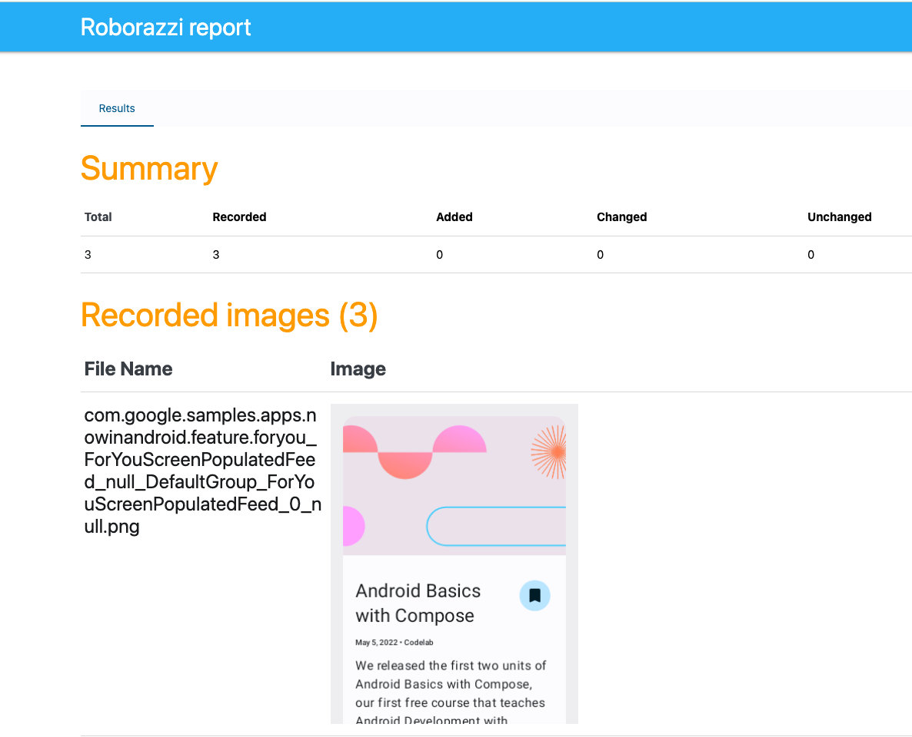
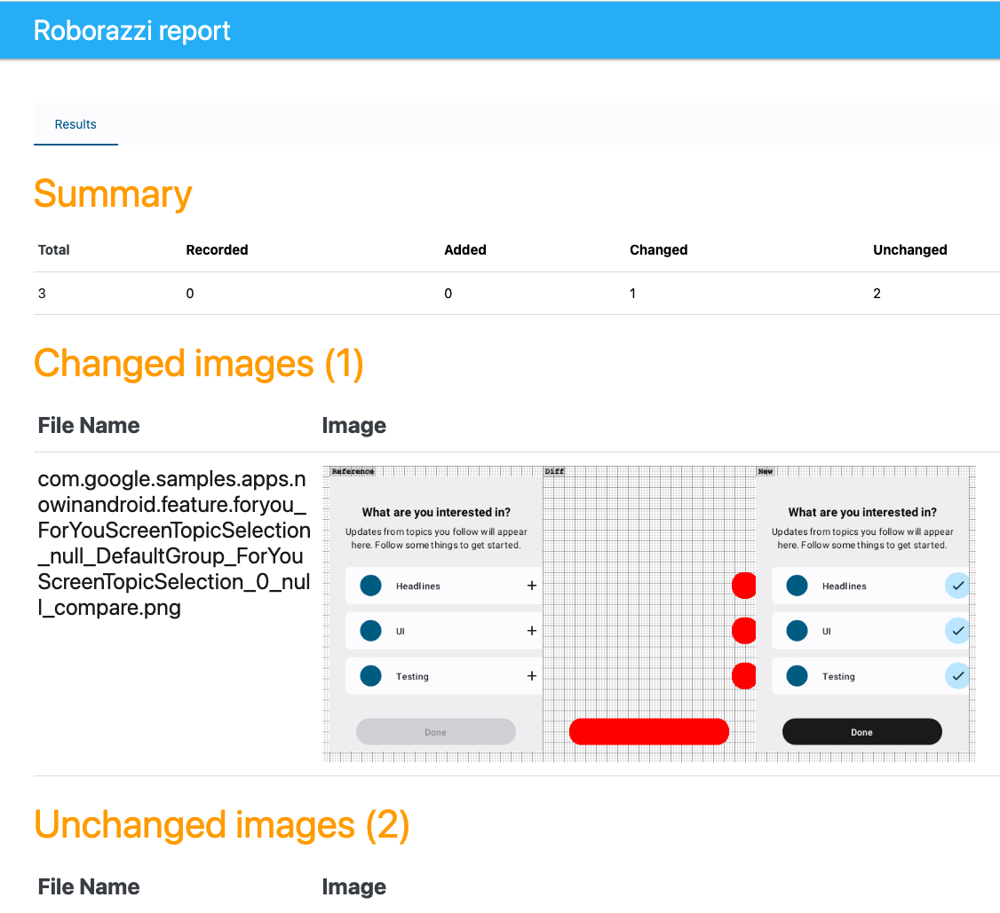

# Composeのプレビュー画面でVisual Regression Testを行う

本節では、`@Preview`アノテーションが付けられたComposeのプレビュー画面のスクリーンショットを自動的に撮る方法を学ぶ。

「[ViewModelを結合してComposeをテストする](./UIElementTest_ComposeWithViewModel.md)」でも「UI Stateが更新されたら意図した画面に変化すること」を確認する方法を学んだが、確認できる内容はComposeのセマンティックツリーとして表現されている情報の範囲に限られていた。
セマンティックツリーの情報だけでは、たとえば次のような観点の確認をすることは難しい。

 - 異なる画面サイズ(タブレットなど)でレイアウト崩れが発生していないか
 - ダークモードで表示させたときに配色が正しいか
 - トグルスイッチやボタン、テキストフィールドなど、複数の状態をもつコンポーネントが、各状態で正しく表示されているか

<!-- textlint-disable ja-no-redundant-expression,japanese/no-doubled-joshi -->

このような、より「見た目」に近いレイヤーでの確認を行うには、画面のスクリーンショットを自動的に撮影・保存するようなテストを実行し、 保存されたスクリーンショットを目視で確認する必要がある。
とはいえ、すべてのスクリーンショットを継続して目視で確認し続けることは現実的ではない。
その解決手段として登場したのがVisual Regression Test (VRT)である。

<!-- textlint-enable -->


VRTでは、コードの修正前後で保存された画面スクリーンショットをピクセル単位で比較し、意図しない画面の変化(レイアウト崩れや、フォント・色の適用ミスなど)がないことを(目視で)確認するテスト手法である。
 VRTのためのツールを使えば、画像の差分を可視化したレポートを生成できるため、そのレポートを元に差分のある画像だけを確認対象にすれば、目視の負担を大きく軽減できる。

以降では[Showkase](https://github.com/airbnb/Showkase)と[Roborazzi](https://github.com/takahirom/roborazzi)を使って、
Composeのプレビュー画面のスクリーンショットを自動的に撮り、その差分レポートを生成する方法を説明する。

- [ツールの紹介](#tool)
- [Showkaseのセットアップ](#showkase)
- [Roborazziのセットアップ](#roborazzi)
- [プレビュー画面のスクリーンショットを撮影・保存する](#test-code)
- [テストコードを洗練させる](#improve)
- [テストの実行と結果レポートの確認](#reporting)


## <a id="tool"></a>ツールの紹介

このハンズオンで利用するツールを紹介する。VRTを実現するための画像比較ツールについては次の節で紹介する。

### Showkase

URL: https://github.com/airbnb/Showkase

Showkaseは、`@Preview`アノテーションが付けられたComposeのプレビュー画像の一覧画面(Showkaseブラウザ)をKAPT/KSPを用いて自動生成するツールである。
デバッグメニューなどで次のコードを呼び出すようにするだけで、簡単にUIカタログをアプリに組み込むことができる。

```kotlin
startActivity(Showkase.getBrowserIntent(context))
```

このハンズオンでは、`@Preview`アノテーションが付けられたComposeのプレビュー画像を収集するために本ツールを利用する。

### Roborazzi

URL: https://github.com/takahirom/roborazzi

Roborazziは、Robolectricを使って(Local JVMで)、Androidの画面スクリーンショットを撮影できるツールである。
(技術的にはRobolectric 4.10より導入された[Robolectric Native Graphics (RNG)](https://github.com/robolectric/robolectric/releases/tag/robolectric-4.10)を使って実現されている)
また、過去に撮影したスクリーンショットとの画像差分レポートを出力する機能も備えている。

これまでの画面のスクリーンショットを撮るテストは、Androidのエミュレータまたは実機で動作させるInstrumented Testとして実行する必要があった。
Instrumented Testは実行時間が長いため、Pull Requestのチェックタスクとして毎回実行するのは現実的でなかった。
一方、RoborazziはLocal JVM上で高速にスクリーンショットを撮影できるため、そのような頻繁に実行する用途でも使えるようになった。
ただし、Robolectricは画面のレンダリングをエミュレーションしているに過ぎないため、Andorid端末でレンダリングした結果と完全には一致しない点に注意が必要である。

|         |  メリット | デメリット |
|---------|-----------|------------|
| Roborazzi + Robolectric | 高速に実行できる | 画面のレンダリング結果が実機のものとは多少異なる<sup>※1</sup><br>(シャドウの有無など) |
| Instrumented Testで動作するスクリーンショット取得API<br>UiAutomatorの`takeScreenshot()`など | より忠実度の高いレンダリング結果が得られる<br>(利用するツールによる<sup>※2</sup>) | 実行に時間がかかる |


<!-- textlint-disable jtf-style/3.1.1.全角文字と半角文字の間 -->

- ※1 RobolectricにShadow Rendering Supportを導入する動きがあるため、今後はより忠実度の高いレンダリング結果が得られる見込み
- ※2 スクリーンショット取得APIによるレンダリング結果の違いについては「[Androidのテストで利用できるスクリーンショット取得APIのまとめ](https://qiita.com/tkmnzm/items/c25c43a8bac07bb90dfb)」を参照のこと

<!-- textlint-enable -->

## <a id="showkase"></a>Showkaseのセットアップ

### ビルドスクリプトの設定

ShowkaseはKSPとKAPTの両方をサポートしているものの、[KSPでしか使えない機能](https://github.com/airbnb/Showkase/releases/tag/1.0.0-beta15)があるため、KSPを使った設定方法を紹介する。

トップレベルの`build.gradle.kts`でKSPプラグインの使用を宣言する。  

```kotlin
plugins {
    id("com.google.devtools.ksp") version "1.9.20-1.0.14" apply false
}
```

モジュールレベルの`build.gradle.kts`のうち **`@Preview`アノテーションが含まれる全モジュール** について、KSPプラグインを適用し、Showkaseのランタイムライブラリを追加する。  

```kotlin
plugins {
    id("com.google.devtools.ksp")
}

dependencies {
    implementation("com.airbnb.android:showkase:1.0.2")
    ksp("com.airbnb.android:showkase-processor:1.0.2")
}
```

デフォルトではShowkaseは`private`なPreview関数があるとビルドエラーになるが、エラーにせず無視し、単に収集対象外にしたい場合は次の宣言も追加する。

```kotlin
ksp {
    arg("skipPrivatePreviews", "true")
}
```

### `ShowkaseRootModule`インターフェイスの実装クラス定義

アプリケーションモジュール(典型的には`app`モジュール)に、次のようなクラスを定義する。クラス名は任意でよい。

```kotlin
@ShowkaseRoot
class MyRootModule: ShowkaseRootModule
```

### Previewタグの確認

既存のPreview関数について、スクリーンショット対象にしたいかどうかに応じて次のいずれかの修正をする。

- スクリーンショット対象にしたいPreview関数は、アクセス修飾子を`internal`またはそれより広くする
- スクリーンショット対象にしたくないPreview関数は、アクセス修飾子を`private`するか、次のように`@ShowkaseComposable`アノテーションを付ける  

  ```kotlin
  @ShowkaseComposable(skip = true)
  @Preview
  @Composable
  fun MyComposable() {
      ...
  }
  ```

後者の「スクリーンショット対象にしたくないPreview関数」は、同じ画面を複数の画面サイズ・ロケールなどでそれぞれプレビューしていると必要になることがある。

 `@Preview(locale = "ja")` や `@Preview(device = Devices.TABLET)`のような`@Preview`のオプション引数は、Showkaseでは一部を除いて無視されてしまう。
たとえば、次のように複数ロケールで同じ画面をプレビューしている場合、Android Studioではそれぞれ指定されたロケールでプレビュー画像が表示されるが、Showkaseではすべて同じ(デフォルトロケールの)画像になってしまう。このようなときは、(重複する)片方をスクリーンショット対象から除外するとよい。  
(`@Preview`のオプション引数を無視せず両方ともスクリーンショット対象にする方法は、後で「プレビューでは確認できないComposeの画面のスクリーンショットを撮る」にて説明する)

```kotlin
@Composable
fun MyComposable() { ... }

@Preview(locale = "ja")
fun MyJapaneseComposable() {
    MyComposable()
}

@Preview(locale = "en)
fun MyEnglishComposable() {
    MyComposable()
}
```

なお、Showkaseは本来UIカタログ画面を自動生成するツールであるため、この方法でスクリーンショット対象となったものは自動的にUIカタログにも含まれる。

### 動作確認

デバッグメニューなどから次のコードを実行できるようにし、Showkaseブラウザ(Showkaseが提供するUIカタログ画面)を起動してみる。  
※サンプルのNow in Android Appアプリにはデバッグメニューがないため、後述のadbコマンドを使う方法で確認する

```kotlin
startActivity(Showkase.getBrowserIntent(context))

```

または、`getBrowserIntent()`の実装を参考に、次のようにadbコマンドでShowkaseブラウザのActivityを起動してみてもよい。

```sh
adb shell am start-activity -n {アプリケーションID}/com.airbnb.android.showkase.ui.ShowkaseBrowserActivity -e SHOWKASE_ROOT_MODULE {ShowkaseRootModuleインターフェイスの実装クラス名}
```

その結果、https://github.com/airbnb/Showkase/blob/master/assets/showkase_features.png にあるようなShowkaseブラウザ画面が表示されるはずである。
スクリーンショット対象にしたいPreview関数のみが一覧に載っていれば正しくセットアップできている。

### トラブルシューティング

動作確認の結果、ビルドできない、Showkaseブラウザに出てくるはずの画面が出てこない、などの事象が発生した場合は、次の点を確認してみるとよい。

#### Gradleのキャッシュに関する問題

ShowkaseはGradleのキャッシュと相性が悪いことあるので、次の方法でGradleのキャッシュを削除、または無効化してみる。

##### 方法1： キャッシュを常に無効化する

`gradle.properties`に以下を追加する。

```
org.gradle.caching=false
org.gradle.unsafe.configuration-cache=false
```


##### 方法2: キャッシュを削除、または一時的に無効化する

- Configuration Cacheを削除する  
  
  ```
  rm -rf .gradle/configuration-cache/
  ```
- `--no-build-cache`オプションを付けてcleanする   
  ```
  ./gradlew clean --no-build-cache
  ```

#### KSPプラグインの適用漏れに関する問題

KSPプラグインの適用漏れがあると、Showkaseブラウザに表示されるはずのプレビュー画像が表示されない、という形で問題が表面化する。
以前に触れたように、`@Preview`アノテーションが含まれている全モジュールに対してKSPプラグイン適用すればよいのだが、
マルチプレビューアノテーションが使われている場合には更なる注意が必要となる。

Jetpack Composeのマルチプレビューアノテーションとは、次のように複数の`Preview`アノテーションを1つにまとめた独自アノテーションのことである。

```kotlin
@Preview(name = "phone", device = "spec:shape=Normal,width=360,height=640,unit=dp,dpi=480")
@Preview(name = "landscape", device = "spec:shape=Normal,width=640,height=360,unit=dp,dpi=480")
@Preview(name = "foldable", device = "spec:shape=Normal,width=673,height=841,unit=dp,dpi=480")
@Preview(name = "tablet", device = "spec:shape=Normal,width=1280,height=800,unit=dp,dpi=480")
annotation class DevicePreviews
```

マルチプレビューアノテーションが指定されたComposable関数をShowkaseの収集対象に含めたい場合は、そのアノテーションが定義されたモジュールにもKSPプラグインを適用する必要がある。
もし適用が漏れてしまうと、マルチプレビューアノテーションが指定されたComposable関数だけShowkaseブラウザに表示されなくなってしまう。

## <a id="roborazzi"></a>Roborazziのセットアップ

- 公式ドキュメント：https://github.com/takahirom/roborazzi#build-setup

RoborazziはRobolectricに依存しているため、RoborazziとRobolectricの両方を設定する方法を紹介する。

### 基本設定

トップレベルの`build.gradle.kts`でRoborazziプラグインの使用を宣言する。

```groovy
plugins {
    id("io.github.takahirom.roborazzi") version "1.10.1" apply false
}
```


アプリケーションモジュール(典型的には`app`モジュール)の`build.gradle.kts`でRoborazziプラグインを適用し、必要なライブラリを追加する。


```kotlin
plugins {
    id("io.github.takahirom.roborazzi") version "1.10.1" apply false
}

android {
    testOptions {
        unitTests {
            // Robolectricで必要
            isIncludeAndroidResources = true
        }
}

dependencies {
    testImplementation("io.github.takahirom.roborazzi:roborazzi:1.10.1")
    testImplementation("io.github.takahirom.roborazzi:roborazzi-compose:1.10.1")
    testImplementation("org.robolectric:robolectric:4.11.1")
}
```

### <a id="output-dir"></a>スクリーンショット画像の出力先ディレクトリの設定

スクリーンショット画像の出力先ディレクトリを設定しておく。次の例では`{プロジェクトルート}/screenshots`ディレクトリにスクリーンショットが保存される。
(デフォルトでは`{そのモジュールのルート}/build/output/roborazzi`となる)

<!-- textlint-disable prh -->

#### gradle.properties

<!-- textlint-enable -->

```
roborazzi.record.filePathStrategy=relativePathFromRoborazziContextOutputDirectory
```

#### モジュールレベルのbuild.gradle.kts

```kotlin
android {
    testOptions {
        unitTests {
            all {
                it.systemProperty(
                    "roborazzi.output.dir",
                    rootProject.file("screenshots").absolutePath
                )
            }
        }
    }
}
```

## <a id="test-code"></a>プレビュー画面のスクリーンショットを撮影・保存する

Showkaseによって収集された`Preview`関数(Showkaseブラウザで一覧できている`Preview`関数)それぞれについて、Roborazziでスクリーンショットを保存するテストを書いていく。
次の2つの段階にわけて説明する。

- Showkaseによって収集された`Preview`関数をテストコード内から呼び出す
- テストコード内から呼び出した`Preview`関数のスクリーンショットを保存する

### Showkaseによって収集された`Preview`関数をテストコード内から呼び出す

Showkaseによって収集された`Preview`関数のリストに関する情報は次のコードで取得できるため、それをパラメトライズドテストの入力に使う。

```kotlin
Showkase.getMetadata().componentList
```

Robolectricのパラメトライズドテストは `@RunWith(ParameterizedRobolectricTestRunner::class)` と宣言することで利用できる。
`@JvmStatic`で宣言された関数の戻り値(ArrayのIterable)1つ1つがコンストラクタのパラメーターに設定され、テストメソッドが呼び出される。

```kotlin
@RunWith(ParameterizedRobolectricTestRunner::class)
class AllPreviewScreenshotTest(
    private val showkaseBrowserComponent: ShowkaseBrowserComponent,
) {
    @get:Rule
    val composeTestRule = createComposeRule()

    @Test
    fun test() {
        composeTestRule.setContent {
            // showkaseBrowserComponent.component() がPreview指定されているComposable関数
            showkaseBrowserComponent.component()
        }
        // ここでスクリーンショットを取得する
    }

    companion object {
        @ParameterizedRobolectricTestRunner.Parameters
        @JvmStatic
        fun components(): Iterable<Array<*>> = Showkase.getMetadata().componentList.map { arrayOf(it) }
    }
}
```

### テストコード内から呼び出した`Preview`関数のスクリーンショットを保存する

Roborazziでは、`composeTestRule`から辿れるセマンティックツリーのNodeに対して`captureRoboImage()`という関数を提供している。そのため、
```kotlin
composeTestRule.onRoot().captureRoboImage()
```
とすることで目的のComposable関数のスクリーンショットを取得できる。

また、RoborazziはRobolectric Native Graphics (RNG)を利用するため、アノテーション`@GraphicsMode(GraphicsMode.Mode.NATIVE)`も必要となる。

`@Config(qualifiers = ...)`で、前提とするデバイスも指定できる。
この方法でデバイスを指定すると、そのデバイスの画面サイズでレンダリングした結果をスクリーンショットとして保存できる。

```kotlin
@RunWith(ParameterizedRobolectricTestRunner::class)
@GraphicsMode(GraphicsMode.Mode.NATIVE)
@Config(qualifiers = RobolectricDeviceQualifiers.Pixel7)
class AllPreviewScreenshotTest(
    private val showkaseBrowserComponent: ShowkaseBrowserComponent,
) {
    @get:Rule
    val composeTestRule = createComposeRule()

    @Test
    fun test() {
        composeTestRule.setContent {
            // showkaseBrowserComponent.component() がPreview指定されているComposable関数
            showkaseBrowserComponent.component()
        }
        // ここでスクリーンショットを取得する
        composeTestRule.onRoot().captureRoboImage()
    }

    companion object {
        @ParameterizedRobolectricTestRunner.Parameters
        @JvmStatic
        fun components(): Iterable<Array<*>> = Showkase.getMetadata().componentList.map { arrayOf(it) }
    }
}

```

### 練習問題1

ここまでの手順にしたがってテストを書き、実行してみよう。
`gradle.properties`に次の行を追加し、Android Studio上でテストを実行してみよう。

```
roborazzi.test.record=true
```

成功すると`build/reports/roborazzi/index.html`に結果レポートが生成されるので、内容を確認してみよう。

- 背景画像は表示されましたか？

### 練習問題2

[SettingsDialog.kt](../../feature/settings/src/main/java/com/google/samples/apps/nowinandroid/feature/settings/SettingsDialog.kt)の`PreviewSettingsDialog`関数に付いているアノテーション
`@ShowkaseComposable(skip = true)`を削除し、改めてテストを実行してみよう。

- テストは成功しましたか？失敗した場合どのようなエラーになりましたか？


## <a id="improve"></a>テストコードを洗練させる

ここまでのコードでは、いくつかのエッジケースで動かないことがあるため、より洗練された形にしていく。

### LocalInspectionMode

Jetpack Composeの仕様では、Composable関数がプレビューのために実行されているかどうかは、`LocalInspectionMode.current`が`true`になっているかどうかで判定できる
(「[コンポーザブルのプレビューで UI をプレビューする](https://developer.android.com/jetpack/compose/tooling/previews?hl=ja#localinspectionmode)」参照)。

<!-- textlint-disable japanese/sentence-length -->
そのため`LocalInspectionMode.current`の値によって条件分岐しているようなComposable関数を、
IDEでプレビューしたときと同じ状態でスクリーンショットを撮るには、
次のように`LocalInspectionMode.current`を`true`にしてからComposable関数を実行する必要がある。
<!-- textlint-enable -->

```kotlin
composeTestRule.setContent {
    CompositionLocalProvider(
        LocalInspectionMode provides true,
    ) {
        showkaseBrowserComponent.component()
    }
}
```

### ファイル名の重複防止

次のようなケースでは、1つのComposable関数につき、複数のプレビューが存在する。
そのため、スクリーンショットのファイル名をComposable関数のフルネームにしただけではファイル名が重複し、
すべてのスクリーンショットを保存できないことがある。

- 1つのComposable関数に複数の`@Preview`アノテーションが宣言されている場合
- 複数の`@Preview`を1つにまとめた[カスタムマルチプレビューアノテーション](https://developer.android.com/jetpack/compose/tooling/previews#preview-multiple)が使われている場合
- 1つのComposable関数にさまざまなパターンのパラメーターを渡した結果をプレビューできる[`PreviewParameterProvider`](https://developer.android.com/jetpack/compose/tooling/previews#preview-data)が使われている場合


そこで、次のように、Showkaseが提供するユニークなキー`showkaseBrowserComponent.componentKey`をファイル名に含めることで重複を避けるのが望ましい。

```kotlin
val filePath = "${testCase.showkaseBrowserComponent.componentKey}.png"
composeTestRule.setContent {
    ...
}
composeTestRule.onRoot().captureRoboImage(filePath)
```

ただし、Kotlinのパッケージ名が長いなどの要因で、ファイル名がファイルシステムの長さ制限を超えてしまうことがある。
そのようなときは`componentKey`の一部をファイル名から取り除くなど、ファイル名が短くなるように工夫する。


### ダイアログのスクリーンショット

ダイアログを表示している場合など、状況によっては`composeTestRule.onRoot()`が1つに定まらないことがある。
その場合は「スクリーンショットを撮りたいノードには子ノードを持っているはず」という条件を用いてスクリーンショットを撮るノードを1つに絞り込む必要がある。

```kotlin
kotlin.runCatching {
    // 複数Windowがある場合、子コンポーネントがいる最初のものをとってくる
    composeTestRule.onAllNodes(isRoot())
        .filter(hasAnyChild())
        .onFirst()
        .assertExists() // 念のため存在していることをassertしている。assertに失敗したらnullを返し、captureScreenRoboImage()を使って全画面スクリーンショットを撮る
}.getOrNull()?.captureRoboImage(filePath) ?: captureScreenRoboImage(filePath)
```

ここで、`hasAnyChild()`の定義は次のとおり

```kotlin
fun hasAnyChild(): SemanticsMatcher {
    return SemanticsMatcher("hasAnyChildThat") {
        it.children.isNotEmpty()
    }
}
```

### テスト名の工夫

<!-- textlint-disable  japanese/no-doubled-joshi -->

`ParameterizedRobolectricTestRunner`では、デフォルトでは`{テストメソッドの名前}[{通番}]`というテスト名になるため、
テストが失敗したときに、どの`Preview`関数が原因なのか特定するのが難しい。
テスト名は`@ParameterizedRobolectricTestRunner.Parameters`の引数で指定できるため、
次のように(ファイル名で使った)`componentKey`をテスト名に含めるようにする。

<!-- textlint-enable -->

パラメトライズドテストでこのようなカスタマイズをするときは、パラメーターを格納するクラス(次の例では`TestCase`クラス)を導入すると便利に使える。

```kotlin
class AllPreviewScreenshotTest(
    private val testCase: TestCase
) {
    ...
    companion object {
        // パラメーターを独自クラスにする
        class TestCase(
            val showkaseBrowserComponent: ShowkaseBrowserComponent
        ) {
            // ここにテスト名に含めたい情報を入れる
            override fun toString() = showkaseBrowserComponent.componentKey
        }

        // {index}は通し番号、{0}は`arrayOf(...)`の第1引数を`toString()`したものになるため、
        // `test[[5] com.example_MyPreview_null_null_0_null]` といったテスト名となる
        @ParameterizedRobolectricTestRunner.Parameters(name = "[{index}] {0}")
        @JvmStatic
        fun components(): Iterable<Array<*>> = Showkase.getMetadata().componentList.map {
            arrayOf(TestCase(it))
        }
    }
}
```

### 最終形

これらの工夫をまとめると、最終的に次のようなテストになる。

```kotlin
@RunWith(ParameterizedRobolectricTestRunner::class)
@GraphicsMode(GraphicsMode.Mode.NATIVE)
@Config(qualifiers = RobolectricDeviceQualifiers.Pixel7)
class AllPreviewScreenshotTest(
    private val testCase: TestCase
) {
    @get:Rule
    val composeTestRule = createComposeRule()

    @OptIn(ExperimentalRoborazziApi::class)
    @Test
    fun test() {
        val filePath = "${testCase.showkaseBrowserComponent.componentKey}.png"
        composeTestRule.setContent {
            CompositionLocalProvider(
                LocalInspectionMode provides true,
            ) {
                testCase.showkaseBrowserComponent.component()
            }
        }
        kotlin.runCatching {
            // 複数Windowがある場合、子コンポーネントがいる最初のものをとってくる
            composeTestRule.onAllNodes(isRoot())
                .filter(hasAnyChild())
                .onFirst()
                .assertExists() // 念のため存在していることをassertしている。assertに失敗したらnullを返し、captureScreenRoboImage()を使って全画面スクリーンショットを撮る
        }.getOrNull()?.captureRoboImage(filePath) ?: captureScreenRoboImage(filePath)
    }

    fun hasAnyChild(): SemanticsMatcher {
        return SemanticsMatcher("hasAnyChildThat") {
            it.children.isNotEmpty()
        }
    }

    companion object {
        class TestCase(
            val showkaseBrowserComponent: ShowkaseBrowserComponent
        ) {
            override fun toString() = showkaseBrowserComponent.componentKey
        }


        @ParameterizedRobolectricTestRunner.Parameters(name = "[{index}] {0}")
        @JvmStatic
        fun components(): Iterable<Array<*>> = Showkase.getMetadata().componentList.map {
            arrayOf(TestCase(it))
        }
    }
}
```

### 練習問題3

テストコードを最終形にして、もう一度テストを実行してみよう。

- テストは成功するようになりましたか？
- 背景画像は表示されるようになりましたか？

## <a id="reporting"></a>テストの実行と結果レポートの確認

### Roborazzi専用のGradleタスクで実行する

RoborazziのGradleプラグインによって、Roborazzi専用のGradleタスクが作られる。
それらのタスクについて説明する。

#### スクリーンショットの記録：`recordRoborazzi{ビルドバリアント}`

テストコードを実行し、その結果得られたスクリーンショット画像を保存し、その一覧レポートを生成する。
レポートなどの情報の保存先は次のとおり。

| 情報    | 保存先 |
|:----|:----|
| スクリーンショット一覧レポート          | `build/reports/roborazzi/index.html` |
| 結果が格納されたJSONファイル | `build/test-results/roborazzi/` |
| テストコード(JUnit)の実行結果レポート | `app/build/reports/tests/test{ビルドバリアント}UnitTest/index.html` |

なお、スクリーンショット画像の出力先ディレクトリは、Roborazziの全タスク共通で「[スクリーンショット画像の出力先ディレクトリの設定](#output-dir)」で設定したディレクトリになる。

このタスクで生成されるレポートのイメージは次のとおり。



#### スクリーンショットの比較：`compareRoborazzi{ビルドバリアント}`

テストコードを実行し、その結果得られたスクリーンショット画像と既存のスクリーンショット画像を比較し、その比較レポートを生成する。
比較元となるスクリーンショット画像は、前述のスクリーンショット画像の出力先ディレクトリにあるものが使われる。

比較元の画像と差分があった場合には、差分に関する情報が保存される。情報の保存先は次のとおり。

| 情報 | 保存先 |
|:----|:-------|
| (ピクセル単位で比較した)差分画像 | `build/outputs/roborazzi/{オリジナルのファイル名}_compare.png` |
| 今回のテストで取得したスクリーンショット画像 | `{スクリーンショット画像の出力先ディレクトリ}/{オリジナルのファイル名}_actual.png` |
| スクリーンショット比較レポート | `build/reports/roborazzi/index.html` |
| 結果が格納されたJSONファイル | `build/test-results/roborazzi/` |
| テストコード(JUnit)の実行結果レポート | `app/build/reports/tests/test{ビルドバリアント}UnitTest/index.html` |

このタスクで生成されるレポートでは、増えた画像、差分ありの画像、差分なしの画像に分類されて表示される。



#### スクリーンショット比較結果の検証：`verifyAndRecordRoborazzi{ビルドバリアント}`

「スクリーンショットの比較」と同じだが、画像に差分が生じたテストは失敗する。
失敗したテストは「テストコード(JUnit)の実行結果レポート」に記録されている。

#### スクリーンショット比較結果の検証と比較元画像の更新：`verifyAndRecordRoborazzi{ビルドバリアント}`

「スクリーンショットの比較結果の検証」と同じだが、次の点が異なる。

- 比較元の画像と差分があった場合、新しい画像(「スクリーンショットの比較結果の検証」では末尾が`_acutual.png`という名前で保存されていた画像)でオリジナルの画像を上書きする
- 比較元の画像と差分があった場合`_actual.png`という名前で終わるファイルは作られない。差分画像である`_compare.png`という名前で終わるファイルは作られる

### Android Gradle Pluginが提供するテストタスクで実行する

Android Gradle Pluginが提供する、標準のテストタスク(`test{ビルドバリアント}UnitTest`)でも、Roborazziの専用タスクと同じ内容を実現できる。
その場合はGradleプロパティ(`gradle.properties`に宣言するプロパティ)の宣言内容によって動作が決まる。

| Gradleプロパティ | `test{ビルドバリアント}UnitTest` で実行されるタスク |
|:-----------------|:----------------------------------------------------|
| (何も宣言しない) | (スクリーンショットは保存されない。通常のJUnit Testとして実行される) |
| `roborazzi.test.record=true` | スクリーンショットの記録：`recordRoborazzi{ビルドバリアント}` |
| `roborazzi.test.compare=true` | スクリーンショットの比較：`compareRoborazzi{ビルドバリアント}` |
| `roborazzi.test.verify=true` | スクリーンショット比較結果の検証：`verifyAndRecordRoborazzi{ビルドバリアント}` |
| `roborazzi.test.record=true`と`roborazzi.test.verify=true`の両方を指定 | スクリーンショット比較結果の検証と比較元画像の更新：`verifyAndRecordRoborazzi{ビルドバリアント}` |

この機能は、Android Studioで開いたテストコードからテストを実行したいときに便利である。


### 実行時間を減らす工夫

通常のユースケースでは、Roborazziでスクリーンショットを撮りたいときには、それ以外の(スクリーンショットを撮らない)ユニットテストを実行すると時間が無駄になってしまう。
ところが、Roborazzi専用のGradleタスクであってもすべてのユニットテストが実行されてしまう。

そうではなく、スクリーンショットを撮るテストだけを実行したいときは、[JUnit4のCategories機能](https://github.com/junit-team/junit4/wiki/Categories)を活用する。
JUnit 4のCategories機能を使うと、次のことを実現できる。

- `@Category`アノテーションを使って、テストメソッドに「カテゴリー」を付与できる
- テスト実行時に、特定のカテゴリーだけを実行する

スクリーンショットを撮るテストにだけ特定のカテゴリーを付与すれば、この機能を使ってスクリーンショットを撮るテストだけを実行できる。
その手順を説明する。

#### 「カテゴリー」を付与するためのマーカーインターフェイスを定義する

適当な名前でマーカーインターフェイスを定義する。この名前がカテゴリー名となる。

```kotlin
package com.example.androidtuesday

interface ScreenshotTests
```

### スクリーンショットを撮るテストにカテゴリーを付与する


```kotlin
@Category(ScreenshotTests::class)
@Test
fun test() {
    // スクリーンショットを撮るテスト
}
```

### 特定のカテゴリーだけテストを実行するかどうかをGradleプロパティで切り替えられるようにする

次のように宣言すると、Gradleプロパティ`screenshot`を指定したときは`ScreenshotTests`カテゴリーのテストだけを実行できるようになる。
(例: `./gradlew recordRoborazziDebug -Pscreenshot`)


```kotlin
testOptions {
    unitTests.all {
        it.useJUnit {
            if (hasProperty("screenshot")) {
                includeCategories("com.example.androidtuesday.ScreenshotTests")
            }
        }
    }
}
```

### 練習問題4

「スクリーンショットの記録」タスクを実行してから、わざとPreview画面の内容を変更してみよう。
その後、その他のタスクを実行し、どのようなレポートが生成されるか確認してみよう。
