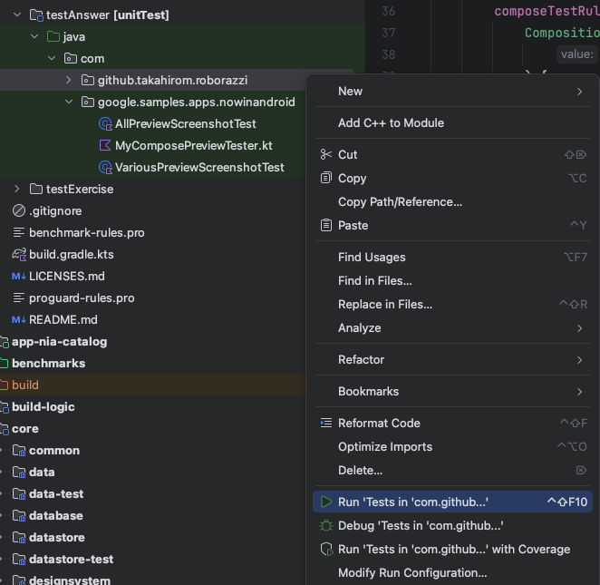

# Composable Preview Scannerを使ってプレビュー画面のスクリーンショットを撮る

本章では、`@Preview`アノテーションが付けられたComposeのプレビュー画面のスクリーンショットを、Composable Preview Scannerを使って撮る方法を説明する。

<!-- textlint-disable prh -->
この章は、DroidKaigi 2024のセッション「[仕組みから理解する！Composeプレビューを様々なバリエーションでスクリーンショットテストしよう](https://2024.droidkaigi.jp/timetable/692264/)」の補助資料として、次の仕組みの実装方法を説明する。
<!-- textlint-enable -->

<!-- textlint-disable japanese/no-doubled-joshi -->
- プレビュー関数を集めるライブラリとして[Composable Preview Scanner](https://github.com/sergio-sastre/ComposablePreviewScanner)を使用する
- `@Preview`アノテーションに指定されたプロパティのうち、次のプロパティに指定された内容にしたがってスクリーンショットを出し分ける
  - `uiMode`のうち、ナイトモードとライトモードの指定
  - `widthDp`・`heightDp` (画面サイズ)
  - `fontScale` (フォントスケール)
- プレビュー関数に`@DelayedPreview(delay = ...)`というカスタムアノテーションが付いている場合は、プレビュー画像を表示してから`delay`の時間だけ経過したタイミングのスクリーンショットを保存する

<!-- textlint-enable -->


## サンプルコードについて

<!-- textlint-disable ja-no-redundant-expression -->
- このコードを試す場合は `demoAnswerDebug` ビルドバリアントを利用する
- テストを実行して保存されたスクリーンショットは、`./gradlew clean`では消えない。代わりに次のコマンドを利用する  
  ```sh
  ./gradlew clearRoborazziDemoAnswerDebug
  ```
- 他の章の解説の都合上、本章とは無関係なテストコードも含まれている。ここで説明しているテストだけを実行したいときは、次のコマンドを利用する  
  ```sh
  ./gradlew app:testDemoAnswerDebugUnitTest --tests com.github.takahirom.roborazzi.RoborazziPreviewParameterizedTests
  ```
- Android Studioでは、`build/generated/`配下に生成されたクラスを個別にGradleのtestタスクで実行できない。
  Android Studioから実行するときは、`app/src/testAnswer`の`com.github.takahirom.roborazzi`パッケージを右クリックして「Run 'Tests in 'com.github...'」を実行する

<!-- textlint-enable -->


## この説明で動作確認したバージョン

- Android Studio: Koala Feature Drop 2024.1.2
- Gradle: 8.7
- Android Gradle Plugin: 8.5.1
- Robolectric: 4.13
- Roborazzi: 1.26.0
- Composable Preview Scanner: 0.3.0

## ビルドスクリプトのセットアップ

<!-- textlint-disable prh -->
### gradle.properties
<!-- textlint-enable -->


次のプロパティを設定する
- Roborazziが撮影したスクリーンショット画像の保存先ディレクトリを一箇所に固定するプロパティ
- Android Studioでテストを実行したときにスクリーンショットが保存されるようにするプロパティ

```
roborazzi.record.filePathStrategy=relativePathFromRoborazziContextOutputDirectory
roborazzi.test.record=true
```

### settings.gradle.kts

`dependencyResolutionManagement`の`repositories`に、Composable Preview Scannerの配布元であるjitpack.ioを追加する。

```kotlin
dependencyResolutionManagement {
    ...
    repositories {
        ...
        maven {
            url = URI("https://jitpack.io")
        }
    }
}
```

### トップレベルのbuild.gradle.kts

トップレベルの`build.gradle.kts`でRoborazziプラグインの使用を宣言する。

```kotlin
plugins {
    id("io.github.takahirom.roborazzi") version "1.26.0" apply false
}
```

### appモジュールのbuild.gradle.kts

appモジュールの`build.gradle.kts`でRoborazziプラグインを適用し、次の設定を追加する。

- ユニットテスト実行時のシステムプロパティ `roborazzi.output.dir` には、スクリーンショットを保存するディレクトリを絶対パスで指定する
- 依存関係にはRoborazzi関連3つ、Composable Preview Scanner、Robolectricをそれぞれ指定する
- `roborazzi`ブロックに次の内容を指定する
    - 出力先ディレクトリの指定 (システムプロパティ`roborazzi.output.dir`に指定したものと同じ内容)
    - (この後で実装する)ComposePreviewTesterの実装クラスのFQCN
    - スクリーンショットを撮る対象のプレビュー関数があるパッケージのリスト

```kotlin
plugins {
    id("io.github.takahirom.roborazzi") version "1.26.0"
}

...

android {
    testOptions {
        unitTests {
            all {
                it.systemProperties(
                    "roborazzi.output.dir" to rootProject.file("screenshots").absolutePath,
                    "robolectric.pixelCopyRenderMode" to "hardware"
                )
            }
            isIncludeAndroidResources = true
        }
    }
}

...

dependencies {
    testImplementation("io.github.takahirom.roborazzi:roborazzi:1.26.0")
    testImplementation("io.github.takahirom.roborazzi:roborazzi-compose:1.26.0")
    testImplementation("io.github.takahirom.roborazzi:roborazzi-compose-preview-scanner-support:1.26.0")
    testImplementation("com.github.sergio-sastre.ComposablePreviewScanner:android:0.3.0")
    testImplementation("org.robolectric:robolectric:4.13")
}

roborazzi {
    outputDir.set(rootProject.file("screenshots"))
    @OptIn(ExperimentalRoborazziApi::class)
    generateComposePreviewRobolectricTests {
        enable = true

        // ComposePreviewTesterの実装クラスの名前(これから実装する)
        testerQualifiedClassName = "com.google.samples.apps.nowinandroid.MyComposePreviewTester"

        // プレビュー関数を集めるパッケージ名。ここではfeature.interestsとfeature.foryouだけにしている
        packages = listOf(
            "com.google.samples.apps.nowinandroid.feature.interests",
            "com.google.samples.apps.nowinandroid.feature.foryou"
        )
    }
}

```

## DelayedPreviewカスタムアノテーションの定義

プレビュー関数の撮影タイミングを遅らせる`@DelayedPreview`カスタムアノテーションを定義する。
プレビュー関数が定義されているfeatureモジュールから参照できる必要があるため、ここでは`core:ui`モジュールで定義する。

```kotlin
package com.google.samples.apps.nowinandroid.core.ui

annotation class DelayedPreview(val delay: Long)
```
## ComposePreviewTesterの実装

ファイル名：[MyComposablePreviewTester.kt](../../app/src/testAnswer/java/com/google/samples/apps/nowinandroid/MyComposePreviewTester.kt)

appモジュールのテストソースセット(ここでは`app/src/testAnswer`)に、ComposePreviewTesterインターフェイスを実装する

<!-- textlint-disable japanese/no-doubled-joshi -->
- ①にて、テストで利用したいJUnit 4 Ruleである `composeTestRule` を宣言する。
  インスタンスは`createAndroidComposeRule()`で生成する
- ②にて、`options()`メソッドをオーバーライドし、①の`composeTestRule`をJUnit 4 Ruleとして使うようにする。
  `testLifecycleOptions`プロパティの`testRuleFactory`に指定する
- ③にて、`previews()`メソッドをオーバーライドする。
  Composable Preview Scannerを使って集めたプレビュー関数と、
  そのメタデータが格納されているクラス`ComposablePreview<AndroidPreviewInfo>`のリストを返すように実装する
  - `scanPackageTrees()`にはプレビュー関数をスキャンしたいパッケージ名を指定する。
     その値はbuild.gradle.ktsの`roborazzi`ブロックに書かれているので、
     その指定内容を`options.scanOptions`から取ってきている
  - 同時にカスタムアノテーション`@DelayedPreview`の情報もスキャンするように
    `includeAnnotationInfoForAllOf`を使って、スキャンするカスタムアノテーションを指定する
- ④にて、`test()`メソッドをオーバーライドする。
  プレビュー関数個々の情報(`preview: ComposablePreview<AndroidPreviewInfo>`)を受け取り、
  それに対してスクリーンショットを撮るコードを書く。
  - ④-1にて、`@DelayedPreview`アノテーションが指定されている場合は、その`delayed`プロパティを取得する
  - ④-2にて、スクリーンショットファイル名が各プレビュー関数(引数として受け取っている`preview`)ごとに一意になるように工夫する
  - ④-3にて、撮影環境を変えるのにRobolectricを使うものについて、環境を変えActivityを再生成する  
    (`myApplyToRobolectricConfiguration()`の内容は後述する)
  - ④-4にて、`@DelayedPreview`アノテーションの`delayed`プロパティが指定されているときだけ、
    `composeTestRule`の`mainClock`を使って、スクリーンショットを撮るタイミングを操作する
  - ④-5にて、LocalCompositionProviderを使って撮影環境を変える  
    (`ApplyToCompositionLocal`の内容は後述する)

<!-- textlint-enable -->

```kotlin
package com.google.samples.apps.nowinandroid

@OptIn(ExperimentalRoborazziApi::class)
class MyComposePreviewTester : ComposePreviewTester<AndroidPreviewInfo> {
    // ①
    val composeTestRule = createAndroidComposeRule<ComponentActivity>()

    // ②
    override fun options(): ComposePreviewTester.Options {
        val testLifecycleOptions = ComposePreviewTester.Options.JUnit4TestLifecycleOptions(
            testRuleFactory = { composeTestRule }
        )
        return super.options().copy(testLifecycleOptions = testLifecycleOptions)
    }

    // ③
    override fun previews(): List<ComposablePreview<AndroidPreviewInfo>> {
        val options = options()
        return AndroidComposablePreviewScanner()
            .scanPackageTrees(*options.scanOptions.packages.toTypedArray())
            .includeAnnotationInfoForAllOf(DelayedPreview::class.java)
            .getPreviews()
    }

    // ④
    override fun test(preview: ComposablePreview<AndroidPreviewInfo>) {
        // ④-1
        val delay = preview.getAnnotation<DelayedPreview>()?.delay ?: 0L

        // ④-2
        val previewScannerFileName =
            AndroidPreviewScreenshotIdBuilder(preview).build()
        val fileName =
            if (delay == 0L) previewScannerFileName else "${previewScannerFileName}_delay$delay"
        val filePath = "$fileName.png"

        // ④-3
        preview.myApplyToRobolectricConfiguration()
        composeTestRule.activityRule.scenario.recreate()


        composeTestRule.apply {
            try {
                // ④-4
                if (delay != 0L) {
                    mainClock.autoAdvance = false
                }
                setContent {
                    // ④-5
                    ApplyToCompositionLocal(preview) {
                        preview()
                    }
                }
                // ④-4
                if (delay != 0L) {
                    mainClock.advanceTimeBy(delay)
                }
                onRoot().captureRoboImage(filePath = filePath)
            } finally {
                // ④-4
                mainClock.autoAdvance = true
            }
        }
    }
}
```

## uiModeと画面サイズへの対応 (`myApplyToRobolectricConfiguration()`の実装)

`myApplyToRobolectricConfiguration()`にて、`uiMode`と画面サイズに対応する実装は次のとおり。

```kotlin
fun ComposablePreview<AndroidPreviewInfo>.myApplyToRobolectricConfiguration() {
    val preview = this
    // ナイトモード
    when (preview.previewInfo.uiMode and Configuration.UI_MODE_NIGHT_MASK) {
        Configuration.UI_MODE_NIGHT_YES -> RuntimeEnvironment.setQualifiers("+night")
        Configuration.UI_MODE_NIGHT_NO -> RuntimeEnvironment.setQualifiers("+notnight")
        else -> { /* do nothing */
        }
    }

    // 画面サイズ
    if (preview.previewInfo.widthDp != -1 && preview.previewInfo.heightDp != -1) {
        setDisplaySize(preview.previewInfo.widthDp, preview.previewInfo.heightDp)
    }
}

private fun setDisplaySize(widthDp: Int, heightDp: Int) {
    val context = ApplicationProvider.getApplicationContext<Context>()
    val display = ShadowDisplay.getDefaultDisplay()
    val density = context.resources.displayMetrics.density
    widthDp.let {
        val widthPx = (widthDp * density).roundToInt()
        Shadows.shadowOf(display).setWidth(widthPx)
    }
    heightDp.let {
        val heightPx = (heightDp * density).roundToInt()
        Shadows.shadowOf(display).setHeight(heightPx)
    }
}
```

## フォントスケールへの対応 (`ApplyToCompositionLocal()`の実装)


`ApplyToCompositionLocal()`にて、フォントスケールに対応する実装は次のとおり。

```kotlin
@Composable
fun ApplyToCompositionLocal(
    preview: ComposablePreview<AndroidPreviewInfo>,
    content: @Composable () -> Unit
) {
    val fontScale = preview.previewInfo.fontScale
    val density = LocalDensity.current
    val customDensity =
        Density(density = density.density, fontScale = density.fontScale * fontScale)
    CompositionLocalProvider(LocalDensity provides customDensity) {
        content()
    }
}
```

## テストの実行

### Android Studioからの実行

ここで作ったファイル`MyComposePreviewTester.kt`はテストクラスではないため、そのファイルを右クリックしてテストを実行できない。

<!-- textlint-disable japanese/sentence-length -->
このファイルを実行するテストクラスは、Roborazziが自動生成する`com.github.takahirom.roborazzi.RoborazziPreviewParameterizedTests`だが、
このファイルは`build/generated`に生成されるため、Android StudioがGradleのtestタスクで実行するテストだと認識しない。
<!-- textlint-enable -->

そのため、`RoborazziPreviewParameterizedTests`が所属するパッケージ`com.github.takahirom.roborazzi`を`app/src/testAnswer`にも作成し、
それを右クリックしてテストを実行する(作成したパッケージの中身は空で良い)。



### コマンドラインからの実行

このテストだけを実行したいときは、次のコマンドを実行する。

```sh
./gradlew app:testDemoAnswerDebugUnitTest --tests com.github.takahirom.roborazzi.RoborazziPreviewParameterizedTests
```

### スクリーンショットやテストレポートの格納先

- スクリーンショットは、Gradleのルートプロジェクトのディレクトリ直下の `screenshots/`に保存される
- テストレポートは`app/build/reports/roborazzi/index.html`に生成される

### スクリーンショットのクリーン

テスト実行をやり直したいなどの理由で、保存されたスクリーンショットを削除したいときは、次のコマンドを実行する。

```sh
./gradlew clearRoborazziDemoAnswerDebug
```

## 用意されているプレビュー関数について

ここでは、[ForYouScreen.kt](../../feature/foryou/src/main/java/com/google/samples/apps/nowinandroid/feature/foryou/ForYouScreen.kt)のプレビュー関数に対して、いくつかのプロパティを設定している。

`@Preview`のプロパティに指定している値や`@DelayedPreview`の`delay`プロパティに指定している値を変更し、
スクリーンショットを撮りなおしてみて、どのように結果が変化するのか見てみるとより理解が深まる。

### ForYouScreenPopulatedFeed

次のように、3つの`@Preview`アノテーションで、3枚のスクリーンショットを撮るように指定している。

- 画面サイズ「幅1280dp × 高さ300dp」
- ナイトモード
- フォントスケール2倍

```kotlin
@Preview(widthDp = 1280, heightDp = 300)
@Preview(uiMode = Configuration.UI_MODE_NIGHT_YES)
@Preview(fontScale = 2f)
@Composable
fun ForYouScreenPopulatedFeed() {
    ...
}
```

### ForYouScreenLoading

このプレビュー画面は、ローディングアニメーションが無限にリピートするものだが、そこで2秒(2000msec)後のスクリーンショットを撮るように指定している。

```
@Preview
@DelayedPreview(delay = 2000)
@Composable
fun ForYouScreenLoading() {
    ...
}
```
